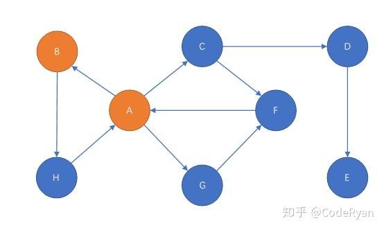

# tarjan 连通图

## 内容


- 割点
- 割边
- SCC 缩点
- vDCC 缩点 (点双连通分量缩点)
- eDCC 缩点 (边双连通分量缩点)
- 强连通分量


### 本质差别

首先要明确共同点：

两者都需要判断当前节点是否能回到之前的节点（即Low的作用）。

本质的差别：

- 强连通分量关注判断的点是不是在**同一个强连通分量集合**内
- 割点/边问题关注**搜索子树**的个数

于是我就找出了一个很恶心的图，导致如果细节处理不好，两个题总有一个爆炸。

图中，A、B请分别试以它们作为0号点（起始搜索点）的情况，割点/边问题将有向图改为无向图即可。

答案：

- 强连通分量：三个，ABCFGH、D、E
- 割点：三个，A、C、D
- 割边：两条，CD、DE

如果你的代码能把这个图处理的无误，那么代码应该是没有问题的。

## Tarjan核心代码区别

- 强连通分量：需要有一个**栈**来记录当前搜索到的强连通分量

- 割点/边：

- - 需要记录当前点的搜索来源（即上一个点，也就是father，记录root没有必要，因为可以通过father==now来判断），读到的下一个点是来源的时候，就要跳过更新low的函数（针对无向图，有向图不存在此问题【实际上，Tarjan割点/边问题在有向图中，判断的是弱连通的割点/边】）
  - 还需要记录**子树的个数**（即从当前点出发，**触发Tarjan DFS函数的次数**【特别注意：不是未访问到的节点个数！！！因为每一遍Tarjan DFS都会更新很多low，导致for循环的时候，下一个要访问的点并不一定是未访问过的！】）

## 判断条件区别

### 强连通分量：

- 当前点所有的边都被遍历完之后，判断它的dfn是否等于low（dfn[now] == low[now]）

- - True：表示搜到了一个强连通分量的根（或者说中心节点），开始弹栈，弹出来的都是这个强连通分量集合内的节点，直到弹到当前点自己为止。
  - False：回溯

### 割点/边问题：

- 当对于一条边的访问完成后（大坑！不能是结尾一起判断），周边是否有点i，使得dfn[now] <= low[i]（即只有唯一的边从当前点能到达它）

- - True：

  - - 当前点是不是根：

    - - True：该判断结束
      - False：当前点是**割点**

    - 是否满足dfn[now] < low[i]

    - - True：边(now,i)是一条**割边**
      - False：该判断结束

  - False

  - - 该判断结束

- 当前点所有的边都被遍历完之后，判断一堆事：

- - 当前点是不是根：

  - - True：子树个数是否多于1个

    - - True： 当前点是**割点**
      - False：该判断结束

    - False：该判断结束

割点/边问题的第二个判断必须在在**每次Tarjan DFS结束之后**进行，这里为了比对区别所以放在一起了，**这么做实际上是错误的**！

## 著名大坑——为什么是dfn[i]而不是low[i]

出自核心代码的这里：

```text
if (dfn[i]):  # 已经被处理过
    low[now] = min(low[now], dfn[i])
```

这个巨大的坑就是那个后面的dfn[i]，**一直没找到能够清楚解释为什么是dfn[i]而不是low[i]**。要拿Tarjan的定义来说：low的意义是当前节点能回到的最早的dfn，但那恰恰中了这个问题的下怀。

更要命的是，这个地方如果换成low[i]，**强连通分量的判断没有任何问题**！

逻辑思维大佬应该已经看出问题了——没错，我踩坑就踩在了割点/边问题上，如果**换成low[i]**，那么会发现，在我上面给出的样例图里，**以B作为起始点，将会导致A这个割点判断不出来**！

究其原因，是因为**low数组除了承担了本身定义的任务，还承担了区分搜索子树的任务**，强连通分量不关心搜索子树，所以也就不会产生影响。

但是割点/边问题关注搜索子树——非根节点判断其是否为割点的条件dfn[now] <= low[i]，这个“=”的意义非同寻常，它解决了这样的如下图的判断问题：


在这个图中，A对边的访问顺序将会导致两种结果

- 先访问绿边

- - 这是绝大多数例子里面的方式
  - 这会在搜索绿边的Tarjan完成时之后使得low[B]=low[C]=low[A]
  - 然后再去访问橙边，会导致low[A]<dfn[A]
  - 这种情况并不会导致异常。

- 先访问橙边

- - 这会导致low[A]先被更新low[A]<dfn[A]

  - 然后再搜索绿边的时候，low[C]的判断就会变得尤为关键

  - - 错误的写法：min(low[now], low[i])

    - - 这会**导致low[B]=low[C]=low[A]<dfn[A]，使得任意A周边的点L（L∈{B,C,...}都无法满足dfn[A] <= low[L]**，从而导致判断出错
      - 实际上，这就是将**两棵搜索子树合二为一**了，导致无法判断出来A是割点

    - 正确的写法：**min(low[now], dfn[i])**

    - - 这使得**low[B]=low[C]=dfn[A]>low[A]，从而让dfn[now] <= low[i]这个条件在now=A，i=B的时候被满足**。

当然，AB、BC、CA都不是割边。

## 割点模版

```cpp
const int N = 1e5 + 10;
// https://www.luogu.com.cn/problem/P3388

int n,m;
struct Edge {
    int to, next, w;
} e[N << 1];
int head[N];
void add(int u, int v){
    static int idx = 0;
    e[++idx] = (Edge){v, head[u]};
    head[u] = idx;
}
//
int dfn[N], low[N], dn;
int res[N], cnt;
void tarjan(int u, int root){
    dfn[u] = low[u] = ++dn;
    int son = 0;
    for(int i = head[u];i;i = e[i].next){
        int v = e[i].to;
        debug(">%d %d %d\n", u, v, low[u]);
        if(!dfn[v]){
            tarjan(v, 0);
            low[u] = min(low[v], low[u]);
            if(low[v] >= dfn[u] && !root) {
                cnt += !res[u];
                res[u] = 1;
            }
            if(root) son++;

        }else{
            low[u] = min(low[u], dfn[v]);
        }
    }
    if(son >= 2 && root){
        cnt += !res[u];
        res[u] = 1;
    }
}

void solve(){
    cin >> n >> m;
    for(int i = 1;i <= m;i++){
        int u,v; cin >> u >> v;
        add(u,v);
        add(v,u);
    }
    for(int i = 1;i <= n;i++) if(!dfn[i]) tarjan(i, i);
    cout << cnt << endl;
    for(int i = 1;i <= n;i++){
        if(res[i]) cout << i << " ";
    }
}

signed main(){
    ios::sync_with_stdio(false);
    cin.tie(0);cout.tie(0);
    int n = 1;
    // cin >> n;
    while(n--){
        solve();
    }
    return 0;
}
```


## tarjan 割点

> **割点**：对于一个无向图，如果把一个点删除后，连通块的个数增加了，那么这个点就是割点（又称割项）。


> 割点判定法则：
>
> 如果 × 不是根节点，当搜索树上存在×的一个子节点y，满足low[y] ≥ dfn[x]，那么x就是割点。
>
> 如果 x 是根节点，当搜索树上存在至少两个子节点y1,y2，满足上述条件，那么×就是割点。
>
> low[y] ≥ dfn[x]，说明从 y 出发，在不通过 x 点的前提下，不管走哪条边，都无法到达比×更早访问的节点。
>
> 故删除 × 点后，以y为根的子树 subtree() 也就断开了。即环顶的点割得掉。
>
> 反之，若low[y] < dfn[x]，则说明 y 能绕行其他边到达比 × 更早访问的节点，x就不是割点了。即环内的点割不掉。


### 题面翻译

B 城有 $n$ 个城镇，$m$ 条双向道路。

每条道路连结两个不同的城镇，没有重复的道路，所有城镇连通。

把城镇看作节点，把道路看作边，容易发现，整个城市构成了一个无向图。

请你对于每个节点 $i$ 求出，把与节点 $i$ 关联的所有边去掉以后（不去掉节点 $i$ 本身），无向图有多少个有序点 $(x,y)$，满足 $x$ 和 $y$ 不连通。

**【输入格式】**

第一行包含两个整数 $n$ 和 $m$。

接下来 $m$ 行，每行包含两个整数 $a$ 和 $b$，表示城镇 $a$ 和 $b$ 之间存在一条道路。

**【输出格式】**

输出共 $n$ 行，每行输出一个整数。

第 $i$ 行输出的整数表示把与节点 $i$ 关联的所有边去掉以后（不去掉节点 $i$ 本身），无向图有多少个有序点 $(x,y)$，满足 $x$ 和 $y$ 不连通。


```cpp
const int N = 1e6 + 10;
// https://www.luogu.com.cn/problem/P3469

int n,m;
struct Edge {
    int to, next;
} e[N << 1];
int head[N];
void add(int u, int v){
    static int idx = 0;
    e[++idx] = (Edge){v, head[u]};
    head[u] = idx;
}
//
int dfn[N], low[N], siz[N], dfncnt;
bool res[N];
int ans[N];
void tarjan(int u, bool root){
    dfn[u] = low[u] = ++dfncnt;
    ans[u] = 0;
    int son = 0;
    siz[u] = 1;
    int sum = 0;
    for(int i = head[u];i;i = e[i].next){
        int v = e[i].to;
        if(!dfn[v]){
            son ++;
            tarjan(v, false);
            low[u] = min(low[u], low[v]);
            siz[u] += siz[v];
            if(low[v] >= dfn[u]) {
                res[u] = true;
                sum += siz[v];
                ans[u] += siz[v] * (n - siz[v]);
            }
        }else low[u] = min(low[u], dfn[v]);
    }
    if(son >= 2 && root) res[u] = true;
    if(son < 2 && root) res[u] = false;
    if(res[u]) ans[u] += (n - sum - 1) * (sum + 1) + (n - 1);
}

void solve(){
    cin >> n >> m;
    for(int i = 0, u, v;i <= m;i++){
        cin >> u >> v;
        add(u,v);
        add(v,u);
    }
    for(int i = 1;i <= n;i++) if(!dfn[i]) tarjan(i, true);
    for(int i = 1;i <= n;i++){
        if(res[i]){
            cout << ans[i] << endl;
        }else{
            cout << 2 * (n - 1) << endl;
        }
    }
}

signed main(){
    ios::sync_with_stdio(false);
    cin.tie(0);cout.tie(0);
    int n = 1;
    // cin >> n;
    while(n--){
        solve();
    }
    return 0;
}
```


```cpp
const int N = 1e5 + 10;
// https://www.luogu.com.cn/problem/P2863

int n, m, a, b;
vector<int> e[N];
int dfn[N], low[N], tot;
int stk[N], instk[N], top;
int scc[N], siz[N], cnt;

void tarjan(int x)
{
    // 入x时，盖戳、入栈
    dfn[x] = low[x] = ++tot;
    stk[++top] = x, instk[x] = 1;
    for (int y : e[x])
    {
        if (!dfn[y])
        { // 若y尚未访问
            tarjan(y);
            low[x] = min(low[x], low[y]); // 回x时更新low
        }
        else if (instk[y])                // 若y已访问且在栈中
            low[x] = min(low[x], dfn[y]); // 在x时更新low
    }
    // 离x时，收集SCC
    if (dfn[x] == low[x])
    { // 若x是SCC的根
        int y;
        ++cnt;
        do
        {
            y = stk[top--];
            instk[y] = 0;
            scc[y] = cnt; // SCC编号
            ++siz[cnt];   // SCC大小
        } while (y != x);
    }
}

void solve()
{
    cin >> n >> m;
    while (m--)
        cin >> a >> b, e[a].push_back(b);
    for (int i = 1; i <= n; i++) // 可能不连通
        if (!dfn[i])
            tarjan(i);
    int ans = 0;
    for (int i = 1; i <= cnt; i++)
        if (siz[i] > 1)
            ans++;
    cout << ans << endl;
}

signed main()
{
    ios::sync_with_stdio(false);
    cin.tie(0);
    cout.tie(0);
    int n = 1;
    // cin >> n;
    while (n--)
    {
        solve();
    }
    return 0;
}
```


## Tarjan scc 缩点

> 把有环图抽象成无环图
>
> 缩点后观察 **入度** 和 **出度** 来构造答案
>
> 缩点后重建拓扑图，利用拓扑图递推找到答案

### 题目描述

共有 $n$ 所学校 $(1 \leq n \leq 10000)$ 已知他们实现设计好的网络共 $m$ 条线路，为了保证高速，网络是单向的。现在请你告诉他们至少选几所学校作为共享软件的母机，能使每所学校都可以用上。再告诉他们至少要添加几条线路能使任意一所学校作为母机都可以使别的学校使用上软件。

### 输入格式

第一行一个正整数 $n$。

接下来 $n$ 行每行有若干个整数，用空格隔开。

第 $i+1$ 行，每行输入若干个非零整数 $x$，表示从 $i$ 到 $x$ 有一条线路。以 $0$ 作为结束标志。

### 输出格式

第一行一个整数，表示至少选几所学校作为共享软件的母机，能使每所学校都可以用上。

第二行一个整数，表示至少要添加几条线路能使任意一所学校作为母机都可以使别的学校使用上软件。

```cpp
const int N = 1e5 + 10;
// https://www.luogu.com.cn/problem/P2812

int n;

vector<int> g[N];

int dfn[N], low[N], dfncnt;
int stk[N], instk[N], top;
int scc[N], cnt;
int din[N], dout[N];

void tarjan(int u){
    dfn[u] = low[u] = ++dfncnt;
    stk[++top] = u;
    instk[u] = 1;
    for(auto v : g[u]){
        if(!dfn[v]){
            tarjan(v);
            low[u] = min(low[u], low[v]);
        }else if(instk[v]){
            low[u] = min(low[u], dfn[v]);
        }
    }
    if(dfn[u] == low[u]){
        int v; ++cnt;
        do {
            v = stk[top--];
            instk[v] = 0;
            scc[v] = cnt;
        } while(u != v);
    }
}

void solve(){
    cin >> n;
    for(int i = 1, u;i <= n;i++){
        while(cin >> u, u){
            g[i].push_back(u);
        }
    }
    for(int i = 1;i <= n;i++) if(!dfn[i]) tarjan(i);
    for(int i = 1;i <= n;i++){
        for(auto v : g[i]){
            if(scc[i] != scc[v]){
                din[scc[v]]++;
                dout[scc[i]]++;
            }
        }
    }
    int a = 0, b = 0;
    for(int i = 1;i <= cnt;i++){ 
        if(!din[i]) a++;
        if(!dout[i]) b++;
    }
    cout << a << endl;
    if(cnt == 1) cout << 0 << endl;
    else
    cout << max(a, b) << endl;
}

signed main(){
    ios::sync_with_stdio(false);
    cin.tie(0);cout.tie(0);
    int n = 1;
    // cin >> n;
    while(n--){
        solve();
    }
    return 0;
}
```


每头奶牛都梦想成为牛棚里的明星。被所有奶牛喜欢的奶牛就是一头明星奶牛。所有奶牛都是自恋狂，每头奶牛总是喜欢自己的。奶牛之间的“喜欢”是可以传递的——如果 $A$ 喜欢 $B$，$B$ 喜欢 $C$，那么 $A$ 也喜欢 $C$。牛栏里共有 $N$ 头奶牛，给定一些奶牛之间的爱慕关系，请你算出有多少头奶牛可以当明星。

```cpp
const int N = 1e5 + 10;
// https://www.luogu.com.cn/problem/P2341
int n, m;

//
struct Edge{
    int to, next;
} e[N << 1];
int head[N];
void add(int u, int v){
    static int idx = 0;
    e[++idx] = (Edge){v, head[u]};
    head[u] = idx;
}

//
int dfn[N], low[N], dfncnt;
int stk[N], instk[N], top;
int scc[N], siz[N], cnt;

void tarjan(int u){
    dfn[u] = low[u] = ++dfncnt;
    stk[++top] = u;
    instk[u] = 1;
    for(int i = head[u];i;i = e[i].next){
        int v = e[i].to;
        if(!dfn[v]){
            tarjan(v);
            low[u] = min(low[u], low[v]);
        } else {
            low[u] = min(low[u], dfn[v]);
        }
    }
    if(dfn[u] == low[u]){
        int v; ++cnt;
        do {
            v = stk[top--];
            instk[v] = 0;
            scc[v] = cnt;
            siz[cnt]++;
         } while(v != u);
    }
}

int din[N], dout[N];

void solve(){
    cin >> n >> m;
    for(int i = 1;i <= m;i++){
        int u,v; cin >> u >> v;
        add(u, v);
    }
    for(int i = 1;i <= n;i++) if(!dfn[i]) tarjan(i);
    for(int u = 1;u <= n;u++){
        for(int i = head[u];i;i = e[i].next){
            int v = e[i].to;
            if(scc[u] == scc[v]) continue;
            din[scc[v]]++;
            dout[scc[u]]++;
        }
    }
    int res = 0, zero = 0;
    for(int i = 1;i <= cnt;i++){
        if(dout[i] == 0) {
            res = siz[i];
            zero++;
        }
    }
    if(zero > 1) cout << 0 << endl;
    else
    cout << res << endl;
}

signed main(){
    ios::sync_with_stdio(false);
    cin.tie(0);cout.tie(0);
    int n = 1;
    // cin >> n;
    while(n--){
        solve();
    }
    return 0;
}
```


### 题目描述

给定一个 $n$ 个点 $m$ 条边有向图，每个点有一个权值，求一条路径，使路径经过的点权值之和最大。你只需要求出这个权值和。

允许多次经过一条边或者一个点，但是，重复经过的点，权值只计算一次。

```cpp
const int N = 1e5 + 10;
// https://www.luogu.com.cn/problem/P3387
int n, m;
//
struct Edge{
    int to, next;
} e[N << 1], ne[N << 1];
int head[N], nhead[N];
void add(int u, int v){
    static int idx = 0;
    e[++idx] = (Edge){v, head[u]};
    head[u] = idx;
}
void nadd(int u, int v){
    static int idx = 0;
    ne[++idx] = (Edge){v, nhead[u]};
    nhead[u] = idx;
}
//

int dfn[N], low[N], dfncnt;
int stk[N], instk[N], top;
int scc[N], cnt;
void tarjan(int u){
    dfn[u] = low[u] = ++dfncnt;
    stk[++top] = u;
    instk[u] = 1;
    for(int i = head[u];i;i = e[i].next){
        int v = e[i].to;
        if(!dfn[v]){
            tarjan(v);
            low[u] = min(low[u], low[v]);
        }else if(instk[v]){
            low[u] = min(low[u], dfn[v]);
        }
    }
    if(dfn[u] == low[u]){
        int v; ++cnt;
        do {
            v = stk[top--];
            instk[v] = 0;
            scc[v] = cnt;
        } while(u != v);
    }
}

int w[N], nw[N], dp[N];

void solve(){
    cin >> n >> m;
    for(int i = 1;i <= n;i++) cin >> w[i];
    for(int i = 1;i <= m;i++){
        int u,v; cin >> u >> v;
        add(u, v);
    }
    for(int i = 1;i <= n;i++) if(!dfn[i]) tarjan(i);
    for(int u = 1;u <= n;u++){
        nw[scc[u]] += w[u];
        for(int i = head[u];i;i = e[i].next){
            int v = e[i].to;
            if(scc[u] == scc[v]) continue;
            nadd(scc[u], scc[v]);
        }
    }
    for(int u = cnt;u;u--){ // 思考： 为什么 cnt 开始遍历
        if(dp[u] == 0) dp[u] = nw[u];

        for(int i = nhead[u];i;i = ne[i].next){
            int v = ne[i].to;
            dp[v] = max(dp[v], dp[u] + nw[v]);
        }
    }
    int res = 0;
    for(int i = 1;i <= cnt;i++){
        res = max(res, dp[i]);
    }
    cout << res << endl;
}

signed main(){
    ios::sync_with_stdio(false);
    cin.tie(0);cout.tie(0);
    int n = 1;
    // cin >> n;
    while(n--){
        solve();
    }
    return 0;
}
```


## 割边

> 割边：对于一个无向图，如果删掉一条边后图中的连通块个数增加了，则称这条边为桥或者割边。

> 割边判定法则：
>
> 当搜索树上存在 × 的一个子节点 y，满足 low{y} > dfn[x]，则（x.y）这条边就是割边。
>
> low[y] > dfn[x]，说明从 y 出发，在不经过（x.y）这条边的前提下，不管走哪条边，都无法到达×或 更早访问的节点。
>
> 故删除（x, y）这条边，以 y 为根的子树 subtree(y) 也就断开了。即环外的边割得断。
>
> 反之，若low[y] <= dfn[x]，则说明 y 能绕行其他边到达 x 或更早访问的节点，
>
> （x.y）就不是割边了。即环内的边割不断。

```cpp
```


## 边双连通分量 eDCC 缩点

> 无向图中极大的不包含割边的连通块被称“边双连通分量"。
>
> eDCC -> 缩点 所得的图一定是树（或森林），树边就是原来的割边


## 点双连通分量 vDCC 缩点

在无向图中，存在一个极大子图，其中**任意两个顶点之间连通**，并且删除任意一点该子图**仍然是连通的**，我们称该极大子图为**点双连通分量(vertex Double Connected Components，vDCC)**。

#### 推论

- 无向图中**极大的不包含割点的连通分量**被称为**点双连通分量(vertex Double Connected Components，vDCC)**。
- **一个割点存在于至少两个双连通分量之中**
