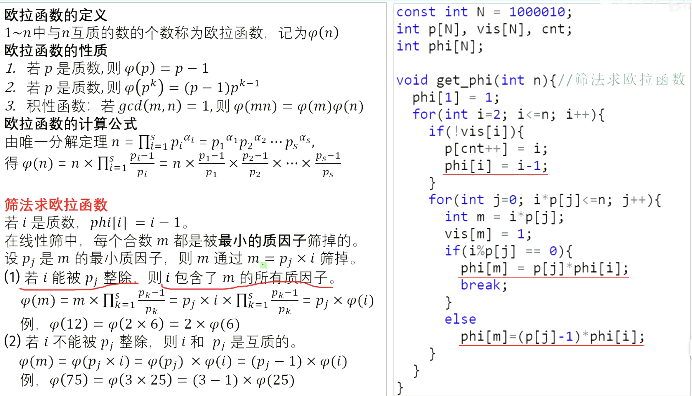
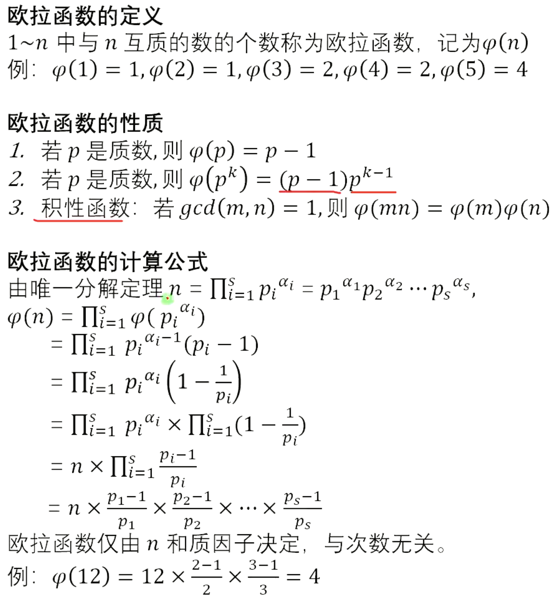

# 欧拉函数

## 欧拉函数





```cpp
#include <iostream>
using namespace std;

const int N = 1000010;
int p[N], vis[N], cnt;
int phi[N];

void get_phi(int n){//筛法求欧拉函数
  phi[1] = 1;
  for(int i=2; i<=n; i++){
    if(!vis[i]){
      p[cnt++] = i;
      phi[i] = i-1;
    }
    for(int j=0; i*p[j]<=n; j++){
      int m = i*p[j];
      vis[m] = 1;
      if(i%p[j] == 0){
        phi[m] = p[j]*phi[i];
        break;
      }
      else
        phi[m]=(p[j]-1)*phi[i];
    }
  }
}
int main(){
  int n;
  cin >> n;
  get_phi(n);
  for(int i=1; i<=n; i++)
    printf("%d\n", phi[i]);
  return 0;
}
```

## 筛法求约数个数

```cpp
#include <iostream>
using namespace std;

const int N = 1000010;
int p[N], vis[N], cnt;
int a[N]; //a[i]记录i的最小质因子的次数
int d[N]; //d[i]记录i的约数个数

void get_d(int n){ //筛法求约数个数
  d[1] = 1;
  for(int i=2; i<=n; i++){
    if(!vis[i]){
      p[++cnt] = i;
      a[i] = 1;
      d[i] = 2;
    }
    for(int j=1; i*p[j]<=n; j++){
      int m = i*p[j];
      vis[m] = 1;
      if(i%p[j] == 0){
        a[m] = a[i]+1;
        d[m] = d[i]/a[m]*(a[m]+1);
        break;
      } 
      else{
        a[m] = 1;
        d[m] = d[i]*2;
      }
    }
  }
}
int main(){
  int n;
  cin >> n;
  get_d(n);
  for(int i=1; i<=n; i++)
    printf("%d\n", d[i]);
  return 0;
}
```


## 筛法求约数和

```cpp
#include <iostream>
using namespace std;

const int N = 1000010;
int p[N], vis[N], cnt;
//g[i]表示i的最小质因子的1+p^1+...+p^k
int g[N], f[N];//f[i]表示i的约数和

void get_f(int n){ //筛法求约数和
  g[1] = f[1] = 1;
  for(int i=2; i<=n; i++){
    if(!vis[i]){
      p[++cnt] = i;
      g[i] = f[i] = i+1;
    }
    for(int j=1; i*p[j]<=n; j++){
      int m = i*p[j]; 
      vis[m] = 1;
      if(i%p[j] == 0){
        g[m] = g[i]*p[j]+1;
        f[m] = f[i]/g[i]*g[m];
        break;
      } 
      else{
        g[m] = p[j]+1;
        f[m] = f[i]*g[m];
      }
    }
  }
}
int main(){
  int n;
  cin >> n;
  get_f(n);
  for(int i=1; i<=n; i++)
    printf("%d\n",f[i]);
  return 0;
}
```

## 筛法求莫比乌斯函数

```cpp
#include <iostream>
using namespace std;

const int N = 1000010;
int p[N], vis[N], cnt;
int mu[N];

void get_mu(int n){//筛法求莫比乌斯函数
  mu[1] = 1;
  for(int i=2; i<=n; i++){
    if(!vis[i]){
      p[++cnt] = i;
      mu[i] = -1;
    }
    for(int j=1; i*p[j]<=n; j++){
      int m = i*p[j]; 
      vis[m] = 1;
      if(i%p[j] == 0){
        mu[m] = 0;
        break;
      } 
      else
        mu[m] = -mu[i];
    }
  }
}
int main(){
  int n;
  cin >> n;
  get_mu(n);
  for(int i=1; i<=n; i++)
    printf("%d\n",mu[i]);
  return 0;
}
```

## 同余式 乘法逆元 费马小定理

## 剩余系 欧拉定理 扩展欧拉定理

