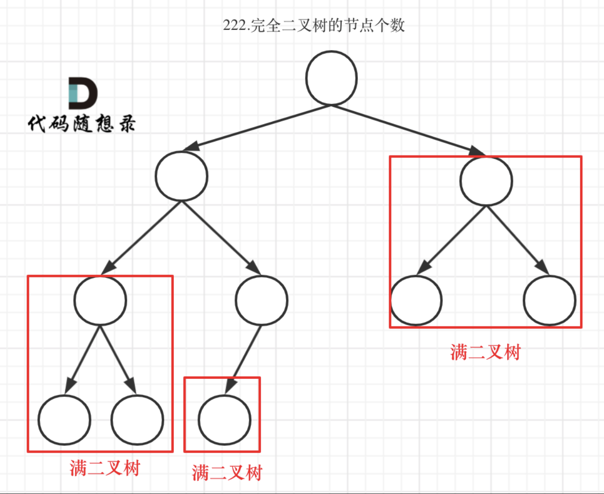

# 二叉树

## 前序中序构建二叉树

```go
func buildTree(preorder, inorder []int) *TreeNode {
    n := len(preorder)
    if n == 0 { // 空节点
        return nil
    }
    leftSize := slices.Index(inorder, preorder[0]) // 左子树的大小
    left := buildTree(preorder[1:1+leftSize], inorder[:leftSize])
    right := buildTree(preorder[1+leftSize:], inorder[1+leftSize:])
    return &TreeNode{preorder[0], left, right}
}
```

## 后序中序构建二叉树

```go
func buildTree(inorder, postorder []int) *TreeNode {
    n := len(postorder)
    if n == 0 { // 空节点
        return nil
    }
    leftSize := slices.Index(inorder, postorder[n-1]) // 左子树的大小
    left := buildTree(inorder[:leftSize], postorder[:leftSize])
    right := buildTree(inorder[leftSize+1:], postorder[leftSize:n-1])
    return &TreeNode{postorder[n-1], left, right}
}
```

## 中序遍历

补充右侧指针

```go
func connect(root *Node) *Node {
	if root == nil {
        return nil
    }
    q := []*Node{root}
    for len(q) > 0 {
        t := q
        q = nil
        for i, node := range t {
            if i + 1 < len(t) { // 连接同一层的两个相邻节点
                node.Next = t[i + 1]
            }
            if node.Left != nil {
                q = append(q, node.Left)
            }
            if node.Right != nil {
                q = append(q, node.Right)
            }
        }
    }
    return root
}
```

## 二叉树展开成链表

```go
func flatten(root *TreeNode)  {
    var head *TreeNode
    var dfs func(*TreeNode)
    dfs = func(node *TreeNode) {
        if node == nil {
            return
        }
        dfs(node.Right)
        dfs(node.Left)
        node.Left = nil
        node.Right = head
        head = node
    }
    dfs(root)
}
```

## 路径和

```go
func hasPathSum(root *TreeNode, targetSum int) bool {
    if root == nil {
        return false
    }
    targetSum -= root.Val
    if root.Left == root.Right { // 叶子结点
        return targetSum == 0
    }
    return hasPathSum(root.Left, targetSum) || hasPathSum(root.Right, targetSum)
}
```

## 根节点到叶子节点数字之和

```go
func sumNumbers(root *TreeNode) int {
    res := 0
    var dfs func(node *TreeNode, sum int)
    dfs = func(node *TreeNode, sum int) {
        if node == nil {
            return
        }
        sum = sum * 10 + node.Val
        if node.Left == node.Right {
            res += sum
        }
        dfs(node.Left, sum)
        dfs(node.Right, sum)
    }
    dfs(root, 0)
    return res
}
```

## 二叉树的直径

```go
func diameterOfBinaryTree(root *TreeNode) (ans int) {
	var dfs func(*TreeNode) int
	dfs = func(node *TreeNode) int {
		if node == nil {
			return -1
		}
		lLen := dfs(node.Left) + 1  // 左子树最大链长+1
		rLen := dfs(node.Right) + 1 // 右子树最大链长+1
		ans = max(ans, lLen+rLen)   // 两条链拼成路径
		return max(lLen, rLen)      // 当前子树最大链长
	}
	dfs(root)
	return
}
```

## 二叉树最大路径和

```go
func maxPathSum(root *TreeNode) int {
    maxSum := math.MinInt32
    var maxGain func(*TreeNode) int
    maxGain = func(node *TreeNode) int {
        if node == nil {
            return 0
        }

        // 递归计算左右子节点的最大贡献值
        // 只有在最大贡献值大于 0 时，才会选取对应子节点
        leftGain := maxGain(node.Left)
        rightGain := maxGain(node.Right)

        // 节点的最大路径和取决于该节点的值与该节点的左右子节点的最大贡献值
        priceNewPath := node.Val + leftGain + rightGain

        // 更新答案
        maxSum = max(maxSum, priceNewPath)

        // 返回节点的最大贡献值
        return max(node.Val + max(leftGain, rightGain), 0)
    }
    maxGain(root)
    return maxSum
}
```

## 一般树的最大路径

```go
func longestPath(parent []int, s string) int {
    ans := 0
    n := len(parent)
	g := make([][]int, n)
	for i := 1; i < n; i++ {
		pa := parent[i]
		g[pa] = append(g[pa], i)
	}

	var dfs func(int) int
	dfs = func(x int) (maxLen int) {
		for _, y := range g[x] {
			len := dfs(y) + 1
			if s[y] != s[x] {
				ans = max(ans, maxLen+len)
				maxLen = max(maxLen, len)
			}
		}
		return
	}
	dfs(0)
	return ans + 1
}
```

## 完全二叉树的节点数量



```go
func countNodes(root *TreeNode) int {
    if root == nil {
        return 0
    }
    l := root.Left
    r := root.Right
    lh, rh := 0, 0
    for l != nil {
        l = l.Left
        lh++
    }
    for r != nil {
        r = r.Right
        rh++
    }
    if lh == rh {
        return (2 << lh) - 1
    }
    return countNodes(root.Left) + countNodes(root.Right) + 1
}
```

## 二叉树最近公共祖先

```go
func lowestCommonAncestor(root, p, q *TreeNode) *TreeNode {
    if root == nil || root == q || root == p {
        return root
    }
    l := lowestCommonAncestor(root.Left, p, q)
    r := lowestCommonAncestor(root.Right, p, q)
    if l == nil {
        return r
    }
    if r == nil {
        return l
    }
    return root
}
```

## 二叉搜索树最近公共祖先

```go
func lowestCommonAncestor(root, p, q *TreeNode) *TreeNode {
	val := root.Val
    if p.Val < val && q.Val < val {
        return lowestCommonAncestor(root.Left, p, q)
    }
    if p.Val > val && q.Val > val {
        return lowestCommonAncestor(root.Right, p, q)
    }
    return root
}
```

## 二叉树层序遍历

```go
func levelOrder(root *TreeNode) (res [][]int) {
	if root == nil {
		return
	}
	q := []*TreeNode{root}
	for len(q) > 0 {
        n := len(q)
        vals := make([]int, n)
		for i, _ := range vals {
            t := q[0]
            q = q[1:]
            vals[i] = t.Val
			if t.Left != nil {
				q = append(q, t.Left)
			}
			if t.Right != nil {
				q = append(q, t.Right)
			}
		}
        res = append(res, vals)
	}
	return 
}
```

## 二叉树的右视图

```go
func rightSideView(root *TreeNode) (res []int) {
    if root == nil {
		return
	}
	q := []*TreeNode{root}
	for len(q) > 0 {
        vals := 0
        n := len(q)
		for range n {
            t := q[0]
            q = q[1:]
            vals = t.Val
			if t.Left != nil {
				q = append(q, t.Left)
			}
			if t.Right != nil {
				q = append(q, t.Right)
			}
		}
        res = append(res, vals)
	}
    return res
}
```

## 有序数组转成二叉搜索树

```go
func sortedArrayToBST(nums []int) *TreeNode {
    return helper(nums, 0, len(nums) - 1)
}

func helper(nums []int, left, right int) *TreeNode {
    if left > right {
        return nil
    }
    mid := (left + right) >> 1
    root := &TreeNode{Val: nums[mid]}
    root.Left = helper(nums, left, mid - 1)
    root.Right = helper(nums, mid + 1, right)
    return root
}
```

