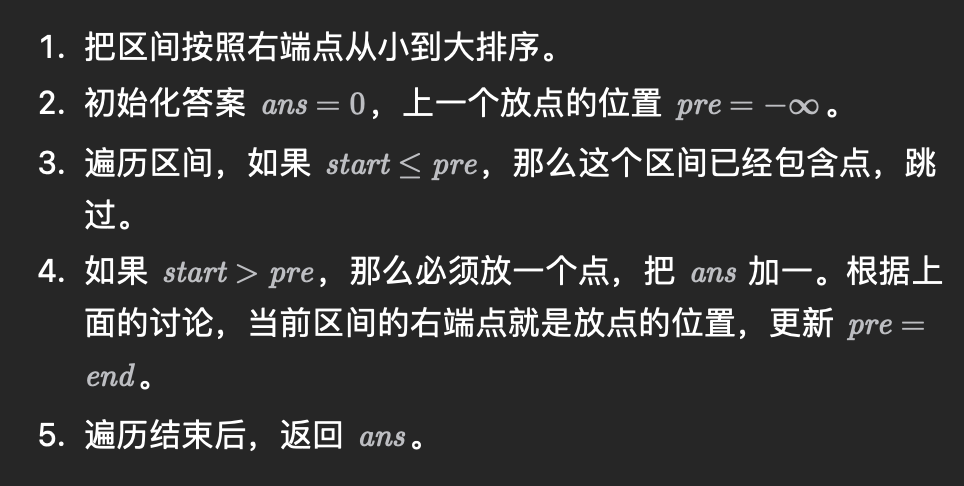

# 区间

## 汇总区间

给定一个  **无重复元素** 的 **有序** 整数数组 `nums` 。

返回 ***恰好覆盖数组中所有数字** 的 **最小有序** 区间范围列表* 。也就是说，`nums` 的每个元素都恰好被某个区间范围所覆盖，并且不存在属于某个范围但不属于 `nums` 的数字 `x` 。

列表中的每个区间范围 `[a,b]` 应该按如下格式输出：

- `"a->b"` ，如果 `a != b`
- `"a"` ，如果 `a == b`

```go
func summaryRanges(nums []int) (ans []string) {
    for i, n := 0, len(nums); i < n; {
        left := i
        for i++; i < n && nums[i-1]+1 == nums[i]; i++ {
        }
        s := strconv.Itoa(nums[left])
        if left < i-1 {
            s += "->" + strconv.Itoa(nums[i-1])
        }
        ans = append(ans, s)
    }
    return
}
```

## 合并区间

以数组 `intervals` 表示若干个区间的集合，其中单个区间为 `intervals[i] = [starti, endi]` 。请你合并所有重叠的区间，并返回 *一个不重叠的区间数组，该数组需恰好覆盖输入中的所有区间* 。

**示例 1：**

```
输入：intervals = [[1,3],[2,6],[8,10],[15,18]]
输出：[[1,6],[8,10],[15,18]]
解释：区间 [1,3] 和 [2,6] 重叠, 将它们合并为 [1,6].
```

**示例 2：**

```
输入：intervals = [[1,4],[4,5]]
输出：[[1,5]]
解释：区间 [1,4] 和 [4,5] 可被视为重叠区间。
```

```go
func merge(intervals [][]int) [][]int {
	slices.SortFunc(intervals, func(a, b []int) int {
		return a[0] - b[0]
	})
    res := make([][]int, 0)
    for _, val := range intervals {
        m := len(res)
        if m > 0 && val[0] <= res[m - 1][1] { // 第二个数组 第一个数 与 第一个数组第二个数比较
            res[m-1][1] = max(res[m-1][1], val[1])
        } else {
            res = append(res, val)
        }
    }
    return res
}
```

## 插入区间

```go
func insert(intervals [][]int, newInterval []int) [][]int {
    l , r := newInterval[0], newInterval[1]
    vis := false
    res := make([][]int, 0)
    for _, val := range intervals {
        if val[0] > r {
            // 在插入区间的右侧且无交集
            if !vis {
                res = append(res, []int{l, r})
                vis = true
            }
            res = append(res, val)
        } else if val[1] < l {
            // 在插入区间的左侧且无交集
            res = append(res, val)
        } else {
            // 与插入区间有交集，计算它们的并集
            l = min(l, val[0])
            r = max(r, val[1])
        }
    }
    if !vis {
        res = append(res, []int{l, r})
    }
    return res
}
```

## 区间选点



默认选右面

```go
func findMinArrowShots(points [][]int) int {
    slices.SortFunc(points, func(i, j []int) int {
        return i[1] - j[1]
    })
    pre := math.MinInt
    res := 0
    for _, val := range points {
        if val[0] > pre {
            res++
            pre = val[1]
        }
    }
    return res
}
```

