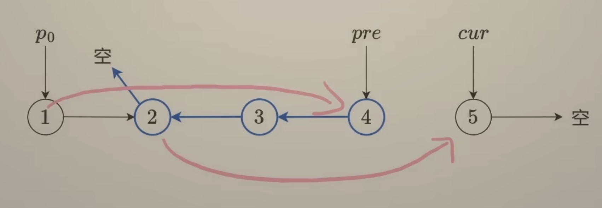
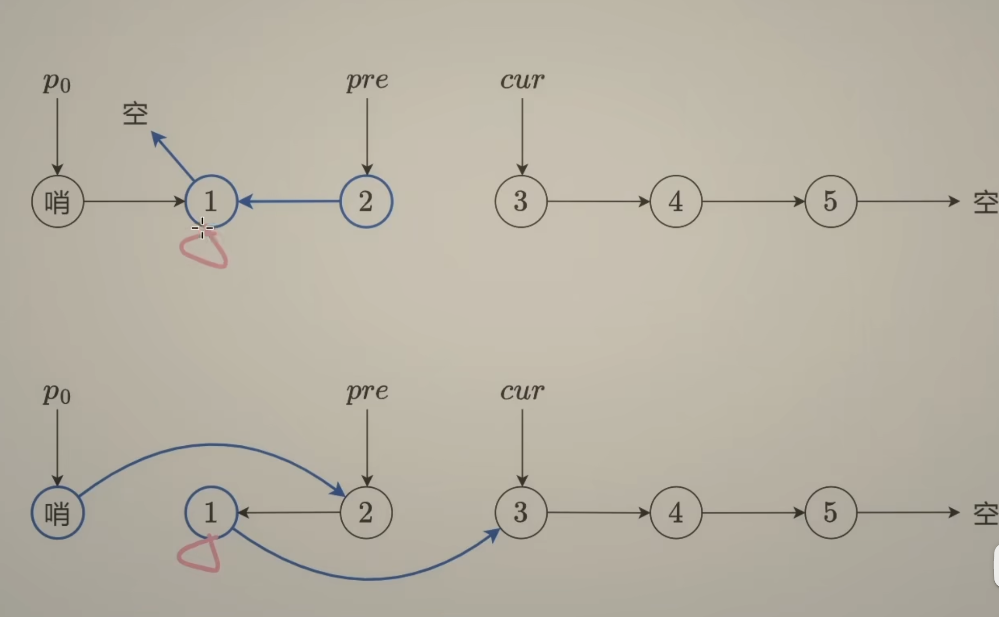

# 链表

## 俩数相加

```go
func addTwoNumbers(l1, l2 *ListNode) *ListNode {
	var (
		tail  *ListNode
		head  *ListNode
		carry = 0
	)
	for l1 != nil || l2 != nil {
		n1, n2 := 0, 0
		if l1 != nil {
			n1 = l1.Val
			l1 = l1.Next
		}
		if l2 != nil {
			n2 = l2.Val
			l2 = l2.Next
		}
		sum := n1 + n2 + carry
        sum, carry = sum % 10, sum / 10
        if head == nil {
            head = &ListNode{Val: sum}
            tail = head
        } else {
            tail.Next = &ListNode{Val: sum}
            tail = tail.Next
        }
	}
    if carry > 0 {
        tail.Next = &ListNode{Val: carry}
    }
    return head
}
```

## 合并俩个有序链表

```go
func mergeTwoLists(l1 *ListNode, l2 *ListNode) *ListNode {
	t := ListNode{}
    cur := &t
    for l1 != nil && l2 != nil {
        if l1.Val < l2.Val {
            cur.Next = l1
            l1 = l1.Next
        } else {
            cur.Next = l2
            l2 = l2.Next
        }
        cur = cur.Next
    }
    if l1 != nil {
        cur.Next = l1
    } else {
        cur.Next = l2
    }
    return t.Next
}
```

## 反转链表



```go
func reverseBetween(head *ListNode, left int, right int) *ListNode {
	res := &ListNode{Next:head}
    l := res
    for i := 0;i < left - 1;i++ {
        l = l.Next
    }

    var pre, cur *ListNode = nil, l.Next

    for i := 0;i < right - left + 1; i++ {
        next := cur.Next
        cur.Next = pre
        pre = cur
        cur = next
    }

    l.Next.Next = cur
    l.Next = pre

    return res.Next
}
```

## k个一组反转链表



```go
func reverseKGroup(head *ListNode, k int) *ListNode {
	n := 0
	for t := head; t != nil; t = t.Next {
		n++
	}

	res := &ListNode{Next: head}
	l := res

	var pre, cur *ListNode = nil, l.Next

	for ; n >= k; n -= k {
		for i := 0; i < k; i++ {
			next := cur.Next
			cur.Next = pre
			pre = cur
			cur = next
		}

		nxt := l.Next
		l.Next.Next = cur
		l.Next = pre
		l = nxt
	}

	return res.Next
}
```

## 删除倒数第N个数

```go
func removeNthFromEnd(head *ListNode, k int) *ListNode {
	res := &ListNode{Next: head}
	l, r := res, res
	for n := k; n > 0; n-- {
		r = r.Next
	}
	for r.Next != nil {
		l = l.Next
		r = r.Next
	}
	l.Next = l.Next.Next
	return res.Next
}
```

## 删除重复元素

```go
func deleteDuplicates(head *ListNode) *ListNode {
    if head == nil {
        return nil
    }
    cur := head
    for cur.Next != nil {
        if cur.Next.Val == cur.Val {
            cur.Next = cur.Next.Next
        } else {
            cur = cur.Next
        }
    }
    return head
}
```

## 删除重复元素2

```go
func deleteDuplicates(head *ListNode) *ListNode {
    res := &ListNode{Next:head}
    cur := res
    for cur.Next != nil && cur.Next.Next != nil { // 比较下一个节点 和下下一个节点
        val := cur.Next.Val
        if cur.Next.Next.Val == val {
            for cur.Next != nil && cur.Next.Val == val {
                cur.Next = cur.Next.Next
            }
        } else {
            cur = cur.Next
        }
    }
    return res.Next
}
```

## 旋转链表

```go
func rotateRight(head *ListNode, k int) *ListNode {
    if k == 0 || head == nil || head.Next == nil {
        return head
    }
    n := 1
    i := head
    for ; i.Next != nil; i = i.Next {
        n++
    }
    add := n - k % n
    if add == n {
        return head
    }
    i.Next = head
    for add > 0 {
        i = i.Next
        add--
    }
    res := i.Next
    i.Next = nil
    return res
}
```

## 分隔链表

```go
func partition(head *ListNode, x int) *ListNode {
    i := &ListNode{}
    iH := i
    j := &ListNode{}
    jH := j
    for head != nil {
        if head.Val < x {
            i.Next = head
            i = i.Next
        } else {
            j.Next = head
            j = j.Next
        }
        head = head.Next
    }
    j.Next = nil
    i.Next = jH.Next
    return iH.Next
}
```

## LRU

```go
type LRUCache struct {
    cap int
    list *list.List
    cache map[int]*list.Element
}

type entry struct {
    key, val int
}

func Constructor(capacity int) LRUCache {
    return LRUCache{capacity, list.New(), map[int]*list.Element{}}
}


func (this *LRUCache) Get(key int) int {
    node := this.cache[key]
    if node == nil {
        return -1
    }
    this.list.MoveToFront(node)
    return node.Value.(entry).val
}


func (this *LRUCache) Put(key int, value int)  {
    if node := this.cache[key]; node != nil {
        node.Value = entry{key, value}
        this.list.MoveToFront(node)
        return
    }
    this.cache[key] = this.list.PushFront(entry{key, value})
    if len(this.cache) > this.cap {
        delete(this.cache, this.list.Remove(this.list.Back()).(entry).key)
    }
}

```

## 重排链表

```go
// 143
func reorderList(head *ListNode)  {
    head2 := rev(mid(head))
    for head2.Next != nil {
        next := head.Next
        next2 := head2.Next
        head.Next = head2
        head2.Next = next
        head = next
        head2 = next2
    }
}

func rev(head *ListNode) (res *ListNode) {
    cur := head
    var pre *ListNode
    for cur != nil {
        next := cur.Next
        cur.Next = pre
        pre = cur
        cur = next
    }
    return pre
}

func mid(head *ListNode) (res *ListNode) {
    l, r := head, head
    for r != nil && r.Next != nil {
        l = l.Next
        r = r.Next.Next
    }
    return l
}
```

## 排序列表

```go
// 876. 链表的中间结点（快慢指针）
func middleNode(head *ListNode) *ListNode {
    pre, slow, fast := head, head, head
    for fast != nil && fast.Next != nil {
        pre = slow // 记录 slow 的前一个节点
        slow = slow.Next
        fast = fast.Next.Next
    }
    pre.Next = nil  // 断开 slow 的前一个节点和 slow 的连接
    return slow
}

// 21. 合并两个有序链表（双指针）
func mergeTwoLists(list1, list2 *ListNode) *ListNode {
    dummy := ListNode{} // 用哨兵节点简化代码逻辑
    cur := &dummy // cur 指向新链表的末尾
    for list1 != nil && list2 != nil {
        if list1.Val < list2.Val {
            cur.Next = list1 // 把 list1 加到新链表中
            list1 = list1.Next
        } else { // 注：相等的情况加哪个节点都是可以的
            cur.Next = list2 // 把 list2 加到新链表中
            list2 = list2.Next
        }
        cur = cur.Next
    }
    // 拼接剩余链表
    if list1 != nil {
        cur.Next = list1
    } else {
        cur.Next = list2
    }
    return dummy.Next
}

func sortList(head *ListNode) *ListNode {
    // 如果链表为空或者只有一个节点，无需排序
    if head == nil || head.Next == nil {
        return head
    }
    // 找到中间节点，并断开 head2 与其前一个节点的连接
    // 比如 head=[4,2,1,3]，那么 middleNode 调用结束后 head=[4,2] head2=[1,3]
    head2 := middleNode(head)
    // 分治
    head = sortList(head)
    head2 = sortList(head2)
    // 合并
    return mergeTwoLists(head, head2)
}
```

## 合并K个升序链表

```go
// 21. 合并两个有序链表
func mergeTwoLists(list1, list2 *ListNode) *ListNode {
    dummy := &ListNode{} // 用哨兵节点简化代码逻辑
    cur := dummy         // cur 指向新链表的末尾
    for list1 != nil && list2 != nil {
        if list1.Val < list2.Val {
            cur.Next = list1 // 把 list1 加到新链表中
            list1 = list1.Next
        } else { // 注：相等的情况加哪个节点都是可以的
            cur.Next = list2 // 把 list2 加到新链表中
            list2 = list2.Next
        }
        cur = cur.Next
    }
    // 拼接剩余链表
    if list1 != nil {
        cur.Next = list1
    } else {
        cur.Next = list2
    }
    return dummy.Next
}

func mergeKLists(lists []*ListNode) *ListNode {
    m := len(lists)
    if m == 0 { // 注意输入的 lists 可能是空的
        return nil
    }
    if m == 1 { // 无需合并，直接返回
        return lists[0]
    }
    left := mergeKLists(lists[:m/2]) // 合并左半部分
    right := mergeKLists(lists[m/2:]) // 合并右半部分
    return mergeTwoLists(left, right) // 最后把左半和右半合并
}
```

