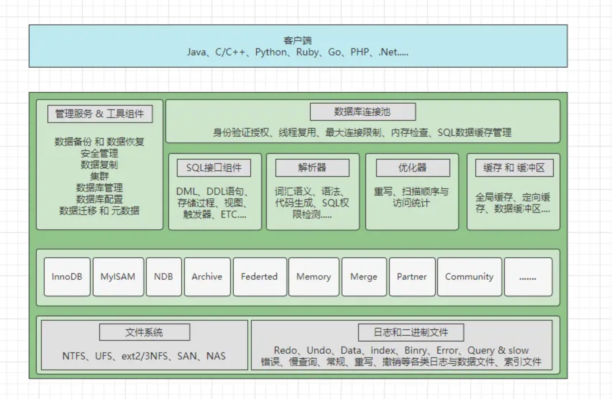
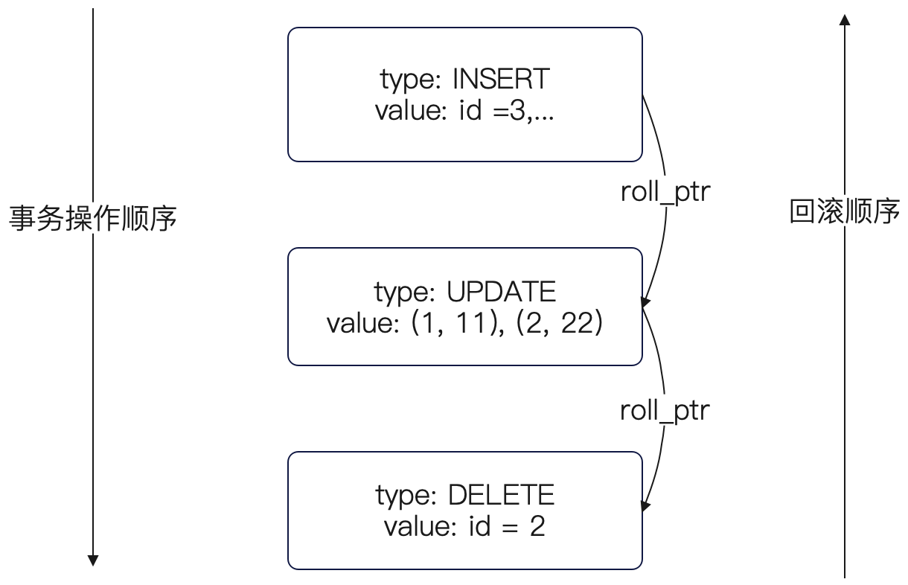
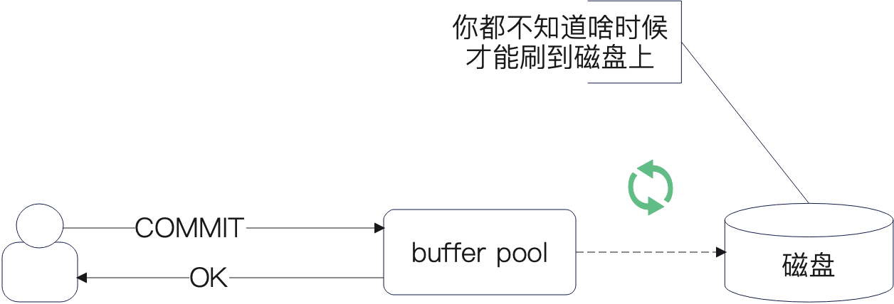

# Mysql

## Mysql 架构

身份验证 -> 解析器 -> 优化器 -> 执行器



## 存储引擎

MySQL 的主要存储引擎包括

1. InnoDB（重点）：
   支持事务、行级锁和外键
   提供高并发性能，适用于高负载的 OLTP 应用
   数据以聚集索引的方式存储，提高检索效率
2. MyISAM（重点）：
   不支持事务和外键，使用表级锁
   适合读取多、更新少的场景，如数据仓库。
   具有较高的读性能和较快的表级锁定。
3. MEMORY：
   数据存储在内存中，速度快，但数据在服务器重启后丢失
   适用于临时数据存储或快速缓存
4. NDB：
   支持高可用性和数据分布，适合大规模分布式应用
   提供行级锁和自动分区
5. ARCHIVE：
   用于存储大量历史数据，支持高效的插入和压缩。
   不支持索引，适合日志数据存储。

## 索引类型

从数据结构角度来看，MVSQL 索引可以分为以下几类

- B+树索引
- 哈希索引
- 倒排索引(Full-Text)
- R-树索引(多维空间树)

从常见的基于 InnoDB B+ 树索引角度来看，可以分为

- 聚簇索引(Clustered lndex)
- 非聚簇索引(Non-clustered Index)

从索引性质的角度来看，可以分为:

- 普通索引(二级索引、辅助索引)
- 主键索引
- 联合索引
- 唯一索引
- 全文索引
- 空间索引

> - 如果有主键，默认会使用主键作为聚簇索引的索引键（key）
> - 如果没有主键，就选择第一个不包含 NULL 值的唯一列作为聚簇索引的索引键（key）
> - 在上面两个都没有的情况下，InnoDB 将自动生成一个隐式自增 id 列作为聚簇索引的索引键（key）

### 索引失效

联合索引的最左匹配原则，在遇到范围查询（如 >、<）的时候，就会停止匹配，也就是范围查询的字段可以用到联合索引，但是在范围查询字段的后面的字段无法用到联合索引。注意，对于 >=、<=、BETWEEN、like 前缀匹配的范围查询，并不会停止匹配

例如 select * from t_table where a >= 1 and b = 2 从符合 a = 1 and b = 2 条件的第一条记录开始扫描，而不需要从第一个 a 字段值为 1 的记录开始扫描

### 数据排序

- 如果命中索引，利用索引排序
- 反之文件排序，数据量少在内存中排序，数据量大在磁盘文件进行外部排序，一般使用归并排序

### B+树索引

**B+树的查询过程**：

1. 数据从根节点找起，根据比较数据键值与节点中存储的索引键值，确定数据落在哪个区间，从而确定分支，从上到下最终定位到叶子节点
2. 叶子节点存储实际的数据行记录，但是一页有 16kb 大小，存储的数据行不止一条
3. 叶子节点中数据行以组的形式划分，利用页目录结构，通过二分查找可以定位到对应的组
4. 定位组后，利用链表遍历就可以找到对应的数据行

高效的查询性能：

- B+ 树是一种平衡树，保证了从每个叶子节点到根节点的路径长度相同，确保了查找、插入和删除等操作的时间复杂度为 O(log⁡n)O(\log n)O(logn)，即使在大数据量情况下，也能保证快速的响应时间。

树的高度增长不会过快，减少查询磁盘 I/O 次数：

- 与红黑树不同，B+ 树的数据增长不会导致高度增长过快。由于它是多叉树，非叶子节点仅保存主键或索引值和页面指针，这样每一页能容纳更多的记录，减少了查询时磁盘 I/O 的次数。

范围查询能力强：

- B+ 树特别适合范围查询，因为它通过节点间的链表连接，能够快速定位查询范围的起始点，并通过顺序扫描链表来获取连续的数据，效率较高。

**聚簇索引**：
索引叶子结点存储的是数据行，可以直接访问完整数据。每个表只能有一个聚簇索引，通常是主键索引，适合范围查询和排序
**非聚簇索引**：
索引叶子节点存储的是数据行的主键和对应的索引列，需通过主键才能访问完整的数据行。一个表可以有多个非聚簇索引(称之为非主键索引、辅助索引、二级索引)，适用于快速查找特定列的数据

> "回表"是指在使用二级索引（非聚簇索引）作为条件进行查询时，由于二级索引中只存储了索引字段的值和对应的主键值，无法得到其它数据。如果要查询数据行中的其它数据，需要根据主键去聚簇索引查找实际的数据行，这个过程被称为回表，**会带来随机IO**

**最左匹配原则**：

MySQL 索引的最左前缀匹配原则指的是在使用联合索引时，查询条件必须从索引的最左侧开始匹配。

**覆盖索引**：

MySQL 的覆盖索引（Covering index）是指二级索引中包含了查询所需的所有字段，从而使查询可以仅通过访问二级索引而不需要访问实际的表数据（主键索引）

**索引下推**：

索引下推（index Condition Pushdown，ICP）是一种减少回表查询，提高查询效率的技术，索引下推就是通过二级索引查到主键id后回表完再进行where条件过滤 改为 => 二级索引查到数据后直接where过滤一遍 再进行回表 减少回表的次数

### 自增主键

一句话解释自增主键，就是为了提高性能。自增主键从两方面提高性能：

- 自增主键可以使得新插入的记录在物理上总是出现在已有记录的后面，避免了页分裂，减少了索引碎片，提升了插入和查询的性能；
- 自增主键可以优化页的利用，减少磁盘 I/O 和内存使用，因为数据是按顺序写入的。并且在范围查询的时候，如果结果集是连续的，那么这些数据很有可能在同一页，或者相邻的页上，这样能够充分利用预读的特性。

除了这两个关键好处以外，从工程上来说自增主键也有好处：

- 从代码落地的角度上来说，可以避免自己手动生成、管理主键的问题；
- 可以统一规定使用自增主键，而不必担忧因为团队规模扩大导致大家胡乱使用主键；

> 预读；页分裂；减少页分裂，优化页利用；

## 实现事务

MySQL 通过锁、Redo Log、Undo Log 和 MVCC 等机制确保事务的原子性、隔离性和持久性，保证数据库的一致性和高并发性能。

1. **锁机制**：
   - MySQL 使用锁（如行锁、间隙锁等）来控制数据的并发访问和修改，确保事务的隔离性。
2. **Redo Log（重做日志）**：
   - Redo Log 用于记录事务对数据库的所有修改，它可以帮助在 MySQL 崩溃或宕机后，通过重放 Redo Log 恢复数据，从而保证事务的持久性。
3. **Undo Log（回滚日志）**：
   - Undo Log 用于记录事务的反向操作，简单来说，就是保存数据的历史版本，以便事务失败时能够回滚到事务开始前的状态，确保原子性和隔离性。
4. **MVCC（多版本并发控制）**：
   - MVCC 通过多版本机制提高了并发性能，满足了读写并发需求，能够支持读已提交和可重复读两种隔离级别，实现事务的隔离性。

## MVCC

多版本并发控制

### 版本链

我们先来看第一个存储不同版本的数据。MVCC 将数据的不同版本存储在 undo log 里面

在 undo log 里面使用**版本链**将数据不同的版本串联起来了，每个数据行有两个额外的隐藏列：

- trx_id，事务 ID，你可以认为它代表的就是版本
- roll_ptr，回滚指针，实质上就是用它来将不同版本串联在了一起

### Read View

那么当一个事务执行的时候，它在这么长的一个链条里面，就要考虑读数据应该读哪个版本了——也就是读哪个事务 ID 对应的数据。这个过程是通过一个称为 Read View 的机制来实现的，它也就是 MySQL 中实现不同隔离级别的核心机制。

Read View 决定了你这个事务能看到什么版本的数据。暂时你可以理解为，这个 Read View 就是记录了哪些事务 ID 对于当下这个正在执行的事务来说是可见的

Read View 是 MVCC 的一部分，MYSQL 主要用它来控制事务中的数据可见性，或者说支持事务不同隔离级别。

简单来说，Read View 有一个核心字段 m_ids，这个字段记录了生成 Read View 时候活跃事务 ID。m_ids 中的最小值假设是 min，最大值是 max，那么：

- 如果版本链中的事务 ID 大于 max，那么它的数据是不可见的
- 如果版本链中的事务 ID 小于 min，那么它的数据是可见的
- 如果版本链中的事务 ID 在 min 和 max 之间，但是又不在 m_ids 中，那么说明该事务已经提交了，也是可见的；
- 如果版本链中的事务 ID 在 m_ids 中，那么说明事务还没提交，那么它的数据是不可见的；

这里我们深入分析已提交读和可重复读。

- 对于已提交读来说，每次执行读数据的时候都会生成一个 Read View。
- 对于可重复读来说，在事务开始的时候生成一个 Read View，后面都用这个 Read View。

所以你瞬间就懂了可重复读的精髓—— Read View 始终都是那一个，后续就算事务执行过程中有新事务提交了，但是 Read View 没有更新，读到的就还是历史版本，也就是你事务开启时候的那一个版本的数据。

而与 MVCC 还强关联的一个概念是 redo log，它实际上并不是为了支撑 MVCC 而引入的，它是为了事务提交之后崩溃，还能恢复过来而引入的。

### MVCC 过程

MVCC，全称是多版本并发控制，是 MySQL InnoDB 中用来实现事务，以及事务隔离级别的核心机制。

它的关键点有两个：存储不同版本的数据以及如何控制事务读取哪个版本的事务。

就存储来说，MVCC 使用了版本链。每一条数据都有两个额外的列，一个是事务 ID，也可以看做是版本号；一个是回滚指针，MVCC 利用回滚指针将数据不同的版本串联在一起，并且将这个版本链存储到了 undo log 日志中。

而后，MVCC 使用 Read View 来做数据可见性控制，它记录了生成 Read View 时候还保持活跃的事务。在已提交读的情况下，事务会在每次执行读数据的时候，就重新生成一个 Read View，这样可以保证能够立刻看到最新的提交的事务。

而在可重复读的情况下，只会在事务 BEGIN 的时候生成一个 Read View，后面都是使用这个 Read View。

和 MVCC，或者说和事务实现机制有关的是 redo log，但是一般来说 redo log 是用于事务恢复的。例如说事务提交之后数据库就立刻崩溃了，工作还没做完，那么就需要从 redo log 来恢复数据，保证数据一致性。

### 隔离级别

1. **读未提交（READ UNCOMMITTED）**：
   - 这是最低的隔离级别。
   - 一个事务可以看到另一个事务尚未提交的数据修改。
   - 可能导致**脏读**问题，即读取到其他事务未提交的数据。
2. **读已提交（READ COMMITTED）**：
   - 一个事务只能看到已经提交的其他事务所做的修改。
   - 可以避免脏读问题，但可能会引发**不可重复读**问题，即在同一个事务中，相同的查询可能返回不同的结果，被另一个事务更改。
3. **可重复读（REPEATABLE READ）**：
   - 确保在一个事务中的多个查询返回的结果是一致的。
   - 可以避免不可重复读问题，但可能会引发**幻读**问题，即在同一个事务中，多次查询可能返回不同数量的行，另一个事务添加行。
   - **MySQL默认的隔离级别**。
4. **串行化（SERIALIZABLE）**：
   - 并发SQL事务在SERIALIZABLE隔离级别下的执行被保证是可串行化的。
   - 可串行化执行被定义为：并发执行的SQL事务的操作，其效果与这些SQL事务按某种顺序串行执行的效果相同。
   - 串行执行是指每个SQL事务在下一个SQL事务开始之前完成其全部操作。
   - 这是最高的隔离级别，保证事务间的操作结果相当于一个按顺序执行的单线程操作。
   - 可以避免所有的并发问题，但会大大降低并发性能。

### 幻读解决方案

- 针对**快照读**（普通 select 语句），是**通过 MVCC 方式解决了幻读**，因为可重复读隔离级别下，事务执行过程中看到的数据，一直跟这个事务启动时看到的数据是一致的，即使中途有其他事务插入了一条数据，是查询不出来这条数据的，所以就很好了避免幻读问题。
- 针对**当前读**（select ... for update 等语句），是**通过 next-key lock（记录锁+间隙锁）方式解决了幻读**，因为当执行 select ... for update 语句的时候，会加上 next-key lock，如果有其他事务在 next-key lock 锁范围内插入了一条记录，那么这个插入语句就会被阻塞，无法成功插入，所以就很好了避免幻读问题。

## Log

### undo log

undo log 这个名字叫就已经揭示了它的作用，它的核心作用有两个：

- **支持回滚操作**
- **支持 MVCC**

回滚操作进一步划分也可以分成是用户主动回滚——调用了 ROLLBACK，或者被动回滚——数据库崩溃之后恢复，但是核心步骤是类似的。

undo log 中记录了两大类东西：

- MVCC 使用版本链
- 事务操作的逆向操作，它针对增删改记录了不同的信息：
  - 对于 INSERT 操作来说，它记录了完整的行，那么回滚的时候就可以根据这个行来找到被插入的数据，而后执行删除。
  - 对于 UPDATE 来说，它记录了受影响的行修改之前的值；
  - 对于 DELETE 来说，它记录了被删除的行的主键，删除操作在 MYSQL 执行的时候只是把数据标记为被删除，并没有真的删除，所以回滚的时候就是把这个被删除的标记位去掉。

使用 INSERT 操作时，undo log 不仅仅记录了 ID，一般是整个数据都记录下来了，只是说回滚的时候只需要 id 就可以定位到了。

使用 UPDATE 操作时，为了记录 undo log，UPDATE 执行的时候会先解析 WHERE 条件，定位到被更新的数据之后，才能记录 undo log。

> 这个有点类似于我们在分布式事务里面讨论的，如果要生成反向操作，你需要先知道老的数据是什么。

而 undo log 自身也可以看做是一个链表：



### redo log

redo log 的主要作用是确保事务的持久性，即使在发生故障时也能保持数据库的一致性。它和 undo log 是相辅相成的，undo log 是在崩溃的时候回滚，而 redo log 是在崩溃的时候重新执行事务。

所以用 undo log 回滚还是用 redo log 重做事务，就取决于事务有没有被提交。

你可能很难理解，就是为什么事务提交了，数据库崩溃了，还要用 redo log 来重做事务。这其实有一个点：事务修改数据只是修改 buffer pool，后续再异步的刷新到磁盘上。也就是说当你的业务收到 COMMIT 成功的响应的时候，数据可能还在磁盘上。



这个时候就有一个时间差了，我事务提交了，但是我还没修改磁盘上上的数据，这不就是寄了吗？因此 redo log 就是为了解决这个问题的。因此在修改数据的时候，其实是先写 redo log，再修改 buffer pool。

这时候你就有疑问了，干嘛不直接写磁盘，又写 redo log，又写 buffer pool 的。这就要说到 redo log 的特性了，redo log 本身是一种 WAL（Write-Ahead Log），也就是顺序写的日志，只追加不修改。所以它的性能非常好，极快。

相当于，如果你直接修改磁盘上的数据，那就是随机写；但是你写 redo log，那就是顺序写。而众所周知，顺序写比随机写快多了。

但是这又会有一个问题，redo log 最开始是写到了 redo log buffer 上，而你 redo log 也得刷盘啊。

这个刷盘行为由 innodb_flush_log_at_trx_commit 来控制：

- 0：每秒刷新到磁盘，是从 redo log buffer 到磁盘。
- 1：每次提交的时候刷新到磁盘上，也就是最安全的选项，InnoDB 的**默认值**。
- 2：每次提交的时候刷新到 page cache 里，依赖于操作系统后续刷新到磁盘。而操作系统什么时候刷，就不知道了；

因此很显然，这就有一个问题：如果要是用了参数 0 和 2，那么你业务收到提交成功的时候，redo log 都还在磁盘上，如果此时宕机，一样会丢掉数据。类似的，参数是 2 也会有问题。

### bin log

前面介绍的 undo log 和 redo log 这两个日志都是 Innodb 存储引擎生成的。

MySQL 在完成一条更新操作后，Server 层还会生成一条 binlog，等之后事务提交的时候，会将该事物执行过程中产生的所有 binlog 统一写 入 binlog 文件。

binlog 文件是记录了所有数据库表结构变更和表数据修改的日志，不会记录查询类的操作，比如 SELECT 和 SHOW 操作。

> 事务提交后，redo log 和 binlog 都要持久化到磁盘，但是这两个是独立的逻辑，可能出现半成功的状态，这样就造成两份日志之间的逻辑不一致。
>
> **MySQL 为了避免出现两份日志之间的逻辑不一致的问题，使用了「两阶段提交」来解决**（XA事务）
>
> - **准备阶段**：裁判（协调者）会依次询问两位拳击手（参与者）是否准备好了，然后拳击手听到后做出应答，如果觉得自己准备好了，就会跟裁判说准备好了；如果没有自己还没有准备好（比如拳套还没有带好），就会跟裁判说还没准备好。
> - **提交阶段**：如果两位拳击手（参与者）都回答准备好了，裁判（协调者）宣布比赛正式开始，两位拳击手就可以直接开打；如果任何一位拳击手（参与者）回答没有准备好，裁判（协调者）会宣布比赛暂停，对应事务中的回滚操作。

## Mysql 锁

MYSQL 的锁机制，有很多角度可以回答:

- 行锁与表锁：是锁住行还是锁住表；
- 共享锁与排它锁：这是指一个人加了锁之后，另外一个人还能不能加锁；
- 意向锁：就是想加锁，但是没加锁的意向；
- 记录锁、临键锁和间隙锁：这有点类似行锁还是表锁，描述的是锁的范围，但是这个更加详细：
  - 记录锁：锁住特定的行
  - 间隙锁：锁住行之间的间隙
  - 临键锁：next-key lock，不管是英文名还是中文译名都很难理解，简单说，记录锁 + 间隙锁合并在一起就是临键锁了

如果在查询中查询没有命中任何索引，那么就会使用表锁。这种情况下，性能衰减非常可怕

另外一个就是隔离级别和锁的关系的问题，这主要影响的是临键锁和间隙锁，这两种锁只工作在可重复读这个隔离级别下

不建议在数据库中直接使用 SELECT FOR UPDATE 之类的这种悲观锁，而是更加倾向于使用乐观锁。通过使用乐观锁来优化了很多 SELECT FOR UPDATE 的这种写法，一方面提高了性能，一方面也规避了死锁等问题

同时应该把隔离级别调整到已提交读上，这样可以减少 MYSQL 使用锁。例如说间隙锁和临键锁就是工作在可重复读这个隔离级别的。通常我们说已提交读的性能会更好，也有锁这个原因

### 记录锁、临键锁和间隙锁

1. 记录锁：首先记录锁针对的是一条条的数据，例如说在使用等值查询的时候，一般加的就是记录锁
2. 隙锁针：对的是某一个范围，但是间隙锁一般不包含端点
3. 临键锁：可以看做是记录锁和间隙锁的结合

等值查询记录锁，范围查询间隙锁，端点存在临键锁

> 在读已提交隔离级别下，行级锁的种类只有记录锁，也就是仅仅把一条记录锁上。
>
> 在可重复读隔离级别下，行级锁的种类除了有记录锁，还有间隙锁（目的是为了避免幻读）

### 悲观锁和乐观锁

**悲观锁（Pessimistic Locking）**：适合并发冲突多，写多读少

- 假设会发生冲突，因此在操作数据之前就对数据加锁，确保其他事务无法访问该数据。常见于对数据一致性要求较高的场景。
- 实现方式：使用行级锁或表级锁，例如可以使用 `SELECT ... FOR UPDATE` 或 `LOCK IN SHARE MODE` 语句来加锁。

**乐观锁（Optimistic Locking）**：适合并发冲突小，读多写少

- 假设不会发生冲突，因此在操作数据时不加锁，而是在更新数据时进行版本控制或校验。如果发现数据被其他事务修改，则会拒绝当前事务的修改，需重新尝试。
- 实现方式：通常通过版本号或时间戳来实现，每次更新时检查版本号或时间戳是否一致。

### 行级锁

```sql
//对读取的记录加共享锁(S型锁)
select ... lock in share mode;

//对读取的记录加独占锁(X型锁)
select ... for update;
```

共享锁（S锁）满足读读共享，读写互斥。独占锁（X锁）满足写写互斥、读写互斥。

## 主从同步

### 复制类型

- **异步复制**：主库不需要等待从库的响应（性能较高，数据一致性低）。
- **同步复制**：主库同步等待所有从库确认收到数据（性能差，数据一致性高）。
- **半同步复制**：主库等待至少一个从库确认收到数据（性能折中，数据一致性较高）。

## 性能优化

### EXPLAIN

在MySQL中，`EXPLAIN` 是一个非常有用的SQL语句，用于分析查询语句的执行计划。执行计划是数据库如何执行查询语句的详细步骤，包括如何访问数据（使用索引还是全表扫描）、如何连接表等。通过分析执行计划，你可以了解查询的性能瓶颈，并进行相应的优化。

1. **id**：查询中执行的顺序标识（从1开始）。
2. **select_type**：查询的类型（如SIMPLE, PRIMARY, SUBQUERY等）。
3. **table**：正在访问的表的名称。
4. **partitions**：匹配的分区。
5. **type**：连接类型（如ALL, index, range, ref, eq_ref等）。
6. **possible_keys**：查询中可能使用的索引。
7. **key**：实际使用的索引。
8. **key_len**：使用的索引的长度。
9. **ref**：显示索引的哪一列被使用。
10. **rows**：估计需要读取的行数。
11. **filtered**：表示此查询的表的行被过滤的百分比。
12. **Extra**：额外的信息，如是否使用了索引，是否需要排序等。

### 调优

平时进行SQL调优，主要是通过以下方法：

1. 合理设计索引，利用联合索引进行覆盖索引的优化，避免回表的发生，减少一次查询和随机I/O。
2. 避免使用 `SELECT *`，只查询必要的字段。
3. 避免在SQL中进行函数计算等操作，使得无法命中索引。
4. 避免使用 `%LIKE`，导致全表扫描。
5. 注意联合索引需满足最左匹配原则。
6. 不要对无索引字段进行排序操作。
7. 连表查询需要注意不同字段的字符集是否一致，否则也会导致全表扫描。

除此之外，还可以：

- 利用缓存来优化，一些变化少或者访问频繁的数据设置到缓存中，减轻数据库的压力，提升查询的效率。
- 通过业务来优化，例如少展示一些不必要的字段，减少多表查询的情况，将列表查询替换成分页分批查询等等。