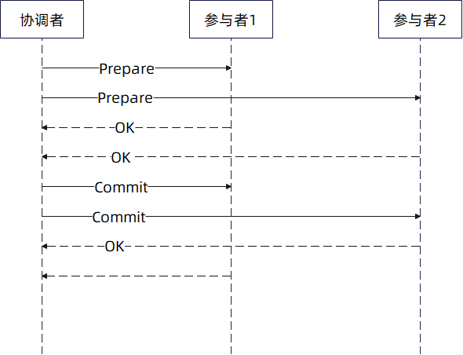
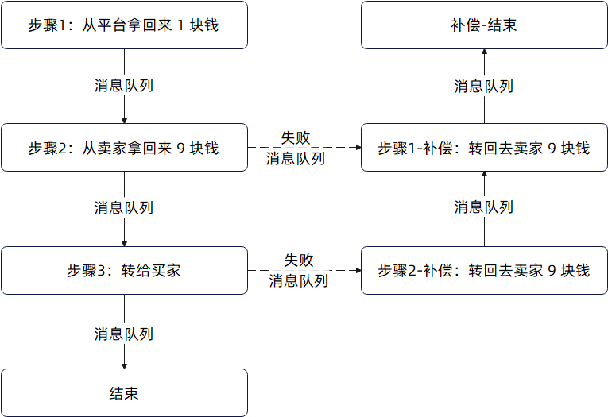
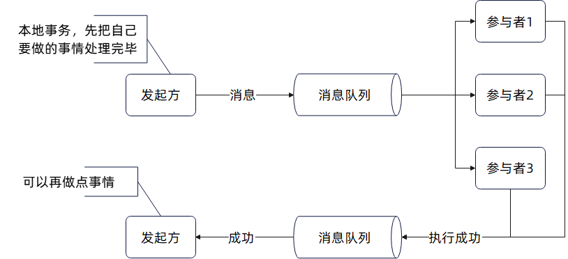
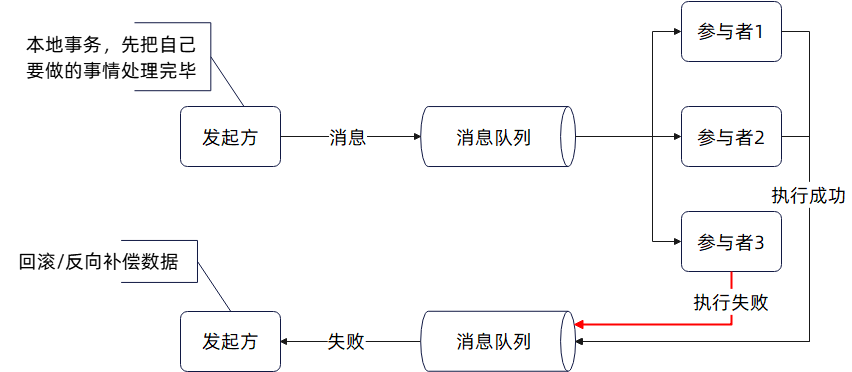
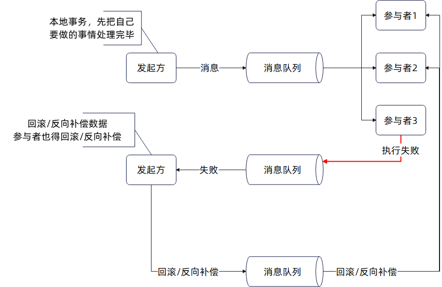

# 分布式系统

## 幂等性

幂等性（Idempotence）是一个重要的概念，它指的是一个操作或函数多次执行的结果与执行一次的结果相同。换句话说，无论这个操作执行多少次，系统的状态都保持不变，或者最终结果都是一样的。

幂等在分布式系统中十分重要，这主要是因为：

- 可靠性：在分布式系统中，网络延迟或故障可能导致请求被重复发送。幂等操作可以确保即使请求被重复执行，系统状态也不会出错。
- 简化逻辑：幂等性可以简化错误处理和重试逻辑，因为不需要担心重复执行带来的副作用。
- 一致性：在并发环境下，幂等操作有助于保持系统的一致性。

正常来说，在分布式环境下，重试 + 幂等是保证业务成功的重要手段。

场景

1. 表单提交，通过要求表单带上一个唯一标识符，可以解决表单重复提交的问题，例如说在电商里面非常重要的重复创建订单问题。
2. 消费者幂等。实践中我会要求我的同事，要尽可能将消费者设计为幂等，而后叠加重试，可以确保消息一定会被消费，并且至多被消费一次。
3. 微服务调用，通过重试加接口幂等的措施，来保证业务的可靠性。

应该说，在整个分布式系统中，大多数的可用性问题、一致性问题和业务可靠性问题，基本上都可以通过重试加幂等来解决。如果要是重试之后都失败了，那就只能考虑手工介入了。

> 表单重复提交；消费者幂等；重试+幂等

## 如何实现幂等性

幂等的意思是，同一个请求执行多次的结果是一样。大多数时候，幂等是通过拒绝多次执行来达成的。

**1. 利用唯一索引来保证幂等**

基本原理：

- 通过在数据库表中设置唯一索引（如订单号、用户ID等），确保每次插入或更新操作都不会产生重复的数据。
- 当尝试插入重复数据时，数据库会抛出唯一性约束异常，系统可以捕获该异常并进行相应处理。

优点：

- 实现简单，直接利用数据库的特性。
- 保证数据的一致性和唯一性。

缺点：

- 依赖于数据库的性能，在高并发情况下可能会成为瓶颈。
- 异常处理逻辑需要谨慎设计，避免影响用户体验。

**2. 利用 Redis 来保证幂等**

基本原理：

- 利用 Redis 的键值存储特性，在执行操作前先在 Redis 中检查是否存在特定的键。
- 如果键已存在，则认为是重复操作，直接返回或忽略。
- 如果键不存在，则认为可以执行，并且写入 Redis。这个过程要注意操作顺序和部分失败的问题。

优点：

- Redis 的读写性能极高，适合高并发场景。
- 可以灵活设置键的过期时间，避免长时间占用存储空间。

缺点：

- 需要额外的存储资源和管理成本。
- 在分布式环境下，需要考虑 Redis 的集群和高可用性。
- Redis 宕机之后数据丢失

**3. 利用 Redis 和唯一索引来保证幂等**

基本原理：

- 结合 Redis 的高性能和数据库的唯一索引特性，先在 Redis 中进行幂等性检查，再在数据库中执行操作。
- Redis 用于快速判断是否为重复请求，数据库唯一索引作为最终保障。

优点：

- 兼具 Redis 的高性能和数据库的可靠性。
- 多层次保障，提高系统的健壮性。

缺点：

- 实现复杂度较高，需要维护两套系统。
- 成本较高，需要同时管理 Redis 和数据库。

**4. 利用布隆过滤器和唯一索引来保证幂等**

基本原理：

- 布隆过滤器用于快速判断元素是否可能存在于集合中，先通过布隆过滤器进行初步检查。
- 如果布隆过滤器判断为不存在，再进行数据库操作，并利用唯一索引确保数据唯一性。

优点：

- 布隆过滤器占用空间小，查询速度快。
- 减少对数据库的访问，降低数据库压力。

缺点：

- 布隆过滤器有误判率，可能将不存在的元素误判为存在。
- 需要定期维护布隆过滤器，避免数据溢出。

**5. 利用布隆过滤器 + Redis + 唯一索引来保证幂等**

基本原理：

- 结合布隆过滤器、Redis 和数据库唯一索引的多重保障机制。
- 先通过布隆过滤器进行初步检查，再通过 Redis 进行二次确认，最后在数据库中执行操作并利用唯一索引确保数据唯一性。

优点：

- 多层次防护，极大提高幂等性的可靠性。
- 充分利用各技术的优势，兼顾性能和可靠性。

缺点：

- 实现复杂度极高，维护成本大。
- 系统架构复杂，需要考虑各组件的协同和高可用性。

## 分布式锁

分布式锁是一种在分布式系统中用于控制多个进程或线程对共享资源进行互斥访问的机制。简单来说，它确保在分布式环境下，同一时间只有一个进程或线程能够操作某个共享资源，从而避免数据不一致或资源冲突的问题。

其实就是一个运作在分布式环境下的锁。

使用分布式锁只有一个原因：排它性地操作资源。也就是说，如果分布式环境下有多个进程/线程/协程要操作同一个资源，那么大家需要先拿到锁，确保同一时刻只有一个人能操作这个资源。

这一类的资源有一个特点，就是如果多个人同时操作的话，会出现数据不一致的场景。最典型的就是分布式任务调度，即某个任务在同一时刻只能有一个人执行。还有类似于更新缓存和数据库的时候，可以用分布式锁来解决并发更新的问题。

某些情况下可以通过优化处理逻辑来规避使用分布式锁。

第一种方式就是通过引入顺序消息。假设说现在 A 和 B 要操作同一个资源，可以让 A 和 B 丢一个消息到消息队列，但是这个消息需要是顺序消息。而后有一个消费者消费这些顺序消息。

第二种方式是使用数据库乐观锁，显然只有需要保护的资源是数据库数据的时候，才能使用这个方式。

> 顺序消息；数据库乐观锁；
>
> 引入顺序消息，数据库乐观锁，逼不得已再用分布式锁；

## 分布式锁解决方案

- 基于数据库的分布式锁实现
  - 实现方式：
    - 排他锁：在数据库中创建一个锁表，通过插入记录来实现锁的获取，通过删除记录来释放锁。
    - 乐观锁：使用版本号或时间戳来检测冲突，适用于读多写少的场景。
  - 优点：
    - 利用现有数据库资源，无需额外部署。
    - 分布式锁是持久化的，宕机之后再恢复锁也还在。
  - 缺点：
    - 性能较低，依赖数据库的可用性。
    - 锁的粒度较粗，容易成为瓶颈。
    - 可能存在死锁问题。
- 基于 Redis 的分布式锁实现
  - 实现方式：
    - 使用SETNX（Set If Not Exists）命令来尝试获取锁。
    - 使用EXPIRE命令设置锁的过期时间，防止死锁。
  - 优点：
    - 性能高，操作简单。
    - 支持多种锁类型和高级特性。
  - 缺点：
    - 依赖Redis的可用性。
    - 在分布式环境下，需要处理时钟同步问题。
    - 考虑 Redis 宕机之后锁就没有了，需要使用 redlock 等解决方案。

也可以利用 Zookeeper、etcd 等中间件的高可靠性和一些特殊机制来实现锁。还有一种比较特殊的基于消息队列的实现，比如RabbitMQ、Kafka，通过独占消费来实现锁。

TODO: 我利用 Go 语言基于 Redis 写过一个分布式锁。它提供了加锁重试、解锁重试、TryLock，手动续约和自动续约功能。整体来说性能很不错，可用性则是完全取决于 Redis。

## 分布式锁三要素

分布式锁的三个基本要素是加锁、释放锁和设置过期时间。

其中加锁，要考虑是否是可重入锁的问题。如果是可重入锁，那么加锁可能对应的是计数增加 1。

释放锁则要注意只能释放自己的锁。也就是在长期运行中，业务方崩溃之后锁被人抢走了，而后业务方又恢复过来，还以为自己有锁，那么就有可能把别人加的锁抢走。

设置过期时间则是为了防止出现死锁。例如说业务方在抢到锁之后崩溃了，如果没有过期时间那么这个锁就再也无法被任何人拿到了。

很容易想到，过期时间不管设置多长时间，业务方都有可能未能在过期时间内完成业务逻辑。所以这个时候就需要引入续约机制，当业务方在发现快要过期了，但是自己又还没结束的时候，延长锁的过期时间。

## CAP 理论

CAP 理论是分布式系统设计中的三个基本属性，分别是：

1. **⼀致性（Consistency）： **即系统在所有节点上的数据是⼀致的。如果在⼀个节点上修改了数据，那么其他节点应该⽴即看到这个修改；

2. **可⽤性（Availability）：** 可⽤性要求系统能够对⽤户的请求做出响应，即使在出现节点故障的情况下仍然保持可⽤；

3. **分区容错性（Partition Tolerance）：** 分区容错性是指系统在⾯对⽹络分区的情况下仍能够正常⼯作。即，当节点之间的⽹络出现故障或⽆法通信时，系统仍能够保持⼀致性和可⽤性。

CAP 理论提出的是在分布式系统中这三个属性不能同时被满⾜。这是由于在分布式系统中，⽹络的不确定性和延迟会导致⽆法同时满⾜⼀致性、可⽤性和分区容错性。

在实践中，分布式系统总是会选择 P，也就是分区容错性。那么剩下的就是 AP 和 CP 之间做选择了。

- 如果选择 CP 模型，也就是你放弃了 A。这个很容易理解，假设说你有两个分区，p1 和 p2。如果你要保证 C （一致性），那么你在写 p1 的时候，就必须同步把这个数据扩散到 p2 上。在这个过程中，p2 是不能对外提供服务的，否则就会出现不一致。因此影响了可用性；
- 如果选择 AP 模型：也就是你放弃了 C。同样的例子，也就是你写入 p1 的时候，根本不管 p2，p2 此时也对外提供服务。那么就有可能从 p2 上读到老数据，引起数据不一致的问题。

## 数据一致性

分布式环境下，数据一致性难以保证主要是由两方面造成的。

一方面是并发更新，也就是有多个线程并发更新同一个数据。举个例子，比如说先更新 MySQL 再更新 Redis 这种缓存更新方案。那么并发更新容易出现的就是线程1 先更新 MySQL，但是后更新 Redis；而线程 2 后更新 MySQL 反而先更新 Redis。这就会导致 MySQL 和 Redis 的数据不一致。

这种不一致是很好的解决的，不管使用版本号来控制，还是用分布式锁来控制，都很好解决。

另一方面就是部分失败，也就是多个操作难以保证它们要么都成功，要么都失败。同样是更新缓存的这个例子，任何一个线程都有可能在更新了 MySQL 之后，更新 Redis 失败。而一旦遇到这种部分失败的问题，完全没有办法解决。最多就是引入重试，但是引入重试之后重试也可能失败。

目前来看，所有的分布式事务解决方案寻求的都是最终一致性。并且如果进一步思考的话会发现分布式事务连隔离性都没解决，这就会导致同一时刻不同线程可能看到完全不同的数据。

## BASE 原理

BASE 是一个缩写，表达了三个特性：

- **基本可用性（Basically Available）**：系统在大多数情况下都能正常响应请求，即使在出现故障或网络分区的情况下，系统仍然能够提供基本的服务。这意味着系统不会因为某个节点的故障而完全不可用。
- **软状态（Soft State）**：系统中的数据状态允许在某个时间点不同步。软状态允许系统在一段时间内存在不一致的状态，这种状态可以通过后续的操作逐渐达到一致。
- **最终一致性（Eventual Consistency）**：经过一段时间后，所有数据节点最终会达到一致的状态。虽然系统在短时间内可能存在数据不一致的情况，但通过一定的机制和策略，最终所有节点的数据会趋于一致。

基本上所有的分布式中间件，业务都是使用 BASE 来作为设计指导思想。比如说：

- 分布式数据库：如 Cassandra、Amazon DynamoDB 等，这些系统通过牺牲强一致性来提高系统的可用性和扩展性。
- 微服务架构：在微服务架构中，各个服务之间通过网络通信，BASE 理论可以帮助设计者在可用性和一致性之间做出权衡。
- 消息队列系统：如 Kafka、RabbitMQ 等，通过异步消息传递和最终一致性来处理分布式事务。

本质上来说，BASE 是因为 CAP 没有办法同时满足才搞出来一个折中方案罢了。它是在 CAP 理论的基础上，针对 AP（可用性和分区容错性）方案进行扩展，提供了一种在实际系统中实现最终一致性的方法。

## 分布式事务

分布式事务是指在分布式系统中，涉及多个节点（如不同的数据库、服务或应用）的事务。它需要保证这些节点上的操作要么全部成功，要么全部失败，以确保数据的一致性和完整性（当然在，这是妄想）。

分布式事务和单体事务还是很不一样的，单体事务只涉及数据库一个组件，ACID 之类的特性还是能满足的，虽然也很复杂。

此外，有些人会说分布式事务也追求 ACID，但是我只能说这个想 P 吃。任何的已有的分布式事务解决方案，差不多都是垃圾，不要说 ACID 全满足，连满足单一的一致性都是要了老命。

常见的分布式事务解决方案：

- 两阶段提交（2PC）
  - 原理：
    - 准备阶段：协调者询问所有参与者是否可以提交事务，参与者执行本地事务并反馈结果。
    - 提交阶段：如果所有参与者都同意，协调者发出提交命令；如果有任何一个参与者不同意，协调者发出回滚命令。
  - 优点
    - 强一致性：确保事务的原子性和一致性。
    - 标准化：广泛支持，易于实现。
  - 缺点
    - 同步阻塞：在准备阶段和提交阶段，参与者需要锁定资源，可能导致长时间阻塞。
    - 单点故障：协调者成为单点故障点。
    - 数据不一致风险：在提交阶段如果协调者崩溃，可能导致数据不一致。
- 三阶段提交（3PC）
  - 原理
    - 预提交阶段：协调者询问参与者是否可以预提交，参与者反馈结果。
    - 准备阶段：如果所有参与者都同意预提交，进入准备阶段，参与者执行本地事务并反馈结果。
    - 提交阶段：如果所有参与者都同意准备，进入提交阶段；否则回滚。
  - 优点
    - 减少阻塞：增加了预提交阶段，减少了阻塞时间。
    - 提高可用性：在一定程度上减少了单点故障的影响。
  - 缺点
    - 实现复杂：相比2PC，增加了阶段，实现更复杂。
    - 仍存在单点故障：协调者依然是单点故障点。
- XA事务
  - 原理
    - 基于XA规范：定义了事务管理器（TM）和资源管理器（RM）之间的接口。
    - 两阶段提交（2PC）：通过2PC协议协调多个资源管理器共同完成事务。
  - 优点
    - 标准化：广泛接受的标准，支持多种数据库和中间件。
    - 强一致性：通过2PC协议确保数据一致性。
  - 缺点
    - 性能开销大：多次网络通信和资源锁定，性能开销大。
    - 单点故障：事务管理器成为单点故障点。
    - 阻塞问题：在准备阶段，资源管理器需要锁定资源，可能导致长时间阻塞。
- TCC（Try-Confirm-Cancel）
  - 原理
    - Try阶段：尝试执行业务操作，但不提交事务。
    - Confirm阶段：如果Try阶段成功，执行确认操作，提交事务。
    - Cancel阶段：如果Try阶段失败，执行取消操作，回滚事务。
  - 优点
    - 灵活性强：适用于复杂的业务场景。
    - 无阻塞：不需要长时间锁定资源。
  - 缺点
    - 实现复杂：需要业务代码实现Try、Confirm、Cancel三个阶段的逻辑。
    - 业务侵入性强：对业务代码有较大侵入性。
- Saga模式
  - 原理
    - 将大事务拆分：将大事务拆分成多个小事务，每个小事务有相应的补偿操作。
    - 顺序执行：按顺序执行小事务，如果某个小事务失败，执行补偿操作回滚。
  - 优点
    - 适用于长事务：适合处理长流程的事务。
    - 高可用性：每个小事务独立执行，系统可用性高。
  - 缺点
    - 实现复杂：需要设计补偿逻辑。
    - 数据不一致窗口：在执行补偿操作前，数据可能处于不一致状态。
- Seata 中的AT事务
  - 原理
    - 自动处理两阶段：通过框架自动处理事务的两阶段提交。
    - 基于.undo日志：在第一阶段记录.undo日志，用于回滚。
  - 优点
    - 无侵入性：对业务代码无侵入性。
    - 自动回滚：自动处理事务的回滚。
  - 缺点
    - 依赖数据库：对数据库有依赖，需要支持.undo日志。
    - 性能开销：记录.undo日志会增加性能开销。
- 最大努力通知
  - 原理
    - 系统A调用系统B：系统A调用系统B后，系统B不断重试通知系统A，直到成功或达到最大重试次数。
  - 优点
    - 实现简单：实现较为简单。
    - 解耦：系统A和系统B解耦。
  - 缺点
    - 一致性保障弱：可能存在长时间未通知成功的情况。
    - 重试开销：频繁重试会增加系统开销。
- 可靠消息最终一致性方案
  - 原理
    - 事务发起方：在执行本地事务成功后，向消息中间件发送一条消息。这部分对应的就是所谓的**本地消息表**解决方案；
    - 消息中间件：负责可靠地存储和传递消息。
    - 事务参与方：从消息中间件接收消息，并执行相应的业务操作。
    - 确认机制：事务参与方在处理完消息后，向消息中间件发送确认消息，消息中间件根据确认情况更新消息状态。
  - 优点
    - 解耦：通过消息中间件解耦事务发起方和事务参与方，系统架构更灵活。
    - 高可用性：消息中间件通常具备高可用性，能够保证消息的可靠传递。
    - 最终一致性：通过消息的可靠传递和确认机制，确保系统的最终一致性。
    - 异步处理：支持异步处理，提高系统的响应速度和吞吐量。
  - 缺点
    - 一致性保障较弱：虽然能保证最终一致性，但在消息处理过程中，系统可能存在短暂的数据不一致状态。
    - 实现复杂度：需要处理消息的持久化、投递、确认等复杂逻辑。
    - 依赖消息中间件：系统的可靠性依赖于消息中间件的稳定性。
    - 消息顺序问题：在分布式环境中，消息的顺序可能无法保证，需要额外处理消息顺序问题。
    - 重复消息处理：可能出现消息重复投递的情况，需要实现幂等性处理机制。
- 延迟事务
  - 原理
    - 用户利用分库分表中间件开启事务
    - 分库分表中间件只有在执行特定语句的时候才会在目标库上开启事务
    - 重试直到成功或者达到最大重试次数
  - 优点：
    - 节省资源：避免在事务不会涉及的数据库上开启事务
  - 缺点：
    - 数据一致性比较差：在出现部分提交成功的情况下，没有任何处理办法

## 两阶段提交

2PC 协议涉及两个主要角色：

- 协调者（Coordinator）：负责协调各个参与者的操作，决定事务的最终提交或回滚。
- 参与者（Participant）：执行具体的事务操作，并根据协调者的指令进行提交或回滚。

通常来说，协调者是一个可用性瓶颈，因为协调者一旦崩溃，整个分布式事务就没有办法继续执行下去了。

协议分为两个阶段：

**第一阶段：准备阶段（Prepare Phase）**

- 事务询问：协调者向所有参与者发送事务预处理请求（Prepare），询问是否可以执行事务。
- 执行本地事务：各参与者执行本地事务的操作，如记录事务日志、锁定资源等，但不实际提交，进入预提交状态。
- 反馈响应：各参与者向协调者反馈事务操作的结果。如果执行成功，返回“同意”（Vote Yes）；如果执行失败，返回“中止”（Vote No）。

**第二阶段：提交/回滚阶段（Commit/Rollback Phase）**

- 决策：协调者根据参与者的反馈结果决定是否提交或回滚事务。
  - 提交：如果所有参与者都返回“同意”，协调者向所有参与者发送提交请求（Commit）。
  - 回滚：如果有任何参与者返回“中止”，或者超时未收到某些参与者的响应，协调者向所有参与者发送回滚请求（Rollback）。
- 执行决策：参与者根据协调者的指令执行提交或回滚操作，并返回执行结果。

整个过程如下图。可以看到，不管是准备阶段还是提交/回滚阶段，都是可以并发执行。

**两阶段提交协议的优点**

- 简单性：协议逻辑相对简单，易于理解和实现。

**两阶段提交协议的缺点**

- 单点故障：协调者是系统的关键节点，其故障可能导致整个事务失败。
- 阻塞：在准备阶段，所有参与者必须等待协调者的决策，可能导致系统阻塞。
- 性能问题：由于需要多轮通信和日志记录，性能可能受到影响。

**解决方案和改进**

为了克服2PC的缺点，可以采取以下措施：

- 引入协调者备份：避免单点故障。
- 优化通信机制：减少通信开销，提高性能。
- 使用三阶段提交协议（3PC）：在2PC基础上增加一个预提交阶段，进一步减少阻塞和单点故障的风险。

### 错误处理

现在重新捋一遍 2PC 的每一个步骤，看看任何一步出了问题会造成什么后果。

**第一种情况：准备阶段，有参与者超时了**。在这种情况下，协调者不知道参与者发生了什么，而参与者实际上可能有三种情况：

- 参与者没收到准备指令
- 参与者收到了准备指令，但是执行失败了
- 参与者收到了准别指令，执行成功了，但是最终返回响应的时候失败了

**第二种情况：准备阶段，协调者发出指令之后就崩溃了**。可能是全部准备指令都发出去了，也可能是只发了部分指令。参与者一直等不到协调者的下一步指示。这时候参与者有两个选择，但是 2PC 没规定具体的参与者应该怎么办

- 超时自动回滚
- 一直等待

**第三种情况：提交阶段，参与者超时了。**同样的，协调者完全不知道参与者当下的状态，参与者有可能：

- 参与者没有收到提交指令
- 参与者收到了提交指令，但是执行失败了
- 参与者是都了提交指令，执行成功了，但是最终返回响应的时候失败了

而对于协调者来说，它能做的事情也不多：

- 重试，直到参与者成功或者返回失败
- 全局回滚。也就是要求提交成功的参与者回滚——这多半已经是不可能的了，因为这些参与者已经成功了，就好比一个数据库事务已经提交了，没办法回滚了
- 反向补偿。也就是要求提交成功的参与者补偿已经成功的

**第四种情况：提交阶段，协调者发出指令之后就崩溃了**。可能是全部条指令都发出去了，也可能是只付出了部分指令。那么对于参与者来说：

- 如果没有收到提交指令，则会处于等待状态，直到：
  - 超时回滚
  - 永不放弃
- 如果参与者收到了提交指令，就会提交。
  - 提交成功，即便协调者收不到提交成功的响应，对于参与者来说也没关系
  - 提交失败，参与者希望获得协调者该如何处理的指令，但是等不到

所以综合来说，你可以注意到在 2PC 里面，根本没有涉及到超时和部分失败的问题怎么处理。而如果你进一步深思就会发现，这些问题是无解的

比如说很多的时候，2PC 能够采取的就是重试。什么步骤超时了，就什么步骤重试；什么步骤部分失败了，就重试失败的部分

### ACID

在讨论分布式事务数据一致性的时候，很多的人都会忽略可见性的问题，而实际上如果不能解决可见性的问题，就不能称为解决了数据一致性的问题

在 2PC 里面，丝毫不涉及隔离性的问题。我这里直接举出一个例子来，你就能看明白

假设说现在有一个分布式事务，要把 MySQL 和 MongoDB 上的 a = 2 修改为 a = 3。而后这个分布式事务已经进入了提交阶段，并且 MySQL 提交成功了，但是 MongoDB 没有提交成功。在这种情况下分布式事务就是失败了

在前面错误处理里面讨论了重试、回滚之类的机制，在这里都不好使。**因为在你重试成功之前，或者回滚之前，数据就被人看到了**。这本质上是一个分布式事务“脏读”，也就是读取到了未提交/提交失败的分布式事务的数据

进一步来说，部分成功部分失败，也谈不上原子性和一致性。既然都没有修改成功，更加说不上什么持久性了。因此综合来说，2PC 并不能实现 ACID

## 三阶段提交

3PC在2PC的基础上增加了额外的询问阶段，将事务的提交过程分为三个阶段：询问阶段（CanCommit）、预提交阶段（PreCommit）和提交/回滚阶段（DoCommit/Abort）。通过引入预提交阶段，3PC减少了系统在不确定状态下的时间，降低了阻塞的可能性

与2PC类似，3PC也涉及协调者和参与者两种角色：

- 协调者（Coordinator）：负责发起事务请求，协调各个参与者的操作，并最终决定事务的提交或回滚
- 参与者（Participant）：接收协调者的指令，执行具体的本地事务操作，并反馈执行结果

整个过程分成三个阶段。其中询问阶段你可以认为就是比 2PC 多出来的部分，它实际上就是问一下，大部分时候参与者就是检查一下自己是否有足够的资源。而后面的两个阶段就直接对应于 2PC 的准备和提交阶段

**第一阶段：询问阶段（CanCommit）**

- 事务询问：协调者向所有参与者发送CanCommit请求，询问是否可以执行事务
- 执行本地事务：参与者执行本地事务的准备工作，但不实际提交
- 反馈响应：参与者向协调者反馈是否可以继续（Yes或No）

**第二阶段：预提交阶段（PreCommit）**

- 决策：协调者根据参与者的反馈决定是否进入预提交阶段。如果所有参与者都同意，协调者发送PreCommit请求
- 预提交：参与者执行预提交操作，锁定资源，但不正式提交
- 确认：参与者向协调者确认预提交成功

**第三阶段：提交/回滚阶段（DoCommit/Abort）**

- 最终决策：协调者根据预提交阶段的反馈，发送DoCommit或Abort请求
- 执行决策：参与者根据协调者的指令，正式提交或回滚事务
- 反馈结果：参与者向协调者反馈最终执行结果

**优点**

- 减少阻塞：通过询问阶段，减少了系统在不确定状态下的时间，降低了阻塞的可能性
- 提高容错性：在协调者或参与者崩溃的情况下，系统可以更快地恢复到一致状态
- 更好的故障处理：引入超时机制，参与者可以在超时后自动回滚，减少了对协调者的依赖

**缺点**

- 复杂性增加：相比2PC，3PC的步骤更多，实现更复杂
- 性能开销：额外的预提交阶段增加了通信和计算开销
- 仍存在部分失败问题：虽然减少了阻塞，但在某些情况下，部分参与者成功提交而其他参与者失败的问题依然存在

### 错误处理

3PC 要处理的异常情况还要多一些，毕竟它多了一个询问阶段。后两个阶段的问题你可以参考 2PC 的部分。

### ACID

基本分析与 2PC 部分差不多，3PC 基本上也没解决 ACID

## TCC

即 Try-Confirm-Cancel，是一种适用于分布式系统的补偿性事务管理机制

TCC模式同样涉及协调者和参与者两种角色：

- 协调者：负责控制事务的总体流程，协调各个参与者的操作，并根据参与者的反馈做出提交或回滚的决策
- 参与者：负责执行具体的Try、Confirm和Cancel操作，并向协调者反馈执行结果

TCC模式将一个分布式事务拆分为三个阶段：**Try、Confirm和Cancel**

- Try阶段：在这个阶段，各个参与者执行事务的预处理操作。一种说法是 Try 阶段只是做一些资源检查啥的，但是在实践中，Try 阶段可能已经把什么事情都搞完了，只查一点点更新状态之类的操作
- Confirm阶段：如果所有参与者的Try阶段都成功，协调者会通知所有参与者进入Confirm阶段。在这个阶段，参与者正式执行事务操作，如更新数据库、发送消息等。如果所有参与者都成功执行了Confirm操作，事务被提交
- Cancel阶段：如果任何一个参与者在Try阶段或Confirm阶段失败，协调者会通知所有参与者进入Cancel阶段。在这个阶段，参与者执行事务的回滚操作，释放已预留的资源，恢复到事务开始前的状态

**优点**

- 灵活性：TCC模式允许参与者根据具体的业务逻辑定制Try、Confirm和Cancel操作，适应性强
- 高可用性：通过补偿机制，TCC能够在参与者失败时进行回滚，保证了系统的高可用性

**缺点**

- 实现复杂：TCC模式需要参与者实现三个阶段的操作，代码复杂度较高
- 资源占用：在Try阶段需要预留资源，可能会造成资源占用和浪费
- 依赖协调者：TCC模式依然依赖于协调者的决策，协调者的故障可能导致事务阻塞

**适用场景**：

- 分布式服务调用：多个服务之间需要进行事务性操作，且需要保证一致性
- 资源预留操作：如预订系统中的座位预留、库存锁定等
- 需要补偿的业务场景：如支付系统中的支付和退款操作

在微服务中，一个微服务要参与到 TCC 中来，就得同时提供 TCC 对应的三个接口。而客户端引入分布式事务框架之后，就可以自己扮演分布式事务协调者了

错误处理与 2PC 基本一致

ACID 情况与 2PC 基本一致

## SAGA

可靠消息的最终一致性方案

SAGA模式将一个长事务拆分为多个本地事务，每个本地事务对应一个服务操作，并通过事件或消息驱动的方式来协调这些本地事务。SAGA模式通常分为两个阶段：事务分割阶段和补偿阶段

- 事务分割阶段：在这个阶段，长事务被拆分为多个小的本地事务，每个本地事务独立执行并提交。每个本地事务的成功执行会生成一个事件或消息，驱动下一个本地事务的执行
- 补偿阶段：如果某个本地事务失败，SAGA会执行补偿操作，回滚之前已执行的本地事务，确保整个长事务的一致性。补偿操作通常是通过反向操作来实现的，如撤销之前的更新、恢复数据等

SAGA模式涉及以下角色：

- 服务：执行具体的本地事务操作，并生成事件或消息
- 事件/消息总线：负责传递事件或消息，协调各个服务之间的操作
- 补偿服务：在某个服务操作失败时，负责执行补偿操作，回滚之前的操作

这个你不太好理解。我用一个退款的例子来跟你解释。假设现在用户支付了 10 块钱，然后 9 块钱给了卖家，商家抽走了 1 块钱。在退款的时候要做两件事，需要先从平台里面拿回来 1 块钱，再从卖家里面扣 9 块钱过来。而后汇总之后再一次性退回去给用户。这本质上就是一个事务，而后在使用 SAGA 的时候，它的执行路径如下图。在图里面标注出来了补偿步骤，它们就对应于补偿阶段。

你可以发现，在 SAGA 机制之下，并没有什么回滚之类的说法，因为每一个小步骤都是一个完整的本地事务，也就是一个步骤结束之后，这个事务已经提交了。而提交之后你显然是没有办法回滚的

因此在 SAGA 里面，有的只是补偿

而后在从一个步骤到另外一个步骤，是事件或者消息驱动的，在大规模分布式系统中，消息驱动更多，也就是上图标注的那样

你进一步观察就会发现，每一个步骤都是一个本地事务+发送消息到消息队列上，这就是**本地消息表**的应用。或者整个 SAGA 你都可以看做是多个可靠消息最终一致性方案组成的

**优点**

- 解耦：通过事件或消息驱动，服务之间松耦合，提高了系统的可扩展性和可维护性
- 高可用性：每个本地事务独立执行，失败时只需回滚部分操作，不会影响整个系统
- 灵活性：适用于复杂的业务场景，可以灵活地拆分和组合事务

**缺点**

- 实现复杂：需要设计和实现补偿逻辑，增加了代码的复杂度
- 数据不一致：在补偿阶段，可能会出现短暂的数据不一致状态
- 事务管理难度大：需要管理多个本地事务和补偿操作，增加了事务管理的难

**应用场景**

- 微服务架构：在微服务架构中，多个服务之间需要进行事务性操作，且需要保证一致性
- 长事务处理：如订单处理、供应链管理等需要多个步骤和多个系统协作的业务场景
- 需要高可用性的系统：在需要高可用性的系统中，SAGA模式可以通过补偿机制快速恢复到一致状态

### 错误处理

在当下大规模分布式系统里面，基本上都是采用消息队列来作为事件或者消息的载体。因此整个 SAGA 会出现的失败场景就是两种：

- 发消息失败：当前步骤执行之后（不管是成功还是失败），想要发消息到消息队列上失败。例如说在前面的例子中，步骤 3 执行失败，想要步骤 2 补偿的时候，失败了
- 消费消息失败：消费者消息消息失败。例如说步骤 2 收到步骤 1 的消息之后，处理失败。处理失败有多种原因，可能是业务本身就没有成功，也可能是业务成功了，但是提交偏移量的时候失败了

很显然，这部分内容就是对应于**消息队列使用中如何保证发送成功，以及如何保证消费成功**

前面提到过，发消息失败主要是要使用本地消息表作为解决方案。而消费成功，则是要求消费者是幂等的，那么只要消费者消费之后没有提交，就可以一直重试

### ACID

很显然整个方案也是追求最终一致性的。而在数据不一致的期间，别的业务就能看到不一致的数据了。

它的缺点非常类似于可靠消息的最终一致性解决方案，即从事务执行失败，到执行完补偿步骤，是一个冗长的链条，可能要耗时几分钟才能恢复事务开始的状态

在执行事务失败，开启了反向补偿的时候，其实并不能阻止别的服务读取到还没有补偿的数据。类似于数据库中的脏读

## 可靠消息最终一致性方案

可靠消息最终一致性方案是分布式事务的一种常见解决方案，旨在在异步通信的场景下保障消息传递的可靠性和系统的最终一致性

可靠消息最终一致性方案有三个参与者：

- 事务发起方（Producer）：发起分布式事务的服务
- 事务参与方（Consumer）：参与分布式事务的服务
- 消息队列（MQ）：负责存储和传递消息的中间件，一般来说也被认为是可靠消息服务

它的步骤稍微有点复杂：

- 事务发起：事务发起方执行本地事务，并将事务相关的操作转化为消息，而后将消息发送到消息队列，并确保消息持久化
- 消息传递：消息队列将消息分发给各个事务参与方
- 事务执行：各个事务参与方接收到消息后，执行本地事务。执行成功后，向消息队列发送确认消息；执行失败则发送取消消息
- 消息确认：消息队列收集所有参与方的确认消息。如果所有参与方都确认成功，事务发起方收到最终确认，事务成功。如果有任何参与方确认失败，事务发起方收到取消通知，进行回滚操作

总的来说，它是通过定时任务或补偿机制，确保所有参与方的数据最终达到一致状态。整个过程如下图：

而如果要是执行失败了，那么发起方要回滚或者反向补偿数据，如下图：

实际上，执行失败之后，更加常见的事参与者也得跟着一起反向补偿，如下图：

它的优点是：

- 解耦：事务发起方和参与方通过消息队列解耦，提高系统灵活性
- 高可用性：消息队列的持久化机制确保消息不会丢失
- 可扩展性：易于水平扩展，支持高并发处理
- 灵活性：支持多种事务参与方，适应复杂业务场景

它的缺点是：

- 复杂性：需要设计复杂的消息处理和确认机制
- 延迟：由于是异步处理，可能存在一定的处理延迟
- 一致性保证：只能保证最终一致性，不适合强一致性要求的场景
- 消息顺序问题：在分布式环境中，消息的顺序可能难以保证，需要额外处理
- 幂等性要求：消息处理逻辑必须是幂等的，防止重复处理导致的副作用

典型应用场景：

- 订单处理系统：订单创建、支付、发货等环节通过消息队列进行异步处理
- 日志收集系统：各服务产生的日志通过消息队列汇总到日志处理服务
- 数据同步：不同系统间的数据同步，如用户信息更新同步到多个服务

### 错误处理

从上面的图里面你可以注意到，这里有很多地方有可能出现部分失败、超时之类的问题

第一个场景：**发起方执行完本地事务之后，发送消息失败**。这有两种可能：

- 发起方在执行完本地事务之后就崩溃了，没来得及发送消息
- 发起方发送消息的时候收到了超时响应。那么发起方此时不确定消息队列是否已经收到了消息，并且保存好了
- 发起方发送消息的时候收到了失败响应，也就是消息队列明确告诉业务方发送失败了

就后两种情况来说，发起方可以重试，但是这也意味着消费者，也就是事务参与者必须是幂等的。但是第一种情况，就需要考虑定时任务补偿了。当然了，如果要是重试多次都失败了，也可以异步补偿。显然，异步补偿也可以重试，也可以失败，最终就是监控与告警。这本质上就是一个常见的**本地消息表**解决方案

这实际上是在分布式系统里面的**常见套路：立刻重试 + 异步补偿 + 监控和告警**。因此，如果面试官问你一个百分比成功的方案，这是不可能的，他在 PUA 你

第二个场景：**参与方消费消息失败**，这本质上就是一个消费消息失败的问题。解决起来也很简单，就是如果消费失败的话，消费者是不会提交偏移量的，那么下一次还可以重新消费这条消息。如果多次重试都失败了，那么就应该发送一个事务执行失败的消息

第三个场景：**参与方在执行完本地事务之后，发送消息失败**。分析过程和解决办法如第一种情况

第四个场景：**发起方处理事务执行结果消息的时候，失败了**。这同样也是一个消费失败的问题，只要不提交就可以重试下去。如果多次重试之后都失败了，就可以监控和告警

第五个场景：发起方收到事务执行失败的消息之后，发送回滚/反向补偿消息失败。分析和解决思路同样类似第一种解决方案

第六个场景：**参与方收到回滚/反向补偿的消息，处理失败**。这个类似于第二个场景，本身就是一个消费失败的问题

我稍微总结一下：这些场景里面，其实归根节点就是两类：

- **发送失败：**发送者在本地事务之后，发送消息失败，这可以通过本地消息表来解决
- **消费失败：**消费者消费失败。只要不提交，就可以反复消息，所以要做好幂等。如果反复重试都失败了，那么就只能监控和告警了

## XA 事务

XA事务是一种基于两阶段提交（2PC）协议的分布式事务管理机制，旨在确保跨多个数据库或服务的事务能够保持一致性。它由X/Open组织定义，广泛应用于需要强一致性的金融、银行等关键业务场景

它有两个关键角色：

- 事务管理器（TM）： 负责协调和管理整个分布式事务的提交或回滚
- 资源管理器（RM）： 如数据库，负责管理具体资源的提交和回滚操作

既然它是基于 2PC 的，那么自然也有两个阶段：

**准备阶段（Prepare Phase）：**

- 事务管理器（TM）向所有参与事务的资源管理器（RM，如数据库）发送准备提交的请求
- 各资源管理器将事务的状态设置为“预提交”（PREPARED），并锁定相关资源，确保不会被其他事务干扰
- 资源管理器返回是否准备好提交的状态给事务管理器

**提交阶段（Commit Phase）：**

- 如果所有资源管理器都返回“准备好提交”，事务管理器发送提交命令
- 各资源管理器正式提交事务，释放资源锁
- 如果有任何资源管理器返回“未准备好提交”，事务管理器发送回滚命令，所有资源管理器回滚事务

**优点：**

- 强一致性： 确保跨多个资源的事务要么全部成功，要么全部失败，保持数据一致性
- 自动化程度高： 事务管理器自动协调各资源管理器，减少了人工干预

缺点：

- 性能较差： 两阶段提交过程中，资源锁定时间较长，影响系统性能
- 实现复杂： 需要依赖支持XA协议的数据库和事务管理器，增加了系统复杂度
- 单点故障风险： 事务管理器成为系统的单点故障点，一旦出现问题，可能导致整个事务失败

应用场景：

- 金融交易系统： 如银行转账、支付系统，需要确保资金的一致性和安全性
- 分布式数据库操作： 在分库分表的场景下，确保跨多个数据库的事务一致性

XA事务通过两阶段提交协议，提供了强一致性的保障，适用于对数据一致性要求极高的场景。然而，其性能和复杂性也是需要考虑的因素。在实际应用中，需要根据具体业务需求和系统架构，权衡是否采用XA事务
