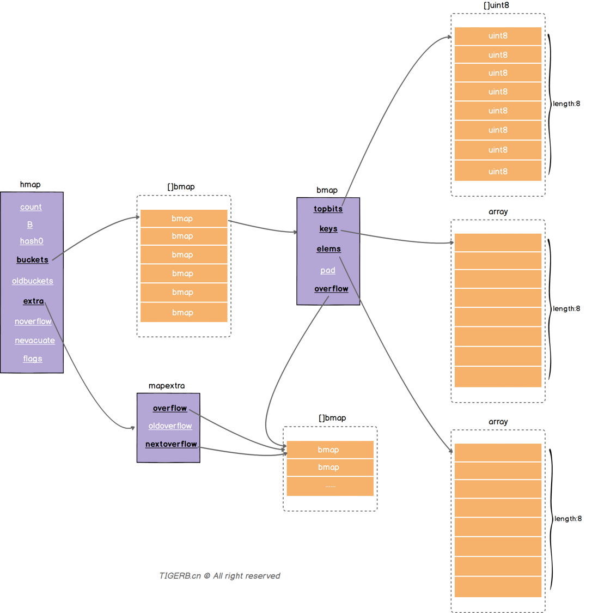
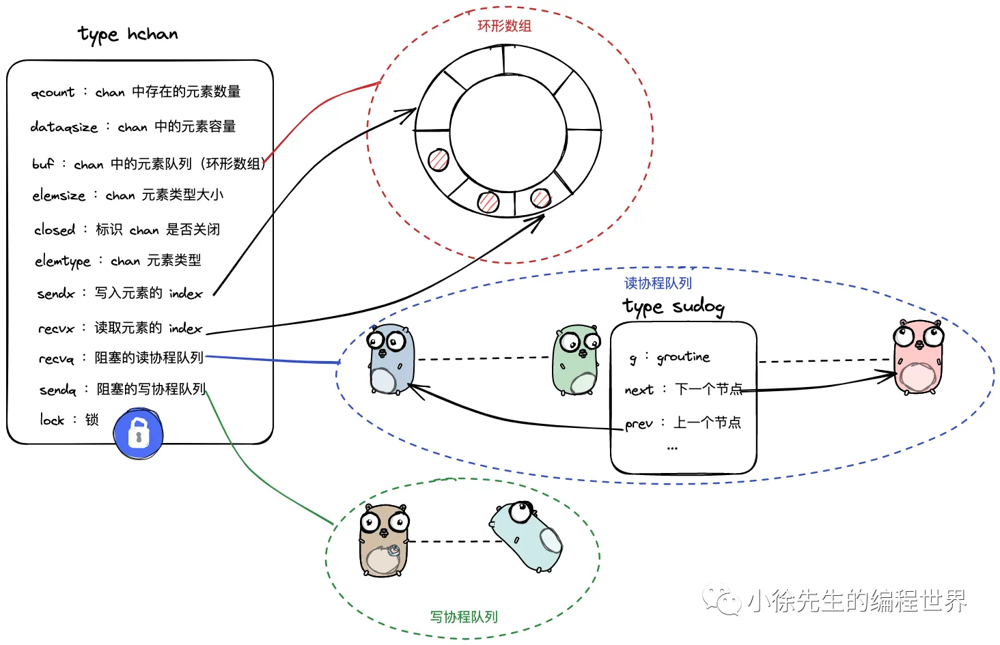
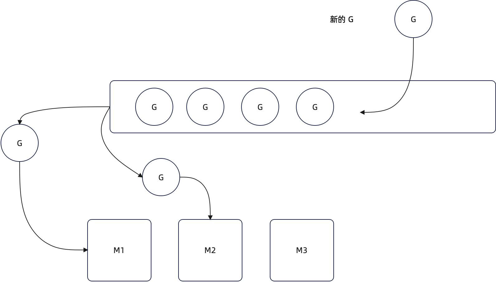
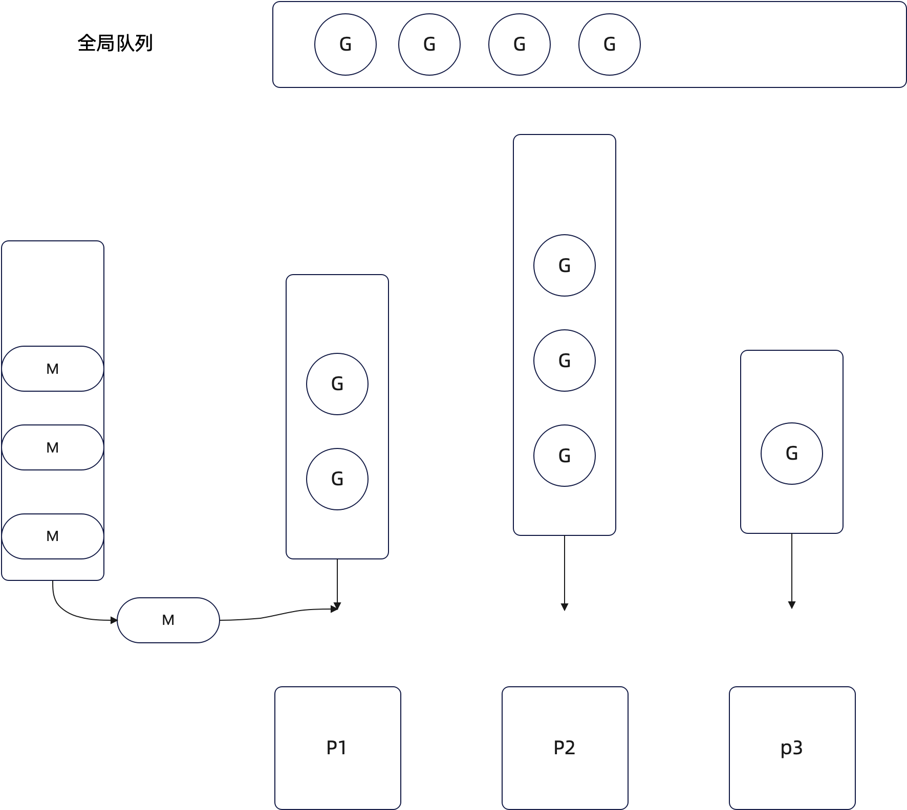
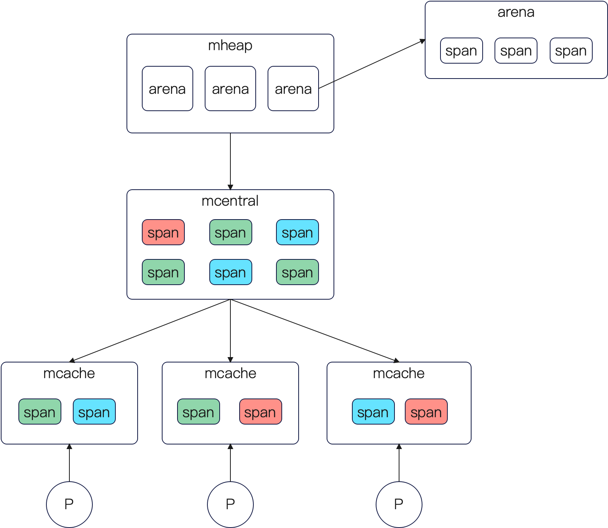
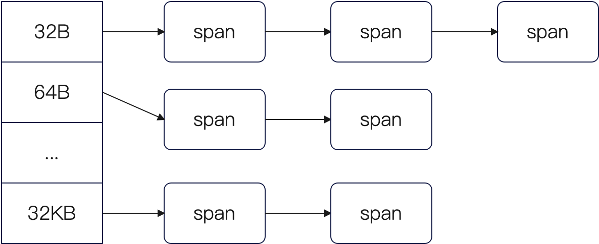
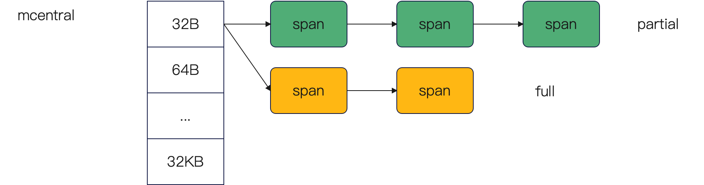
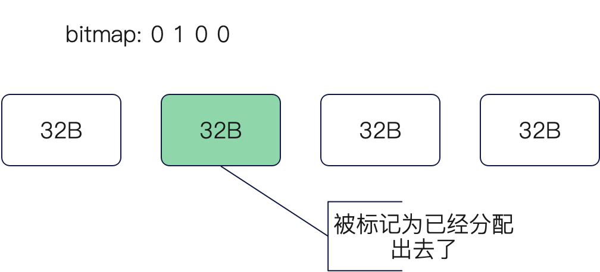
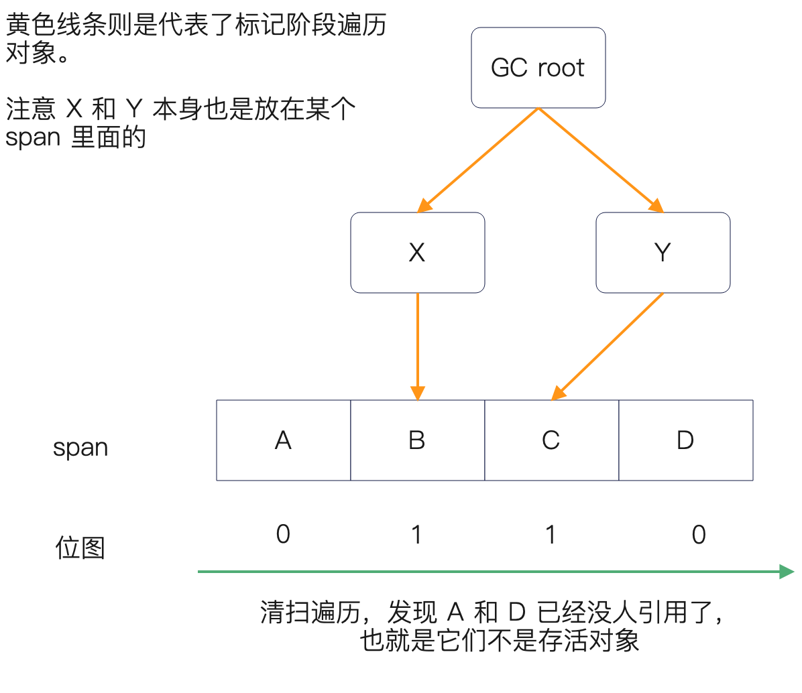
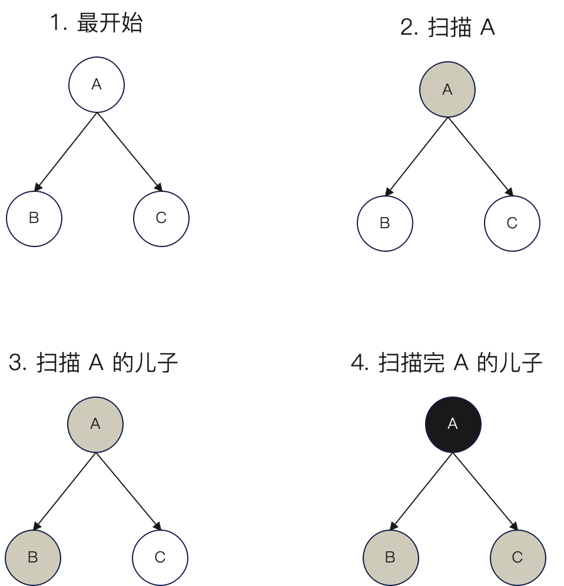

# golang

## Slice

```go
type slice struct {
    ptr       unsafe.Pointer
    len       int
    cap       int
}
```

Go中的切片是如何实现扩容的，这就需要关注一下Go的版本

**在Go的1.18版本以前，是按照如下的规则来进行扩容：**

1、如果原有切片的长度小于 1024，那么新的切片容量会直接扩展为原来的 2 倍

2、如果原有切片的长度大于等于 1024，那么新的切片容量会扩展为原来的 1.25 倍，这一过程可能需要执行多次才能达到期望的容量

3、如果切片属于第一种情况（长度小于 1024）并且需要扩容的容量小于 1024 字节，那么新的切片容量会直接增加到原来的长度加上需要扩容的容量(新容量=原容量+扩容容量)

**从Go的1.18版本开始，是按照如下的规则进行扩容：**

1、当原slice容量(oldcap)小于256的时候，新slice(newcap)容量为原来的2倍

2、原slice容量超过256，新slice容量`newcap = oldcap + (oldcap+3*256) / 4`

## Map

### GET

1. map未初始化或kv对数量为0，是的话返回零值
2. 其他goroutine是否在写，是的话报错
3. 求key的hash值
4. 根据hash值找到对应的bucket
5. 依次遍历桶和桶溢出列表
6. 找到key就返回，找不到就返回零值

### PUT

1. 如果map未初始化或被其他goroutine写，报错
2. 添加写标记
3. 求key对应的hash值
4. 找到key所在的bucket
5. map是否在扩容，如果在扩容，就写⼊新的位置，不是就写⼊当前位置
6. 判断桶内是否有相同key值，有的话直接替换，没有就插⼊
7. 清除写标记

### DELETE

1. 判断是否为未初始化或者被其他groutine写
2. key进⾏hash去找对应的桶上的位置，并加写标记
3. 找到就删除
4. 检查写标记是否被破坏，如果是就报错，不是就结束

### 扩容流程

扩容有两种，一种是等量扩容，另一种是2倍扩容

1. **相同容量扩容**：由于map中不断的put和delete key，桶中可能会出现很多断断续续的空位，这些空位会导致连接的bmap溢出桶很长，导致扫描时间边长。这种扩容实际上是一种整理，把后置位的数据整理到前面。**这种情况下，元素会发生重排，但不会换桶。**
2. **2倍容量扩容**：这种2倍扩容是由于当前桶数组确实不够用了，**发生这种扩容时，元素会重排，可能会发生桶迁移**

### 发生扩容的条件

装载因子 = map中元素的个数 / map中当前桶的个数

1. **装载因子 > 6.5**
2. **溢出桶的数量过多**

### 扩容

1. 在我们的hmap结构中有一个oldbuckets吗，扩容刚发生时，会先将老数据存到这个里面
2. 每次对map进行删改操作时，会触发从oldbucket中迁移到bucket的操作（非一次性，分多次）
3. 在扩容没有完全迁移完成之前，每次get或者put遍历数据时，都会先遍历oldbuckets，然后再遍历buckets

**hash冲突**：当两个不同的 key 落在同一个桶中，就是发生了哈希冲突。冲突的解决手段是采用链表法：在 桶 中，从前往后找到第一个空位进行插入。如果8个kv满了，那么当前桶就会连接到下一个溢出桶（bmap）



## Channel

本质是⼀个阻塞循环队列



```go
type hchan struct {
    qcount    uint // 当前缓冲区中的元素数量
    dataqsiz  uint // 缓冲区的大小
    buf       unsafe.Pointer // 指向缓冲区的指针
    // 其他字段...
    sendx     uint // 发送索引
    recvx     uint // 接收索引
    // 发送和接收的等待队列
    send       waitq // 发送操作的等待队列
    recv       waitq // 接收操作的等待队列
}
```

### PUT 写流程

**有缓冲**

1. 检查channel是否被关闭，关闭直接panic
2. 加锁，防⽌其他groutine修改
3. 检查缓冲区是否已满，如果已经满了，就挂起到sendq等待
4. 将数据写⼊下⼀个可⽤位置，并更新缓冲区状态和qcount
5. 解锁
6. 检查recvq中是否有等待的接受者，如果有就唤醒，没有就结束

**无缓冲**

1. 检查是否关闭
2. 加锁
3. 检查接受者
4. 解锁

### GET 读流程

**有缓冲**

1. 检查是否关闭
2. 加锁
3. 检查缓冲区，缓冲区为空，进⼊recvq进⾏等待
4. 读取可⽤数据，更新缓冲区状态和qcount
5. 解锁
6. 检查sendq中是否有发送者，有就唤醒

**无缓冲**

1. 检查是否关闭
2. 加锁
3. 检查缓冲区，为空就进⼊recvq阻塞等待，不为空就取值
4. 解锁

### 关闭流程

1. 检查是否关闭
2. 加锁
3. 设置关闭标志
4. 清理recvq中等待的接受者
5. 清理sendq中等待的发送者
6. 解锁
7. 唤醒等待的gorutine

## GMP

GMP 是指：

- G：Goroutine
- M：Machine，一般我们都理解成线程
- P：Processor，一般我们的都理解成处理器，或者 CPU。不过严格来说，在 Go 里面这个 Processor 是虚拟的。

现在我们站在一个设计者的角度，我们已经决定要使用 goroutine 了，而在操作系统上它只认线程，根本不认我们搞出来的 goroutine。

那么现在我要调度 goroutine，就需要让 goroutine 绑定一个线程。或者说，找一个线程来执行 goroutine。那么考虑到我们的 goroutine 有很多，而线程数量又不能无限多，因此最简单的做法就是搞一个线程池之类的东西，而后再搞一个队列放 goroutine，每个线程不断从队列里面找一个 goriutine 来执行。

这个阶段可以概括地说是 GM 调度，就是一个线程池的模型，只不过队列里面放的是 goroutine。



显然你能看到这个模型是有很多问题。最大的问题就是线程是并发地去队列中拿 Goroutine 的，所以需要一个**全局锁**保护这个队列。全局锁的弊端自然就是性能极差。

有鉴于全局锁这个弊端，后面引入了 GMP 来改进。那么改进思路也很简单，既然全局只有一个队列会需要一个全局锁来保护，那么我多搞几个队列不就可以了？

> 这个思路经常用于优化全局锁竞争，比如说内存分配。

再进一步考虑，如果我都有多个队列了，我直接把队列绑定到线程上不就可以吗？比如说一个线程一个队列。答案是这样做其实不太行，因为线程如果执行的 goroutine 发起了系统调用，比如说 IO 操作，那么线程也会阻塞。所以最佳的选择其实是 CPU，让 CPU 独占一个队列就不存在什么竞争，于是可以省去各种加锁之类的性能损耗。于是就有了 P 的抽象。

那么整个形态就变成了 GMP。



这个图里面还有一个关键点，就是依旧存在一个全局队列。因为每个 P 上面的队列的 goroutine，有的多有的少，有些执行快有些执行慢，因此全局队列的意义就在于平衡 P 的队列。

如果 P 的队列里面已经没有 G 了，那么它就会去全局队列里面拿一批 G。

那么如果要是极端情况下，连全局队列都没有 G 了，这个时候就会执行工作窃取，从别的 P 里面薅一批 G 过来。

如果全局队列没有 G 了，别的 P 上的队列也没 G 了，那么 P 上绑定的 M 就会自旋等待

在整个过程里面还有很多细节。比如说，如果要是 P 执行 Goroutine 的时候又产生了新的 Goroutine（比如说你使用了 go 关键字开 goroutine），这个时候会优先放回去 P 自己的队列里面。放回自己的队列可以充分**利用局部性原理**（空间局部性，时间局部性）

而如果要是 P 的队列已经满了，就会挪一批到全局队列。

如果在执行 G 的时候，没有 M 了，那么就会创建一个新的 M

## 内存分配

与 Linux 的 SLAB 进行对比，两者都是分层结构，而且都是局部缓存-全局缓存这种结构，和 Go 的 GMP 调度的局部队列-全局队列的思路也是一致的，用引入局部数据结构来降低全局竞争

Go 堆上分配有三个核心结构：

- mcache：这个是和 P 绑定的，看到这个你就知道它是和并发没有什么关系的，是 P 自己独占的；
- mcentral：是所有的 P 共享的。
- mheap：也是所有的 P 共享的，但是一般我们会说它管理的是内存大块是 Areana（注意 Go 的堆外内存实验特性也叫做 Arena）。它和 mcentral 的区别在两方面：它是和操作系统打交道的，负责从操作系统里面申请内存；它还要和垃圾回收打交道，或者说垃圾回收是通过 mheap 来进行的。

一看这种三级结构，你就应该大概猜到分配内存的过程：

- 优先从 mcache 分配一块空闲内存给应用；
- 如果 mcache 没有空闲内存了，那么从 mcentral 里面拿一块大内存，而后分配一块小的给应用；
- 如果 mcentral 也没有空闲内存了，那么就从 mheap 拿一块内存，再分配给 mcache，最终 mcache 分配给应用；

那么在这里有一个要注意的点，就是内存管理不是说随便管的，mcache、mcentral 和 mheap 都是按照 span 来管的，也叫做 mspan。那么这个 mspan 是什么东西呢？

mspan 是一块连续内存，一般由多个页组成，例如说 8KB（2页）一个 mspan。mspan 内部被进一步分配成了固定大小的对象，比如说 64B 一个对象。

那么不同对象大小的 mspan 就相当于有一些是 200 张 50 块的一捆，或者 1000 张 10 块的一捆，又或者 100 张 100 块的一捆。因此大体上结构如下图：



上面不同颜色代表 span 里面对象大小是不同的。比如说你可以认为绿色代表的是 100 块的一捆一万块，蓝色的是 50 块的一捆一万块。

当然，你稍微一想也能知道，最好的管理 span 的方式，就是按照对象大小把这些 span 串联在一起。相当于，50 一捆的放一个库房，100 一捆的放一个库房，这样好管理，好分配。

因此，实际上 mcache 里面的 span 组织方式是这样的：



而 mcentral 有点特殊，因为它放着很多 span，所以它把 span 分成了满（full）和不满（partial）两个部分。对应的结构是：



> 有些人也叫做 empty 和 not empty

所以当 mcache 从 mcentral 里面去拿 span 的时候，就是从 partial 里面拿一个。

而 Go 会使用位图（bitmap）来标记每个 span 内部的对象有没有被使用过。如下图是一个简单的实例：



因此，假设说现在我们需要一个 24B 大小的内存，或者说我们的一个 struct 要占据 24B，那么：

- mcache 看看自己的 32B 对象大小的 span 链表里面能不能找到一个空闲的对象，如果能，则直接返回；
- mcache 发现自己没有，就去找 mcentral 要一个放 32B 对象的 span，mcache 拿到之后，就给我们一个空闲对象；
- 如果 mcentral 也没有，就去找 mheap 要一个放 32B 对象的 span；
- 如果 mheap 也没有，就会去找操作系统要一个 arena，然后切割成 span，将其中的一个给 mcentral；

那么最后还有一个问题，你从上面这个流程里面就能发现，如果我对象只有 4B，难道也是给我一个 32B 的对象吗？那不就是浪费了 28B？而且，绝对部分对象都是小对象，都是很小的对象。比如说只有一两个，两三个字段的结构体，32B 都用不完。岂不是浪费很多？

所以 Go 在 mcache 里面搞了一个小东西，叫做极小对象（tiny object）分配，极小对象也是分配在堆上的，只是它针对的是小于 16B 的非指针对象（指针对象还是走上面的 mcache-mcentral-mheap 的路径）。

最后总结：

- 极小对象：小于 16B 的 no scan（没有指针）对象，专门走 tiny object 的逻辑，直接分配到堆上；
- 小对象：16B ~ 32KB 的指针对象，小于 16B 的 scan （有指针）对象，走 mcache-mcentral-mheap 这条路；
- 大对象：大于 32KB 的对象，直接在 mheap 上分配；

> 极小对象，专门分配；小对象，走三关；大对象，mheap；

极小对象的分配

- 如果这个对象没有发生逃逸，那么就是栈上分配；
- 如果这个对象逃逸了，但是它是 no scan（没有指针） 对象，那么就会使用极小对象分配器，直接分配到特定的极小对象内存区域；
- 如果这个对象逃逸了，但是它不是 no scan（没有指针） 对象，那么就如同普通对象一样，经过 mcache-mcentral-mheap 这个机制分配；

### 流程

Go 的内存分配分成了栈上分配和堆上分配两种。

栈上分配也就是分配到 goroutine 的栈上，这个过程是通过编译器在编译期间计算好如何分配的。

但是如果在编译期间，编译器发现没有办法分配到栈上，那么就会分配到堆上，这也就是所谓的内存逃逸。这个时候，运行时要根据对象大小来判定执行哪一种分配：

- 如果是极小对象，也就是小于 16B 的非指针对象，那么就会直接利用极小对象分配器，分配到堆上
- 如果是大对象，也就是大于 32KB 的对象，那么就会直接分配到 mheap 上
- 否则，就按照 mcache、 mcentral 和 mheap 的三级结构，找到一个合适的 span 里面的空闲对象，分配给应用

举个例子来说，假设说现在应用需要 24B 内存，那么它就会首先找 mcache，mcache 从自己的 32B 的 span 里面找一个空闲的对象，交给应用。

如果 mcache 没有，那么就找 mcentral 里面要一个 span。mcentral 会从自己的 pratial（不满的） 的 span 里面找出一个给 mcache，mcache 再找出一个空闲对象给应用。

如果 mcentral 也没有合适的 span，它就会找 mheap 要一个 span。

如果 mheap 也没有合适的 span，它就会找操作系统要一块 arena，自己切割成 span，交给 mcentral 一块span，而后 mcentral 再给 mcache，mcache 再找空闲对象给应用。

## 垃圾回收

### Go v1.3 标记清除

**步骤**

1. 暂停程序的正常执行流程(开始STW)
2. 从Root Set根节点出发找出所有可达对象
3. 给所有可达对象坐上标记
4. 开始清除未标记的不可达对象
5. 恢复程序的正常执行流程(停止STW)

**缺点**

1. STW，stop the world；让程序暂停，程序出现卡顿 (重要问题)
2. 标记需要扫描整个heap
3. 清除数据会产生heap碎片

### Go v1.5 三色标记清除

1. 暂停程序的正常执行流程(开始STW)
2. 只要是新创建的对象，默认为白色
3. GC开始时，从根节点开始遍历所有对象，把遍历到的第一层对象从白色变为灰色
4. 遍历一次灰色集合，将灰色对象引用的对象变为灰色，把原来灰色对象变为黑色
5. 重复第3步骤，直到没有灰色对象
6. 回收所有白色对象，白色对象没有被任何引用，也就是垃圾
7. 恢复程序的正常执行流程(停止STW)

### Go v1.8 三色标记 + 混合写屏障

**“强-弱” 三色不变式**

我们让GC回收器，满足下面两种情况之一时，即可保对象不丢失。 这两种方式就是“强三色不变式”和“ 弱三色不变式”

**强三色不变式**：强制性的不允许黑色对象引用白色对象(不存在黑色对象引用到白色对象的指针)

**弱三色不变式**：黑色对象可以引用白色对象，但是这个白色对象必须存在其他灰色对象对它的引用，或者可达它的链路上游存在灰色对象，所有被黑色对象引用的白色对象都处于灰色保护状态

为了遵循上述的两个方式，GC算法演进到两种屏障方式，分别为“插入写屏障”, “删除写屏障”。

使用了插入写屏障或者删除写屏障的三色标记法，可以大幅减少STW的时间

### 现代的 Go gc

一句话就可以说清楚 Go 使用的垃圾回收算法：并发-标记-清扫（Concurrent-Mark-Sweep）算法，很类似于 JAVA 的 CMS 算法。

整个垃圾税收可以看成是四步：

- 初始标记阶段：这一个阶段是 STW（Stop the world）的，这个阶段也叫做根对象扫描阶段。顾名思义，它主要是扫描 GC Root，也就是全局变量、栈变量和寄存器；
- 并发标记阶段：这一个阶段回收器会从 GC Root 出发，遍历所有的对象，这些对象就被认为是存活对象。注意这一个阶段应用程序还是在运行的。你可以认为 GC 的 goroutine 和你业务的 goroutine 都在运行；
- 再标记阶段：也是 STW，这一阶段会重新扫描并发标记阶段新生成的对象，或者修改过的对象；
- 清扫阶段：也就是找出所有没有被标记为存活的对象，收回这部分空间。这一步有点难理解，最直观的理解就是遍历所有的 span，以及遍历每一个 span 内部的对象。如果一个对象是存活的，那么在标记阶段这些对象就被设置为存活的，没有这个标记的就是可以回收的了。

清扫阶段和标记阶段是从不同角度的来进行遍历的。下面是一个帮助你理解的示意图：



根据这个图你还能看到想到一个点，就是如果一个 span 所有的对象都被回收了，那么这个 span 也可以被回收了，它首先会被异步地归还给 mcentral，而后再异步地归还给 mheap。

那么这里有一些注意点：

- Go 的标记算法用的是三色标记法，并且加上了弱三色不变性的保证；
- Go 的内存是没有分代的，也就是说没有 JAVA 那边的年轻代，老年代的说法；
- Go 的垃圾回收没暴露太多的调优参数

### GC root

Go 里面的 GC Root 主要包含三个部分：

- 栈上对象：指的是 goroutine 栈上的对象；
- 全局变量：在 Go 里面一般就是指各种包变量；
- 寄存器

在 Go 扫描的过程中，如果当前扫描的是一个指针，就需要沿着指针指向的地址继续扫描，但有些情况无法判定寄存器里面存的是一个值，亦或是一个指针，一律先当指针

### 三色标记法

开始是白色，处理中是灰色，处理后是黑色



对象的引用随时可能发生变化，比如说新建了对象等，又或者删除了引用等

**强弱三色不变性**就是为了解决并发标记而引入的两个假设：

- 强三色不变性：
  - 灰色对象只能引用灰色或黑色对象
  - 白色对象只能通过黑色对象引用
- 弱三色不变性：在处理灰色对象时，可以临时允许它引用白色对象，但在它变为黑色之前，所有引用的白色对象都必须被标记为灰色

Go 本身使用的是弱三色不变性，而不是强三色不变性。弱三色标记性描述的就是三色标记法的步骤3 到步骤 4 之间的这种临时情况。

那么 Go 在并发标记阶段究竟是怎么保证弱三色不变性？利用的是混合写屏障。可以看作是 AOP

## 性能优化

Go 语言的性能优化只有两大角度：

- 内存优化
- 并发优化

其实 CPU 也能优化的，但是可以做的事情不多。

内存优化有很多，一般来说常见的有：

- 对象池：常见的就是使用 sync.Pool 来池化对象，但是你也可以自己设计有不同特色的对象池；
- buffer pool：存放了buffer 的对象池。buffer pool 实际上有很多讲究，比如说怎么控制 buffer pool 淘汰，放回之类的；
- 准确预估内置类型容量，减少扩容；
- 逃逸分析：逃逸分析实际上在业务研发中用处不大，逃逸分析可以减少内存在堆上的分配；
- arena：使用实验特性 arena，arena 是一块不被 Go GC 管理的内存，需要自己手动管理内存；
- 调整对象字段顺序：根据内存对齐的规则，重排序字段，这样可以减少一个对象占用的内存；

并发优化也有一些手段：

- 使用原子操作取代加锁：也就是如果你的锁只需要保护一个资源，并且只是简单的读写，那么某些情况下是可以用原子操作来优化它；
- 使用读写锁来优化锁：正常都是优先考虑使用读写锁，但是如果一开始代码没写好，直接用了写锁，那么就可以尝试优化；
- 减少锁范围：有些人写代码的时候不注意锁的范围，会导致原本可以提前释放锁的时候，并没有释放锁；
- 无锁化：这种手段更加罕见，也就是说通过重新组织代码、设计架构，将某一处的并发完全去除。典型场景的就是类似与 GIN 的路由树，在最开始的注册路由的时候，就没有用锁；
- 使用 copy on write 技术：Go 自身的 SDK 里面没有类似的结构，但是你可以声称自己研发了类似的结构。Copy On Write 是指某个数据结构是只读的，如果要写的话，就会复制一份出来；
- 使用不可变对象：不可变对象天然就是并发安全的。在 Go 里面，如果你用纯粹的值对象（也就是非指针对象，包括它的字段也不是指针），那么它天然就是不可变对象；

这些手段有些属于很难的，有些属于比较简单的，你根据自己掌握的具体情况来选择怎么回答。这里我给你简单分类一下：

- 常规的是人都会的：对象池，buffer pool，原子操作，预估容量，读写锁
- 高级一点的：逃逸分析，arena，调整对象字段顺序，无锁化，copy on write，使用不可变对象

### 逃逸分析

```shell
go build -gcflags '-m'
```


