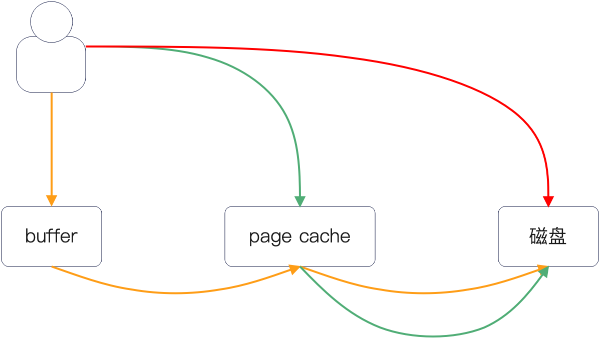

# kafka

## 什么是 kafka

Kafka 整体上可以看做由三个主要部分组成：

- 生产者：也就是生产消息的组件
- Broker：一般也被称为 Kafka 节点，Broker 本身也是一个集群。
- 消费者：消费消息的组件

1. 从逻辑上来说，Kafka 设计了 Topic 来代表不同的业务场景，而一个 Topic 可以有多个 Partition（分区），每个分区至多只有一个消费者。一个 Topic 的不同分区会尽量分散到不同的 Broker 上去
2. 从结构上来说，可以将 Kafka 看做是一个对等结构和主从结构的混合结构。对于特定的某个分区来说，它是主从结构，因为分区由一个主分区和多个从分区组成；而一个 Topic 内部的分区地位、用途都是平等的，所以可以看做是对等结构
3. 从特性上来说，Kafka 具备高吞吐量、高并发、高可扩展性和高稳定性，非常适合用于高吞吐、高并发、高可用和大数据的场景下

常用的三种应用场景

1. 解耦。比如说最典型的就是我在设计用户服务的时候，会根据用户的不同行为来生产不同的消息，比如说用户注册消息，开通会员消息等。下游可以根据自己的业务情况来订阅这些消息
2. 异步，一方面是主动提供异步接口，也就是提供 Topic 给上游，要求上游按照格式来生产消息。一方面是和服务治理结合在一起，在发现服务端节点状态不好之后，将请求转发到 Kafka 上。例如说将被限流的请求和被降级的请求转发到 Kafka 上，后续再处理
3. 削峰。这个主要是用在类似于秒杀之类的场景中，通过 Kafka 来应对突发流量，能有效保护系统并且提高系统的吞吐量

### Kafka 的缺点

- Kafka 消息的有序性。Kafka 的消息在同一个分区内部是有序的，但是在不同的分区里面是无序的，这就会带来一个著名的问题，如何在使用 Kafka 的时候保证消息有序；
- Kafka 不支持延迟消息。也就是说 Kafka 不支持类似于“15分钟之后”才能投递给消费者的场景；
- Kafka 的分区至多只能有一个消费者，容易出现消息积压问题；

## 与同步调用的区别

那么从实践上来说使用 Kafka 的这种形态好处很明显：

- 解耦：也就是应用不再关心下游。这要从两方面来说，一方面是应用不再关心下游有多少个，任何新的下游想要接入，都可以直接订阅 Kafka 上的消息，应用一点都不关心；另外一方面是应用也不再关心下游需要的数据格式，例如说在同步的 RPC 调用中，很可能每个下游的接口都不一样，需要执行适配；
- 削峰：如果应用本身的并发很高，比如说来了一波突发流量。那么引入 Kafka 之后，下游就可以根据自己的处理速率慢慢处理；
- 性能好：对于应用来说，将消息发送到 Kafka 上就可以了，可以快速返回。正常来说 Kafka 可以撑住极高的并发，比如说 10W，但是你同事写的垃圾代码是不太可能撑住 10W 并发的。所以实践中也会考虑在业务流程中引入 Kafka 来优化性能；
- 高可用：应用只需要发送消息到 Kafka 上，Kafka 本身是高可用集群，数据不太可能丢失。而后即便是应用崩溃，或者下游消费者崩溃了，都可以在恢复过来之后继续处理消息。在常规的提高可用性的方案中，你也可以经常看到的引入 Kafka 来提高可用性；

比如，第一个是解耦之后可以灵活调度消费者的消费速率。例如说对于不重要的消费者来说，可以在业务高峰期的时候主动限制自己的消费能力，而在业务低峰期的时候提高消费能力，这个我曾经用在不停机的数据迁移与数据校验中。生产者在双写的时候会发一个消息，提醒下游去校验和修复这一次双写的数据，消费者就去校验和修复。而很显然，这个校验和修复是不能影响正常业务执行的。所以才可以考虑调整这种校验和修复的速率。

## 高性能

整体上来说，Kafka 使用的性能优化手段包括：

- 零拷贝技术（zero-copy）：这个技术手段可以说说是大名鼎鼎了，几乎任何跟网络、磁盘打交道的中间件都会使用这个技术；
- 内存映射文件（memory map file）：内存映射文件，有些人认为它可以看做是零拷贝的一种实现方式，有些人认为它是一种单独的技术；
- 顺序写：这是当年还是机械硬盘时代，Kafka 性能惊呆一大堆业界人士的大杀器。但是到当前时代，几乎任何的跟磁盘 IO 打交道的中间件，都会采用这个技术；
- page cache：也就是充分利用操作系统的 page cache，规避直接发起真实的磁盘 IO；
- 支持批量处理：在生产端和消费端都支持批量处理。批量处理也是常见的性能优化手段；
- 端到端压缩技术：也就是生产端压缩数据，消费端解压缩，而 Kafka 服务器本身只是做一个存储和转发，并不会去任何有关的加密和解密的动作；
- IO 多路复用：也算是一个常见的性能优化手段，或者说现代的高性能中间件，基本上都会使用这个作为性能优化手段；
- 无锁化的 offset 管理：也就是 Kafka 在管理 offset 的时候并没有使用锁，而是使用了原子操作。我们在很多语言层面上的性能优化里面都提到过，使用原子操作来优化锁操作也能带来不错的效果；
- 分区：实际上这是一个非常重要的点，但是在性能优化的时候一般很少提。因为分区是分而治之的体现，而分而治之之后不同分区落在不同的 Kafka 节点上，就能够通过多个节点来分担性能压力。

甚至于，你可以认为 Kafka 是集当代中间件性能优化大成者。基本上你能够想到的提高性能的优化手段在 Kafka 上大概率能够找到。

### 零拷贝

零拷贝是一种优化数据传输的技术，核心思想是尽量避免数据在内存之间的拷贝，并且做到 CPU 完全不参与拷贝，这也就是零拷贝的零的含义。

举个例子来说，如果要从文件里面读取数据并且发送到网络，那么在没有零拷贝技术的时候过程是：

1. 首先从文件中读取内容到内核态，也就是读缓冲；
2. 内核态复制数据到用户态；
3. 用户态再次复制数据到内核态，也就是写缓冲；
4. 内核态复制到网卡

那么这个过程的效率是比较低的。那么零拷贝技术就是规避了 2 和 3 的两次拷贝，简化成了：

1. 从文件中读取内容到内核态；
2. 内核态直接复制到网卡；

而更加优越的地方在于，这个简化的过程可以用 DMA 来完成数据复制。那么零拷贝这种简化流程，从两方面提升了效率：

- 减少了内存拷贝。这个毫无疑问是零拷贝的主要目的；
- 减少了上下文切换，也就是减少了内核态到用户态，用户态到内核态的切换；

> DMA 内核态 用户态

### 顺序写

顺序写为什么性能好

1. 寻址问题：也就是要找到写入的磁盘空间，而后将磁头移动到对应的位置。很显然，随机写是每一次写入都要重新寻址，而顺序写则是找到一个位置之后就可以连绵不绝写下去
2. 局部性原理：充分利用写缓冲
3. 现代的文件系统会有意识地将偏向并且优化顺序写的性能

> 局部性原理 随机写寻址慢，局部性差，文件系统支持不友好

SSD 顺序写快的原因主要是局部性原理的应用，这源自两方面，一个是 SSD 写入是以页为单位的，也就是你写 1B 还是写入 1KB，都是按照页来写入的。另外一个是 SSD 同样会有缓存，顺序写也能更加好的利用这些缓存。

### 端到端压缩

生产者会压缩数据，发送到 Kafka 上，而后 Kafka 直接存储压缩后的消息，等消费者消费的时候，Kafka 直接投递压缩后的数据。

- Kafka 不需要为压缩付出额外的代价。
- 网络传输更快
- 磁盘 IO 也更快

## 分区

引入分区就是为了分而治之，提高性能。

在 Kafka 里面，Topic 代表的是特定业务，或者说特定的业务场景。假定没有分区，或者说一个 Topic 只有一个分区，那么一个 Topic 就只能存放在一个 Kafka 服务器上

此时这个服务器的性能上限就是这个 Topic 的性能上限。而我们知道，在当下的分布式环境下，一些业务的并发量是能够轻易突破服务端性能上限的。在这种情况下，Kafka 只能考虑说引入一种机制，让 Topic 可以进一步分而治之，这也就是分区了

引入了分区之后就可以发现，分区是一种非常有效的横向扩展手段，不同的分区分散到不同的 Kafka 节点上，就可以承载更加高的并发

分区可以看做是 Kafka 组织数据的基本单位。

具体来说，就是一个 Topic 内部会有多个逻辑分区，逻辑分区一般都是主从结构。那么每一个物理分区都可以看做是一个文件，而写入消息的时候，就是往这个文件里面追加数据。当然，相应地为了更好找到某条消息，分别还有一个偏移量索引文件，用于支持按照偏移量来找消息；另外一个是时间戳索引文件，用于支持按照时间戳来找消息。

由此得出特性：

- 分区内部的消息是有序的，而分区之间的消息是无序的。
- 分区内部的消息才能利用顺序写，而不同分区之间的消息是无法利用顺序写的。

## 如何解决顺序消息

Kafka 上保证消息有序，只需要：

- 全局有序：Topic 只能有一个分区
- 业务有序：同一个业务的消息发送到同一个分区上。

要让同一个业务的消息发送到同一个分区上也很简单，让生产者使用哈希类的分区选择算法就可以了。

在订单的例子中，可以用订单 ID 进行哈希运算，例如说总共 10 个分区，那么按照 order_id %10 就可以决定了。

但是这两个解决方案都是有一个隐患的，也就是**消息积压**的隐患。

## 消费者组

消费者组和 Topic 一样，是一个划分业务的概念。也就是说，针对同一个 Topic，不同的业务方就归属于不同的消费者组。

任何一个消费者都归属于一个消费者组，如果你不指定，它就会被分配到一个默认的消费者组。Kafka 会为消费者组里面的消费者分配分区，一个消费者可能对应多个分区，但是一个分区最多一个消费者。

也因此，每次有消费者加入或者离开消费者组的时候，都会引起 rebalance，也就是重新分配分区。

### rebalance

Kafka 的 rebalance（再平衡）指的是Kafka集群重新分配分区给消费者组内各个消费者的过程。这种机制确保了每个消费者能够从一个或多个分区中消费数据，从而维持了消费的均衡性和系统的高可用性

主要是为了负载均衡

那么什么时候会触发 rebalance 呢？

- 组长变了，也就是所谓的 Kafka 的协调者变了
- 任务变了，比如说加了分区或者减了分区
- 组员变了，比如说有人离职，有新人进来

rebalance 的步骤其实也很简单：

- 停止消费
- 重新分配分区
- 消费者更新分配后的信息
- 消费者继续消费

这么一说你也能发现 rebalance 的最大的问题了：停止消费，性能极差

## 实现延迟消息

1. 通过在一个 topic 中设置不同的分区，每个分区代表一个延迟时间，消费者根据不同分区的延迟时间进行睡眠，睡眠完后再将消息转发到不同的业务 topic
2. 和第一个方案比的亮点是支持随机延迟时间，将延迟消息发送到一个 topic，然后延迟消费者将消息转储到mysql中，然后有一个延迟消息发送者，定期查找到时间的延迟消息将其转发到对应的业务 topic

## 消息积压了怎么办

1. 增加消费者。如果要是消费者数量没有达到分区数量的上限，就可以简单通过增加消费者的数量来解决问题。
2. 增加分区。也就是原本十个分区只能有十个消费者，我增加分区到二十个分区，就是可以有二十个消费者了
3. 优化消费者的性能
4. 消费者降级
5. 除了这种降级，还有一些的比较奇诡的降级。例如说很多公司的消费者不仅仅是消费者，还承担着别的功能，比如说服务业务请求，执行的定时任务。那么在这里你有两种做法：
   - 基础做法就是停掉这些业务请求和定时任务
   - 高级做法就是再次部署一批节点，这些节点就专门用来消费消息，原来的那些节点就拿去处理业务请求或者执行定时任务
6. 批量消费。也就是消费者一次拉一批消息，而后使用批量接口来一次性处理掉这一批消息
7. 异步消费，批量提交。它和第二种思路很像，都是拉取一批消息，但是这个时候没有批量接口可以用，所以只能开多个线程同时调用下游接口，最后一起提交
8. 聚合发送，批量消费。这个方案改动比较大，需要修改消息格式
9. 聚合发送，异步消费。它是上一种解决思路的变种，消费者这端没有批量接口，就改为异步消费，每一个 id 开一个线程调用服务处理掉

### 如果消息要求全局有序

- 加消费者、加分区、新 Topic 这个肯定用不了，因为全局有序就限制了只能单一分区，也不能使用新的 Topic
- 优化消费者性能，降级以及降级中的高级方案是可以用的
- 而后批量消费和异步消费基本不能用，因为这两个都不能保证顺序；聚合发送倒是能用，但是在消费者不能异步消费或者批量消费的情况下，单一的聚合发送已经没多少意义了

## 顺序消息，消息积压了怎么办

## 高可用

- Broker 组成的对等结构，这样可以保证即便一部分 Broker 崩溃了，其余 Broker 也能正确运作
- 一个 Topic 分成多个逻辑分区，构成的对等结构。即便某一个逻辑分区崩溃了，其余逻辑分区也能正常运作
- 一个逻辑分区由一个主分区和多个从分区主从，构成主从结构

> 对等结构 主从结构

### 分区数据同步

主分区和从分区之间的数据同步是 pull 模型，从分区定期拉取主分区上的数据到本地

那么就会有一个关键问题：从分区可能不能及时拉走最新数据。为了应付这种情况，Kafka 引入了一个 ISR（In Sync Replica）的概念，也就是说从分区分成两类，一类是跟上了节奏的，一类是没有跟上节奏的，即数据已经差太多了

在 acks=all 的时候，是需要所有在 ISR 中的从分区都提交了，才算是发送成功

### acks 参数

生产者在发送消息的时候，可以指定三个 acks 参数的值：

- acks=0：生产者在成功写入消息到发送缓冲区后，不等待任何来自服务器的确认就认为消息已经发送成功。这种模式延迟最低，但是风险最高，因为如果生产者在消息被服务器处理之前发生故障，或者消息在传输过程中丢失，那么消息将会丢失。注意的是，发送缓存区是在生产者这边的，也就是都还没发起网络 IO
- acks=1：这是默认值。生产者在消息被写入到主分区的日志文件中后，就会收到一个确认。这种模式下，如果主分区在确认消息后立即发生故障，并且在新的主分区选举之前没有足够的时间让从分区同步数据，那么消息也可能会丢失
- acks=all 或者 acks=-1：生产者在 ISR 都成功写入消息后才会收到确认。这提供了最高的耐久性保证，因为只有当所有 ISR 都写入消息后，生产者才会收到确认，从而降低了消息丢失的风险。但是，这种模式可能会导致更高的延迟，吞吐量也会下降

acks=all 的时候，消息有可能会丢失吗，但是仅仅在理论上可能（并没有定义怎么刷盘）

- 生产者发送消息
- 主分区写入消息，但是还没刷盘
- 从分区拉取消息，写入消息，但是没刷盘
- 主分区认为从分区都拉走了消息，也就是大家都写入成功了，返回告知生产者发送成功
- 生产者收到发送成功的响应
- 主分区和所有 ISR 的从分区都崩溃了，此时没有刷盘的数据全部丢失了，也就是生产者刚才发送的消息丢失了

## kafka用的是哪个推拉模型

1. 对于生产者来说，显然是应该用 push 模型。因为 Kafka 本身的性能极好，即便是生产者无脑发送，多半也不会触发什么性能瓶颈问题。Kafka 自己可以专注提高性能，用户就简单了，默认可以无脑发送
2. 对于消费者来说，显然应该用 pull 模型。毕竟消费者的速率是完全不可控的，那么高效率的消费者就可以更快把数据拉走；而低效率的消费者就可以慢慢消费，消息放在磁盘上，一放就是好几天，也不会有什么问题。

因此总结就是：**生产者 push 模型，消费者 pull 模型**

## 在分布式环境下，写入数据的语义有哪些？

写入语义要考虑两重，一重是节点内部的写入语义，一重是分布式环境下的语义。

先来看第一重语义。当我们说写入数据的时候，这个时候有三种可能：

- 写入到了中间件自己的 buffer 里面，比如说 redo log 的 buffer；
- 写入到了 page cache，也就是操作系统层面上的缓存；
- 写入到了磁盘，这个是大多数人理所当然认为的写入语义；

这三重语义如图：

需要注意的是，如果没有直接写入到磁盘，那么就要考虑刷盘的问题。基本上可能选择有几个：

- 不管，完全交给操作系统。数据只要写入到 page cache 之后就返回，操作系统自己会决定什么时候刷盘；
- 固定时间间隔刷盘，例如说间隔一秒刷新一次数据到磁盘；
- 固定业务数量刷盘，例如说每执行一次业务，就是刷新一次磁盘。redo log 默认就是每个事务刷新，也可以是 N 个合并一起刷新，不过 redo log 没这个选项；
- 固定空间刷盘，例如说发现超过 1MB 还没刷盘，就刷一次；

你可以注意到不同的中间件就是提供这几个选项中的一个或者多个，而后用户自己配置决定使用什么。

另外一重是分布式语义下的，一般是主从结构。也就是说，在说写入的时候，有几种语义：

- 写入到了主节点就认为写入成功；
- 写入到了主节点之后，写入到 N 个从节点就认为写入成功了。在这里又有一些子选项：
  - 写入到一个从节点就认为写入成功了；
  - 写入到多个从节点就认为写入成功了；
  - 写入到大多数从节点就认为写入成功了。要注意这里说的大多数，是指至少超过一半的从节点；
  - 写入到全部从节点才认为写入成功了；

这两重语义是要一起考虑的，比如说写入到主节点并且写入到一个从节点这种，你还需要考虑主节点刷盘了没有，从节点刷盘了没有。由此可见，当我们说写入成功的时候，还是有极小概率把数据丢失掉。

甚至于可以说，只有在主节点刷盘，从节点也都刷盘了，才能算是彻底写入成功了。

所以你可以注意到，很多跟 “为什么明明成功了，但是数据却丢了”之类的问题，归根结底都是这两重语义。

## 在 Kafka 异步消费-批量提交的方案中，如果要是部分消费失败了，怎么办？

这里要先解释一下批量提交这个概念。在 Kafka 的 Broker 看来，其实并没有什么批量提交啥的，因为它其实只维护一个偏移量。

也就是它只认最大的那个已提交偏移量。

那么你现在有这些选择：

- 全部不提交，重新异步消费这一批数据，如果都成功了就提交。这个也可以认为整个消费逻辑就是一直重试直到一整批都消费成功，而后提交；
- 部分提交。也就是从这一批中找出消费成功的最大偏移量的消息，在这个例子里面就是 101，而后提交 101。剩下的 102, 103, 104 就会被再次消费；
- 转储并提交：也就是把消费失败的消息存储到另外一个地方，而后直接提交，即便是消费失败的消息也提交了。转储的时候有很多种做法，这里列举一些：
  - 转储到数据库（SQL或者 NoSQL 都可以），后续开启线程处理这些消息；
  - 直接丢回去 Kafka。一般来说可以考虑在消息里面增加一个重试次数，这样一旦重试多次之后，就不要再放回去 Kafka 了，需要告警让人手工介入处理；

那么不管是哪个选择，都难以避免会出现重复消费的问题。那么你又有两个选择：

- 要求业务消费者一定是幂等的；
- 借助 Redis 等工具，提供简单的通用的去重方案。但是这还是需要业务消费者幂等来做最后兜底。

而提供的通用的去重方案，也非常简单，在 Redis 或者本地缓存中存储一个 topic_partion 的 key，对应的值就是这一批中已经消费成功的偏移量。注意，你并不需要存储所有的已经消费成功的偏移量，而是只存储这一批消费成功的偏移量。道理很简单，因为同一个分区内你都是一批批消费的，只有一批消费成功了你才会开始下一批。

于是你最终有这些选择：

- 全部不提交 + 通用去重，通用去重是可选的
- 部分提交 + 通用去重，通用去重是可选的
- 转储并提交

而最终，不管你选哪个方案，在经过重试-去重-重试这种循环之后，可能都没成功，这个时候就只能是考虑告警，让人手工介入处理了。

那么你在回答这个问题的时候，要注意如果面试官问的是通用的解决思路，你就把所有的方案都介绍一遍。如果要是面试官问的是你在使用异步消费的地方是怎么解决的，那么就只需要回答自己采用的解决方案就可以了。