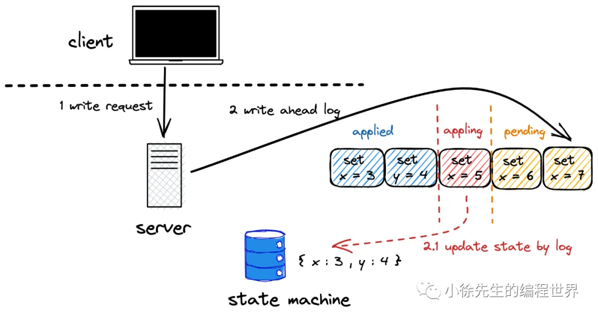
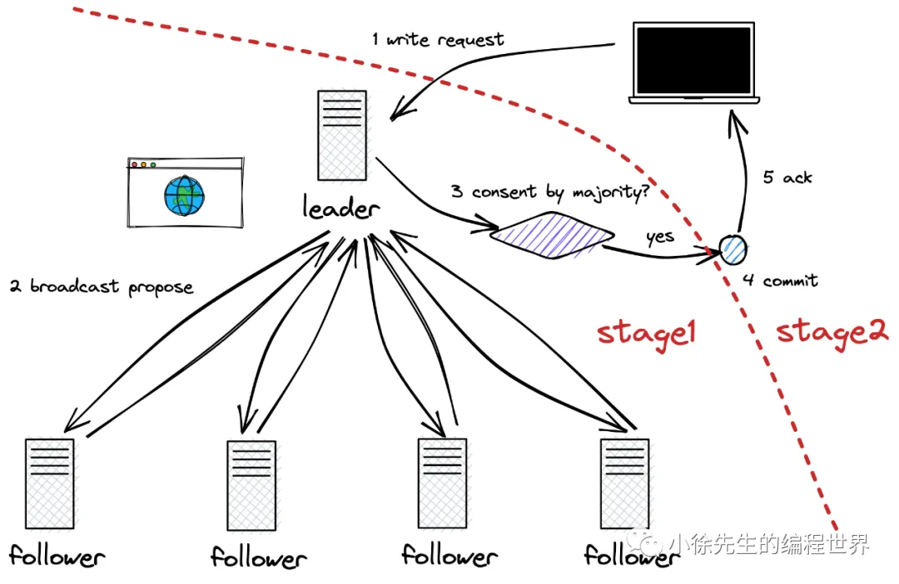

# Raft

| **中文术语** | **英文术语**           | **含义**                                                     |
| ------------ | ---------------------- | ------------------------------------------------------------ |
| 领导者       | leader                 | 节点的三种角色之一. 集群的首脑，负责发起”提议“、”提交“被多数派认可的决断. |
| 跟随者       | follower               | 节点的三种角色之一. 需要对 leader 的 ”提议“ 、”提交“和 candidate 的 ”竞选“ 进行响应. |
| 候选人       | candidate              | 节点的三种角色之一. 是一种处于竞选流程中的临时状态，根据多数派投票的结果会切为 leader 或 follower 的稳定态. |
| 最终一致性   | finnal consistency     | 中强一致性. 对于写请求，服务端保证最终一定能提供出正确的结果，但需要同步时间. 同步期间，可能被读到不一致的老数据. |
| 即时一次性   | immediate consistency  | 强一致性. 服务端要求做到写入立即可读.                        |
| 预写日志     | write ahead log（WAL） | 记录写请求明细的日志.（单指 raft 算法下狭义的预写日志）      |
| 状态机       | state machine          | 节点内存储数据的介质.                                        |
| 提议         | proposal               | 两阶段提交的第一个阶段. 指的是 leader 向所有节点发起日志同步请求的过程. |
| 提交         | commit                 | 两阶段提交的第二个阶段. 指的是 leader 认可一笔写请求已经被系统采纳的动作. |
| 应用         | apply                  | 指的是将预写日志记录内记录的写操作应用到状态机的过程.        |
| 任期         | term                   | 任期是用于标识 leader 更迭的概念. 每个任期内至多只允许有一个 leader. |
| 日志索引     | index                  | 日志在预写日志数组中的位置.                                  |
| 脑裂         | brain split            | 同一任期内，集群出现两个 leader，导致秩序崩盘.               |

## 多数派原则

多数派，指的是一个群体的数量达到总数的一半以上

多数派原则将会贯穿 raft 算法的始终，接下来不论是数据的同步，还是领导者的选举，只需要达到多数派的认可，就可即时采纳结果，同时处于拒绝态或者未响应态的少数派在随后感知到该决断已经被集群多数派认同后，最终也会执行采纳

多数派原则大大提升了 A 的分数，那么接下来的讨论重点就在于，raft 算法如何在多数派这一框架下，达成 C 的要求

## 一主多从、读写分离

### 一主多从

raft 算法下系统中的节点分为领导者 leader 和跟随者 follower 两类角色.

leader拥有更广阔的视野，需要总览全局，领导一些日常事务的推进；

follower 职责相对简单但同样重要，因为这是一个基于多数派原则运作的民众团体，所有角色只要拧成一股绳，聚成了多数派，就能代表整个系统进行决断，甚至包括推翻 leader.

### 读写分离

读操作可以由集群的任意节点提供服务；

写操作统一需要由 leader 收口处理，并向 follower 同步. 倘若 follower 率先收到了来自客户端的写请求，也需要转发给 leader 进行处理.

这种读写分离的机制，通过读操作的负载均衡提高了系统整体的吞吐量，也通过写操作的统一收口降低了共识算法的复杂度，但与此同时也衍生出两个问题：

1. 读操作可由任意节点提供服务，那么倘若一个存在数据状态滞后的 follower 提供了服务，那么客户端就可能读到老数据. 因此到此为止，raft 只能保证到数据的最终一致性，而无法满足即时一致性. 在工程落地中，也针对读操作的即时一致性提出了改进方案
2. 集群一主多从，纵览全局. 倘若 leader 出了问题，群龙无首，系统岂不是会分崩离析吗？针对这个问题，raft 建立了一套完善的领导者选举机制，保证在 leader 不可用时会有替补席的 follower 挺身而出，改朝换代成为新的 leader，保证系统的正常运作

## 状态机与预写日志

状态机 （state machine）是节点实际存储数据的容器,写请求的最后一步是将结果写入状态机，而读请求也需要从状态机中获取数据进行响应.

预写日志（write ahead log，简称 wal）是通过日志的方式记录下每一笔写请求的明细（例如 set x = 3 这样一笔记录），使得变更历史有迹可循. 在 raft 算法中，写请求会先组织成预写日志的形式添加到日志数组中，当一个日志（写请求）达到集群多数派的认可后，才能够被提交，将变更应用到状态机当中.

下面思考一个问题，为什么需要设计预写日志这一道流程，而不是直接将写请求应用到状态机呢？这样是否徒然增加了系统的复杂度？

预写日志的设计正是共识算法的精妙之处，其目的是为了解决顺序一致性的问题，防止最终一致性遭到破坏

预写日志由一个数组承载，为一段时间内的多笔写请求提供了一个缓存区；同时，每笔预写日志是一笔写请求的抽象，通过其记录的明细，使得我们可以对写请求的内容进行比较. 这样的机制之下，我们只要保证预写日志数组中，被准许应用到状态机的部分每笔预写日志的内容都完全相同，这样就能解决写请求乱序的问题，从而达成数据的最终一致性.

## 两阶段提交

两阶段提交可以分别从单机和系统的两个维度进行解读.

从单机层面，一笔写请求会分为添加到预写日志和应用到状态机两个步骤，这是对两阶段提交的一种体现；

在整个系统层面，两阶段提交的流程可拆解如下：

（1）leader 接收到来自客户端的一笔写请求；

（2）leader 将写请求添加到本地的预写日志中，并向集群中其他节点广播同步这笔写请求. 这个过程可以称之为“提议”（proposal）；

（3）集群中各节点接收到同步请求后，会一套检验机制判断是否能执行同步（添加到预写日志），校验机制这里不细述，留待 4.1 小节细说；

（4）倘若集群总计半数以上的节点（包括 leader 自身）都将这笔请求添加预写日志，并给予了 leader 肯定的答复（ack），那么 leader 此时会“提交”这个请求，并给予客户端写请求已成功处理的响应；

（5）其他节点在随后的时段中，会通过与 leader 的交互（心跳或其他同步数据的请求）感知到这个“提交”动作，最终也在预写日志中提交这笔请求；

（6）被提交的预写日志具备了被应用到状态机的资格. 但应用的时机取决于实现方式，倘若只追求最终一致性，可以选择异步应用；倘若追求立即一致性，则会要求 leader 先应用到状态机，才能给予客户端 ack.

上述流程中，第（2）步是提议阶段（proposal），第（4）步是提交阶段（commit），两者相加，构成了所谓的“两阶段提交”的流程.

回头思考，可以发现正是这种两阶段提交的方式，实现了与多数派原则的串联打通. 因为有第一阶段的 proposal，leader 获得了群访 follower 收集民意的机会，一旦多数派达成共识，可以立即提交请求，并响应客户端，这样请求的耗时只取决于多数派中的短板，而不取决于全员的短板，大大提高了可用性.

需要注意的是，所有被提交的请求，都视为已经被系统所采纳，需要受到“最终一致性”这个语义的保护. 那么为什么说一个请求只要被多数派认可（添加到预写日志），就能够具备最终一致性呢，这其实是需要通过领导者选举机制的保证，同时，这个问题的答案将在本文 7.6 小节中给出.

## 领导者选举

leader 是写请求的入口，如果出了问题，会导致整个集群不可写.

raft 中建立了一套完整的选举机制，倘若 leader 挂了，会由 follower 补位成为新的 leader.

这里讨论两个问题：

（1）follower 如何感应到 leader 挂了，从而主动进行补位？

leader 需要定期向 follower 发送心跳，证明自己仍然健在. 与之对应的，follower 会建立一个心跳检测定时器，当超过指定时长未收到 leader 的心跳，则认为 leader 已死，会切换成候选人（candidate）发起竞选，尝试补位成为新的 leader.

（2）什么样的 follower 有资格补位成为 leader？

follower 成为 candidate 后,会广播向所有节点拉票，当投赞同票的节点数（包括candidate 本身）达到多数派的时候，该 candidate 会胜任，成为新的 leader.

此处，参与投票的选民在决定结果时会有一套固定的判断机制，这将呼应了 2.5 小节最后提及的多数派准则下最终一致性的保证机制这一问题. 判断机制详细内容将在本文 5.3 小节中作展开.

## 任期与日志索引

任期 term，就像是朝代，集群由一个 leader 切换到另一个 leader 的过程称之为“改朝换代”，此时对应的任期数会进行累加

每当一个 candidate 发起一轮竞选时，会将当前 term 在旧任期的基础上加1，倘若胜任成为新的 leader，这就将成为自己的“国号”.

值得一提的是，不是每个 term 都有 leader，因为可能在 candidate 未胜出的前提下，term 又进一步进行了累加，从而实现朝代的跨越.

但能够保证的是，每个 term 至多只会有一个 leader，具体的证明过程可见本文 7.1 小节.

节点中的预写日志存放在一个数组中，每则日志在数组中的位置称之为索引 index.

于是，每一则预写日志会有两个核心的标识属性：

（1）term：标志了这则日志是哪个任期的 leader 在位时同步写入的；

（2）index：标志了这则日志在预写日志数组的位置.

通过 {term , index} 二元组可以组成一个全局唯一键，定位到一则日志，并且能够保证位于不同节点中日志，只要其 term 和 index 均相同，其内容一定完全一致. 这一项证明可见本文 7.2 小节.

至此，raft 算法的核心概念初步介绍完毕，第 2 节只是做了主流程的阐述，一些细节还留待后续内容进行补充完善. 下面第 3 节将以 raft 算法下节点的三种角色以及其切换流程作为主线，进一步展开 raft 选举机制的原理介绍.

## 角色定义及切换

raft 算法中，集群节点的角色类型分为：领导者 leader、跟随者 follower、候选人 candidate 三种角色. 各角色的具体职责将在后续 3.2-3.4 小节中详细介绍，下面先对各角色间的切换机制进行一个总览性的描述.

（1）leader -> follower

倘若 leader 发现当前系统中出现了更大的任期，则会进行“禅让”，主动退位成 follower.

这里 leader 发现更大任期的方式包括：I 向 follower 提交日志同步请求时,从 follower 的响应参数中获得; II 收到了来自新任 leader 的心跳或者同步日志请求；III 收到了任期更大的 candidate 的拉票请求.

（2）follower -> candidate

leader 需要定期向 follower 发送心跳，告知自己仍健在的消息.

倘若 follower 超过一定时长没收到 leader 心跳时，会将状态切换为 candidate ，在当前任期的基础上加 1 作为竞选任期，发起竞选尝试补位.

（3）candidate -> follower

candidate 参与竞选过程中，出现以下两种情形时会退回 follower：

I 多数派投了反对票；

II 竞选期间，收到了任期大于等于自身竞选任期的 leader 传来的请求.

（4）candidate -> leader

candidate 竞选时，倘若多数派投了赞同票，则切换为 leader.

（5）candidate -> candidate

candidate 的竞选流程有一个时间阈值. 倘若超时仍未形成有效结论（多数派赞同或拒绝），则会维持 candidate 身份，将竞选任期加1，发起新一轮竞选.

### 领导者

领导者是写请求的统一入口，在接收到来自客户端的写请求时，会开启“两阶段提交”的流程：

（1）广播 proposal，向所有节点同步这一请求

（2）当请求得到多数派的赞同后，才会提交这一请求

leader 还需要周期性地向集群中所有节点发送自己的心跳，告知自己的健康状况，用途包括：

（1）让 follower 重置心跳检测定时器，避免其切换成 candidate 发起竞选

（2）在心跳请求中携带上 leader 最新已提交日志的标识 id（term + index），推动 follower 更新日志提交进度

同时需要注意，心跳请求是单向传输，而非双向通信. 因此，follower 无需对 leader 的心跳请求进行回复，etcd 会收到回复，看有没有跟随着任期比自己大

### 跟随者

（1）负责同步 leader 传来的写请求，此时也有一个参与民主反馈的过程，倘若同步成功，会给予 leader 正向反馈，当 leader 的同步请求收到半数以上的认可时，会提交日志

（2）通过接收 leader 心跳的方式，获取到携带的 commitIndex 信息，及时完成已被多数派认可的预写日志的提交，以推进其写入状态机的进度. 这一项相当于做到了数据的备份，也被读请求最终一致性提供了保证

（3）负责为参与竞选 candidate 的投票，决定赞同与否的判断机制见 5.3 小节

（4）通过心跳检测定时器时时关注 leader 的健康状态，当超时未收到心跳时，会切换为 candidate 发起竞选

### 候选人

candidate 是一个临时态，成为 candidate 意味着此时正处于成与败的分叉路口，candidate 有关的核心流程如下：

（1）倘若 follower 切为 candidate，会将当前任期加1，作为竞选任期

（2）会将自身的一票投给自己

（3）广播向所有节点拉票

（4）倘若拉票请求超时前，得到多数派认可，则上位为 leader

（5）倘若拉票请求超时前，遭到多数派拒绝，则老实退回 follower

（6）倘若拉票请求超时前，收到了任期大于等于自身竞选任期的 leader 的请求，则老实退回 follower

（7）倘若拉票请求超时，则竞选任期加 1，发起新一轮竞选拉票请求

## raft 算法下的外部请求链路梳理

### 写

（1）写操作需要由 leader 统一收口. 倘若 follower 接收到了写请求，则会告知客户端 leader 的所在位置（节点 id），让客户端重新将写请求发送给 leader 处理；

（2）leader 接收到写请求后，会先将请求抽象成一笔预写日志，追加到预写日志数组的末尾；

（3）leader 会广播向集群中所有节点发送同步这笔日志的请求，称之为第一阶段的“提议”；

（4）follower 将日志同步到本机的预写日志数组后，会给 leader 回复一个“同步成功”的ack；

（5）leader 发现这笔请求对应的预写日志已经被集群中的多数派（包括自身）完成同步时，会”提交“该日志，并向客户端回复“写请求成功”的 ack.

上面描述了一个最理想化的写流程链路，其中还存在几个场景需要进行补充：

case 1：leader 任期滞后.

在第（4）步中，倘若 follower 发现当前 leader 的 term 小于自己记录的最新任期，本着”前朝的剑不斩本朝官“的原则，follower 会拒绝 leader 的这次同步请求，并在响应中告知 leader 当前最新的 term；leader 感知到新 term 的存在后，也会识相地主动完成退位.

case 2：follower 日志滞后.

同样在第（4）步中，此时虽然 leader 的 term 是最新的，但是在这笔最新同步日志之前， follower 的预写日志数据还存在缺失的数据，此时 follower 会拒绝 leader 的同步请求；leader 发现 follower 响应的任期与自身相同却又拒绝同步，会递归尝试向 follower 同步预写日志数组中的前一笔日志，直到补齐 follower 缺失的全部日志后，流程则会回归到正常的轨道.

case 3：follower 日志”超前“.

同样在第（4）步中，leader 的 term 是最新的，但是 follower 在 leader 最新同步日志的索引及其之后已存在日志，且日志内容还与当前 leader 不一致. 此时 follower 需要移除这部分”超前“的日志，然后同步 leader 传送的日志，向当前在任 leader 看齐.

小结：case 2 和 case 3 的处理方式共同保证了，在 raft 算法下，各节点间预写日志数组的已提交部分无论在内容还是顺序上都是完全一致的.

case 4：如何将最终一致性升级到即时一致性？

标准的 raft 算法模型中，在 C 方面只能做到”最终一致性“的语义. 倘若想要升级为”即时一致性“，就需要在写流程和读流程中都做些额外的处理.

在写流程第（5）步中，leader 不仅需要提交这笔写请求对应的预写日志，还需要确保将这笔日志应用到状态机中，才能给予客户端”请求成功“的 ack，以此保证读 leader 状态机时，能读取到最新的数据.

### 读

raft 标准模型中，客户端的读请求可以被集群中的任意节点处理，最终会取状态机中的数据进行响应. 由于预写日志 + 二阶段提交 + 多数派原则的机制保证了被提交的日志具有”最终一致性“的语义，而只有被提交的日志才有资格被应用到状态机，因此状态机的数据也必然具有最终一致性，而无法保证即时一次性（follower 和 leader 之间的数据状态）

如果要求读流程满足即时一次性的要求，则要做一些额外的处理：

（1）appliedIndex 校验：每次 leader 处理写请求后，会把最晚一笔应用到状态机的日志索引 appliedIndex 反馈给客户端. 后续客户端和 follower 交互时，会携带 appliedIndex. 倘若 follower 发现自身的 appliedIndex 落后于客户端的 appliedIndex，说明本机存在数据滞后，则拒绝这笔请求，由客户端发送到其他节点进行处理.

（2）强制读主：follower 收到读请求时，也统一转发给 leader 处理. 只要 leader 处理写请求时，保证先写状态机，后给客户端响应，那么状态机的数据可以保证即时一致性. 但是这样的弊端就是 leader 的压力过大，其他 follower 节点只沦为备份数据副本的配角.

同时，这种强制读主的方案还存在一个问题，就是领导者在处理读请求时，需要额外对自己做一次合法性身份证明. 这是因为倘若当前网络出现分区情况，外界早已更换朝代，而 leader 仍坐落于小分区中不知大清已亡，固执地认为自己是正统，那么此时提供的读服务就无法保证即时一致性，会退化为最终一致性.

解决这个问题的方案是，leader 提供读服务时，需要额外向集群所有节点发起一轮广播，当得到多数派的认可，证明自己身份仍然合法时，才会对读请求进行响应.

这个 leader 身份合法校验的问题只存在于读请求中而不影响写请求，这是因为 leader 处理写流程时，在提议阶段就必须与外界通信，获取多数派的反馈.这个反馈的过程实际上就已经完成了对 leader 身份合法性的校验.

## 日志同步请求

（1）请求起点：领导者

（2）请求意图：领导者向其他节点同步预写日志（两阶段提交第一步）

（3）请求参数：

| **字段**     | **说明**                                                 |
| ------------ | -------------------------------------------------------- |
| term         | 领导者的任期                                             |
| leaderID     | leader 的节点 id，方便后续 follower 转发写请求           |
| leaderCommit | leader 最新提交的日志 index，方便 follower 更新数据进度  |
| prevLogIndex | 当前同步日志的前一条日志的 index.                        |
| prevLogTerm  | 当前同步日志的前一条日志的 term.                         |
| log[]        | 同步的日志，可能为多笔，因为 follower 可能滞后了多笔日志 |

（4）请求终点：

终点1：leader

- 倘若该任期小于自身，拒绝，并回复自己的最新任期
- 倘若该任期大于自身，退位为 follower,按照 follower 的模式处理该请求

终点2：follower

- 倘若 leader 任期落后于自己，拒绝请求，并回复自己所在的任期
- 倘若 follower 存在不一致的日志，则删除多余的日志，同步 leader 日志与之保持一致
- 倘若 follower 存在日志滞后，则拒绝请求，让 leader 重发更早的日志，直到补齐所有缺失

终点3：candidate

- 倘若 leader 任期大于等于自己，退回 follower，按照 follower 模式处理请求
- 如果 leader 任期小于自己，拒绝，并回复自己的最新任期.

（5）响应参数：

| **字段** | **说明**               |
| -------- | ---------------------- |
| term     | 节点当前的任期         |
| success  | 同步日志的请求是否成功 |

（6）leader 后处理

倘若多数派都完成了日志同步，leader 会提交这笔日志

倘若某个节点拒绝了同步请求，并回复了一个更新的任期，leader 会退位回 follower，并更新任期

倘若某个节点拒绝了同步请求，但回复了相同的任期，leader 会递归发送前一条日志给该节点，直到其接受同步请求为止

倘若一个节点超时未给 leader 回复，leader 会重发这笔同步日志的请求

## 心跳&提交同步请求

（1）请求起点：领导者

（2）请求意图：周期性发送心跳证明自己还健在；同时日志提交的进度（两阶段提交第二步）

（3）请求参数：

| **字段**     | **说明**                                                |
| ------------ | ------------------------------------------------------- |
| term         | 领导者的任期                                            |
| leaderID     | leader 的节点 id，方便后续 follower 转发写请求          |
| leaderCommit | leader 最新提交的日志 index，方便 follower 更新数据进度 |

（4）请求终点：

终点1：leader

- 倘若该任期小于自身，直接无视
- 倘若该任期大于自身，退位为 follower,按照 follower 的模式处理该请求

终点2：follower

- 倘若任期小于自身，直接无视
- 重置 leader 心跳检测计时器. 查看 leaderCommit, 看是否有预写日志可以被提交

终点3：候选人

- 倘若任期小于自身，直接无视
- 如果任期大于等于自己，退回 follower，按照 follower 模式处理请求

注意，心跳请求是单向非阻塞的，leader 发送心跳后无需等待其他节点的回复

## 竞选拉票请求

（1）请求起点：候选人

（2）请求意图：拉票，希望得到多数派认同，上位成为 leader

（3）请求参数：

term：当前竞选领导者的任期；

candidateID：候选人的节点 ID；

lastLogIndex：候选人最后一笔预写日志的索引；

lastLogTerm：候选人最后一笔预写日志的任期.

| **字段**     | **说明**                                                |
| ------------ | ------------------------------------------------------- |
| term         | candidate 的竞选任期，如果上位了，就采用此任期          |
| candidateID  | candidate 的节点 id，方便 follower 标记自己将票投给了谁 |
| lastLogIndex | candidate 最晚一笔预写日志的 index                      |
| lastLogTerm  | candidate 最晚一笔预写日志的 term                       |

（4）请求终点：

终点1：leader

- 倘若 candidate 的竞选任期小于自身，拒绝，并回复自己的最新任期
- 倘若 candidate 的竞选任期大于自身，退位为 follower,按照 follower 的模式处理该请求

终点2：follower

- 倘若 candidate 的竞选任期小于自身，拒绝，并回复自己的最新任期
- 倘若自己已经将票投给了其他 candidate，拒绝
- 倘若自己已经将票投给了这个 candidate，接受（candidate 侧会幂等去重）
- 倘若 candidate 的 lastLogTerm 大于自己最后一笔预写日志的 term，接受
- 倘若 candidate 的 lastLogTerm 小于自己最后一笔预写日志的 term，拒绝
- 倘若 candidate 的 lastLogTerm 等于自己最后一笔预写日志的 term，且 candidate 的 lastLogIndex 大于等于自己最后一笔预写日志的 index，接受
- 倘若 candidate 的 lastLogTerm 等于自己最后一笔预写日志的 term，且 candidate 的 lastLogIndex 小于自己最后一笔预写日志的 index，拒绝

终点3：candidate

- 倘若 candidate 的竞选任期小于等于自己的竞选任期，拒绝
- 倘若 candidate 的竞选任期大于自己的竞选任期，退回 follower，按照 follower 的模式处理

（5）响应参数：

| **字段** | **说明**       |
| -------- | -------------- |
| term     | 节点当前的任期 |
| granted  | 是否投了赞同票 |

（6）candidate 后处理

- 倘若多数派投了赞同票（包括自己），晋升为 leader，竞选任期则为新的国号
- 倘若多数派投了反对票，则退回 follower
- 倘若反对票中，出现了比自己更高的任期，退回 follower，更新任期
- 倘若形成多数派决议前，收到了任期大于等于自己的 leader 的请求，退回 follower，更新任期
- 倘若拉票请求超时，则自增竞选任期，发起新一轮竞选