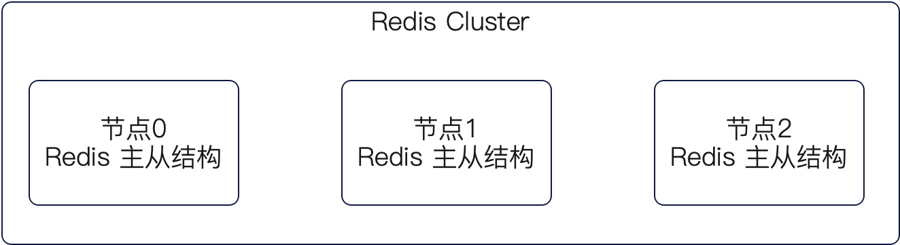
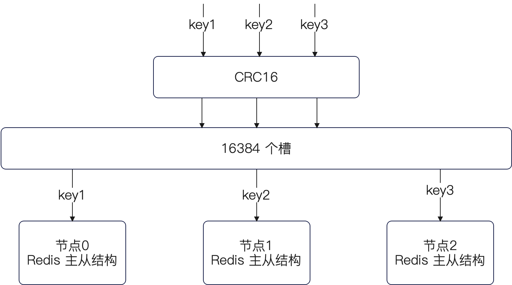

# redis

## redis 高性能

- 数据存储在内存中
- 单线程时间驱动模型，IO多路复用，避免多线程上下文切换和竞态条件
- 多种高效的数据结构

> redis 6.0 之后性能瓶颈在 网络IO，引用了多线程处理提高网络IO

## redis 应用场景

- String类型，首先是热点数据的缓存，再者比较多的就是通过它的incr实现计数，来统计点赞数，播放量，访问量场景，以及进行全局id的生成。而后比较高端就是实现分布式锁，以及布隆过滤器；
- Hash类型，则用在比如说用户不同场景维度的发私信的频控，以及电商类的客户的购物车信息，抖音作品的播放、点赞、收藏等系列数据；
- List 类型，适用于有序但不频繁随机访问的场景，用的比较少。例如说用来实现限流算法，以及关注列表等；
- Set类型，使用在比如说在社交类的场景里面可以用于用户推荐、好友关系（例如我关注了谁，谁关注了我，哪些是互关好友）、存储共同关注的人，推荐可能认识的人等；
- ZSet类型，使用场景如最近听歌数据，最近联系的人，送礼排行榜，热搜榜；

1. 缓存，一般来说根据缓存的数据不同，可以是缓存字符串，或者是 List 结构、哈希结构。一般来说引入 Redis 作为缓存之后，性能会有数量级的提升
2. 滑动窗口算法，用于限流。其基本的思路就是用 List 来维持住流量进来的时间戳，而后每次判定限流的时候则是判定时间窗内有多少时间戳，也就是已经有多少流量了，而这本质上就是一个 Range 的用法。当然在实现的过程中是使用 Lua 脚本来完成的
3. 榜单问题。这个榜单问题的核心就是利用 ZSet 来排序，对应的 score 则是根据排序规则来计算。比如说根据时间、点赞和评论数等计算一个热度，把这个热度作为 score。每次获取前几名，也就是执行一次 Range 而已。
4. 分布式锁。使用 Redis 来设计分布式锁的关键点有两个：使用 SETNX 来排他性的设置一个值；要考虑续约的问题。也就是在设置了一定的过期时间之后，如果在快要过期了业务还没执行完毕，那么要考虑续约的问题，防止分布式锁因为过期而失效。

## redis 数据结构

- 字符串（String）
  - 底层实现：简单动态字符串（SDS）
  - 特点：适用于存储单个值，如用户 session、缓存对象。
  - 场景：大部分简单数据的缓存都是使用这个数据结构的
- 列表（List）
  - 底层实现：有两种实现，ziplist，quicklist（链表）（难点）
  - 特点：适用于存储有序元素，如消息队列、文章列表。
  - 场景：例如说收藏夹中的收藏列表，好友列表等，有些公司还会用作消息队列。List 还有一个使用场景，就是可以用来实现滑动窗口算法，达成限流的效果。
- 集合（Set）
  - 底层实现：hashtable 和 intset
  - 特点：适用于存储无序且唯一元素，如标签、用户关注列表。
  - 场景：很多都是利用集合求差集、并集或者交集。比如说共同好友、共同关注的人这种社交的应用。
- 有序集合（Sorted Set）
  - 底层实现：skiplist（跳表，多层索引的链表） 和 ziplist
  - 特点：适用于存储有序且唯一元素，如排行榜、时间线。
  - 场景：最典型的就是各种榜单了，比如说游戏里面的分数排行，或者社交平台的各种榜单，电商平台的各种榜单。
- 哈希（Hash）
  - 底层实现： ziplist 或 hashtable （取决于元素数量和大小）
  - 特点：适用于存储对象属性，如用户信息、配置项。
  - 场景：适合存储有很多属性的对象，比如说在用户系统中，使用 Redis 哈希存储用户信息，键为 user:userid，字段为 name、email 等，HSET 设置属性，HGET 获取属性，读写都可以只操作部分数据，减少数据冗余。
- 地理空间（Geospatial）
  - 底层实现：有序集合（Sorted Set）的扩展
  - 特点：适用于存储地理空间数据，如附近的人、位置服务。
  - 场景：计算附近的人
- 位图（Bitmap）
  - 底层实现：字符串（String）的位操作
  - 特点：适用于存储布尔值，如用户签到、活跃用户统计。
  - 场景：在社交平台中，使用 Redis 位图记录用户每日签到情况，键为 signin:userid，SETBIT 设置签到，GETBIT 查询签到，节省存储空间。
- HyperLogLog
  - 底层实现：HyperLogLog 算法
  - 特点：适用于统计大量数据的基数，如 UV 统计。
  - 场景：UV 统计，在网站分析系统中，使用 Redis HyperLogLog 统计每日 UV，键为 uv:date，PFADD 添加访问记录，PFCOUNT 获取 UV 数，高效处理大数据统计。
- 流（Stream）
  - 底层实现：Rax 树和链表
  - 特点：适用于消息队列和日志收集，支持持久化。
  - 场景：在监控系统 中，使用 Redis 流收集日志信息，键为 log_stream，XADD 添加日志，XREAD 读取日志，支持持久化和高吞吐量。

选择 Redis 数据结构的基本原则：

- 功能性：也就是你选择的 Redis 数据结构至少能支持你所需要的业务场景，能够解决你的业务问题
- 性能：内存要少，读写操作要快
- 底层实现的潜在问题：要进一步评估在你的业务数据特性下，你使用的数据结构对应的底层结构究竟是什么，防止出现 intset 那种升级问题，或者 ziplist 连锁更新的问题
- 扩展性：典型的就是在考虑存储一个大 JSON 串还是使用 Hash 结构，如果考虑到未来存在单字段的读写情况，那么使用扩展性的问题

> 功能性是基础，性能是目标，底层实现是防御，扩展是未来

### 字典和哈希表

Redis 的 hashtable 有两个核心特征：使用拉链法解决冲突，支持渐进式 rehash。

使用拉链法就意味着 hashtable 是一个数组加链表的混合结构，也就是每个数组的元素都是一个链表。在插入数据的时候，就在链表头部插入，这样更加高效。

在查找的时候，首先根据 key 算出哈希值，而后哈希值除以数组的长度得到下标，沿着下标所在的链表进行查找。

而渐进式的 rehash 则意味着在 hashtable 里面，有 ht[0] 和 ht[1] 两个标准的哈希表，它们也代表渐进式 rehash 中的旧表和新表。而不管是扩容还是缩容都是使用渐进式 rehash 来完成的。

渐进式 rehash 的过程包含三个主要步骤。

1. ht[1] 上创建一个新容量的哈希表。
2. 逐步把 ht[0] 上的数据迁移到 ht[1] 上。一方面，增删改查都会触发迁移，另外一方面 Redis 的后台任务循环也会主动迁移。
3. ht[0] 的数据迁移完成之后，交换 ht[0] 和 ht[1] 的指针，而后将 ht[1] 置为 NULL。

（分析增删改查的过程）在渐进式的 rehash 过程中，如果是增加新的 key，那么会直接在 ht[1] 上操作。

如果是删改查已有的 key，那么就会先找 ht[0] 再找 ht[1]，找到之后就执行操作。

需要注意的是，渐进式过程中，一个 key 要么出现在 ht[0] 上，要么出现在 ht[1] 上。

## 高可用

Redis 的高可用主要是源自两套方案：Redis Sentinel 和 Redis Cluster。

1. Redis Sentinel 本质上是一个主从集群，内部可以进一步细分为 Sentinel 集群和数据集群。Sentinel 集群监控数据集群，而后数据的首先是数据复制。也就是主节点和从节点保持数据同步，这样即便主节点崩溃了，从节点上也还有数据。其次是主从选举，也就是说主节点崩溃之后会立刻选举出来一个新的主节点，继续提供服务。不过 Redis Sentinel 的主从选举和一般主从选举有点区别，它不是从节点互相推举选出来的，而是 Sentinel 选出来的。
2. Redis Cluster 是一个对等结构和主从结构的混合架构。Redis Cluster 由多个节点组成，这些节点之间地位是平等的，也就是说它们构成了一个对等结构。但是从细节上来说，每一个节点都是一个主从集群，也就是说每一个节点都是类似于 Redis Sentinel 模式。Redis Cluster 利用 CRC16 将 key 分散到 16384 个槽上面，而后再次将这些槽分配给不同的节点。可以平均分，也可以不是平均分。

通过这种混合模式，Redis 能有效应对各种问题。

1. 从对等结构上来说，就算是某个节点彻底不可用，也不会影响到别的节点，整个集群还是能够提供有损服务的。
2. 从主从结构上来说，通过数据同步和主从选举，这样即便主节点崩溃了， 也能选举出来一个新的从节点顶上。

Redis Cluster 这种对等集群和主从集群的混合模式，在别的中间件里面也能看到类似的设计，甚至于可以说现代的大规模分布式软件的高可用都是通过这种设计来保证的。

1. Kafka 的一个 Topic 有多个分区，这些分区之间地位是平等的，所以可以看做是对等结构。而每一个分区本身也是一个主从结构，也有数据复制和主从选举。所以Kafka 就算一个分区出问题，或者逻辑分区的主分区出现问题，依旧能够正常对外提供服务。
2. MySQL 的分库分表也可以看做是这种形态。一个逻辑表被分库分表之后，每一个物理表地位都是平等的，也就是可以看做是对等结构。而每一个物理表都是存储在 MySQL 主从集群上的，那么也就是说物理表本身也有主表和从表。通过这种混合模式可以保证极高的可用性。

### Redis Cluster

Redis Cluster 是一个对等结构和主从结构的混合架构。Redis Cluster 由多个节点组成，这些节点之间地位是平等的，也就是说它们构成了一个对等结构。

但是从细节上来说，每一个节点都是一个主从集群，也就是说每一个节点都是类似于 Redis Sentinel 模式。

Redis Cluster 利用 CRC16 将 key 分散到 16384 个槽上面，而后再次将这些槽分配给不同的节点。可以平均分，也可以不是平均分。

通过这种混合模式，Redis 能有效应对各种问题。

首先是从对等结构上来说，就算是某个节点彻底不可用，也不会影响到别的节点，整个集群还是能够提供有损服务的。

而从主从结构上来说，通过数据同步和主从选举，这样即便主节点崩溃了， 也能选举出来一个新的从节点顶上。

Redis Cluster 能够撑住极高的并发，并且能够提供极高的可用性，所以已经成了当下大规模分布式系统里面的核心组件。

### 槽分配

Redis 集群支持自动分配槽，也支持手动分配，同时还支持再平衡。所谓的再平衡就是让 Redis 重新分配这些槽

Redis Cluster 的槽分配很简单，两句话就能说清楚：CRC16算哈希值，槽分配到节点。

也就是说，针对每一个 key，Redis Cluster 会用 CRC16 计算一个哈希值。而后这个哈希值会被映射过去 16384 （2 ^ 14）个槽上，Redis Cluster 再把这些槽分配到节点上。

Redis Cluster 使用 16384 个槽是**为了在性能、资源消耗和可扩展性之间取得平衡**。

当客户端读写 key 的时候，客户端可以在初始化的时候，使用 CLUSTER NODES 命令拿到槽分配的情况，而后自己利用 CRC16 计算哈希值，除以 16384 的余数就是槽编号，而后根据 CLUSTER NODES 返回的数据找出 key 所在的节点，将请求发送过去。

也可以不找，随便找一个节点发过去，如果这个节点发现 key 不在自己这里，就会返回一个 MOVED 响应，告诉客户端 key 所在节点的 IP 和端口。客户端收到 MOVED 之后就可以直接把请求发送过去对应的节点上。不过这种情况下，一个请求相当于发送了两次，性能极差。

Redis Cluster 这种槽机制，虽然很大程度上避免了数据倾斜的问题，但是还是难免会出现数据倾斜、QPS 倾斜之类的问题。

在这种情况下，最好的方案就是让 Redis Cluster 执行再平衡，重新分配一下槽。但是再平衡以及槽迁移是一个很消耗性能的问题，所以正常都不太建议这么搞。

而且，槽迁移只能解决节点级别的数据倾斜和QPS倾斜的问题。但是如果要是特定的槽上面数据就是极多，或者 QPS 极高，那么 Redis Cluster 的再平衡就无能为力。更进一步来说，如果是特定某个 key 的 QPS 极高——这也是常说的热点 key，那么 Redis Cluster 也是无能为力了。

> 槽数据倾斜；热点key；
>
> CRC16算哈希，槽分配到节点，MOVED响应来指路
>
> 再平衡解决数据倾斜

## 主从复制

Redis 的主从复制就两个：

1. **全量复制**：在全量复制中，从节点从主节点那里复制整个数据集。这种策略适用于从节点初次加入或者数据丢失的情况。主节点会生成一个 RDB 快照，并将其发送给从节点，从节点加载这个快照来进行复制。全量复制的缺点是，如果数据集非常大，将会占用大量的网络带宽和时间。
2. **增量复制**：部分重同步是一种增量复制方式，在从节点和主节点断线后重新连接时使用。主节点会将从断线期间执行的写命令发送给从节点，使得从节点能够只接收丢失的部分数据，以此保持数据的一致性。这种方式相对于全量复制来说，节省了大量的带宽和时间。

综合来看，全量复制适用于初始化同步或数据丢失的情况，而部分重同步适用于从节点和主节点断线后的重新连接。

如果站在一个节点的角度，那么当一个节点加入了主从集群之后：

1. **初始化同步**：从服务器连接到主服务器并发送SYNC命令请求进行初始化同步。
2. **快照传输**：如果主服务器没有持久化数据到磁盘，它将执行BGSAVE命令创建一个RDB快照文件。然后，主服务器将这个快照文件发送给从服务器。
3. **增量复制**：一旦快照传输完成，主服务器将继续将写命令传输给从服务器，从服务器会逐步复制主服务器上的新写命令，从而保持数据的一致性。
4. **复制偏移量**：主服务器会记录传输给从服务器的最后一条写命令的偏移量，当从服务器重新连接时，会根据这个偏移量来进行增量复制，从而不重复传输已经同步过的数据。

也不仅仅是 Redis 使用两种形态的复制，在所有的主从结构中，基本上都会支持两种复制模式。

举个例子，MySQL 也支持全量复制和增量复制两种形式，其中增量复制主要是依赖于 binlog 实现的，并且业界还针对这种增量复制模式搞出来很多工具，例如说 Canal，可以进一步用于监听 MySQL 的数据变更。

但是在具体实现上，不同的中间件都会有一些差异。例如说在 MySQL 的例子里面，增量复制借助 binlog 来实现，而从节点在收到 binlog 并不是直接执行这个 binlog，而是要先写入到中继日志中。但是 Redis 的从节点是立刻执行的。

## 主从选举

Redis Sentinel 集群的关键点：有一个 Redis 数据集群和一个 Redis Sentinel 集群的混合集群

你可以直接把 Redis Sentinel 看做是主从结构，而 Sentinel 就是为了解决主从选举而引入的。

- 首先 Sentinel 获取了主从结构的信息，而后向所有的节点发送心跳检测。
  - 如果这个时候发现某个节点没有回复，就把它标记为主观下线；如果这个节点是主节点，那么 Sentinel 就询问别的 Sentinel 节点主节点信息。
  - 如果大多数都 Sentinel 都认为主节点已经下线了，就认为主节点已经客观下线。

- 当主节点已经客观下线，就要步入故障转移阶段。故障转移分成两个步骤，一个是 Sentinel 要选举一个 leader，另外一个步骤是 Sentinel leader 挑一个主节点。
  - Sentinel leader 选举是使用 raft 算法的，选举出 leader 之后，leader 从健康从节点之中依据 <优先级， 偏移量， 服务器ID> 进行排序，挑出一个节点作为主节点。
  - 找出主节点之后，Sentinel 要命令其它从节点连接新的主节点，同时保持对老的主节点的关注，在它恢复过来之后把它标记为从节点，命令它去同步新的主节点。

Redis Sentinel 和一般的主从选举有两个显著的差异。

- 第一个是 Redis Sentinel 的主从选举并不是从节点自己推选的，而是 Sentinel 选出来的。这主要是为了：
  - 快速选举。Sentinel 直接挑选一个从节点要比从节点自己推举快很多，从而快速从故障中恢复；
  - 实现简单。
  - 独立管理。Sentinel 和数据集群是分开的，这意味着可以独立管理 Sentinel，而且不会影响数据集群；
- 第二个是 Redis Sentinel 选主节点挑的是优先级（**按照优先级**、偏移量和服务 ID）最高的从节点，而不是有最新数据的从节点。**好处是可以借助优先级来做一些骚操作，坏处是从节点上可能没有最新数据。**最典型的场景就是在异步多活场景下，可以给本地同机房的节点更高的优先级，从而总是优先筛选本地节点。

> 主观标下线，客观问他人，选Leader，挑主亲，命令从连新，旧主变从跟。

## 数据过期删除

- 定期删除：Redis 每隔一定时间（默认是 100 毫秒）会随机检查一定数量的键，如果发现过期键，则将其删除
- 惰性删除：在每次访问键时，Redis 检查该键是否已过期

### 内存回收

Redis 提供了几种内存回收策略（Eviction Policies），当 Redis 的内存使用超过配置的最大内存限制时，它会根据设置的策略来删除部分数据。以下是 Redis 常见的内存回收策略：

1. **noeviction**
   - **说明**：当内存满时，Redis 不会删除任何键值对。如果尝试执行写操作（例如 `SET` 或 `LPUSH`）时会返回错误。
   - **适用场景**：需要保证数据持久化的场景，或对丢失数据不敏感的场合。
2. **allkeys-lru**
   - **说明**：当内存满时，Redis 会通过**最近最少使用（LRU, Least Recently Used）**算法删除最久未被访问的键。
   - **适用场景**：当需要优先保留访问频繁的数据时，适合缓存使用场景。
3. **volatile-lru**
   - **说明**：与 `allkeys-lru` 相似，但是只会在设置了过期时间的键中使用 LRU 算法删除最久未被访问的键。
   - **适用场景**：当只有部分键有过期时间时，需要优先删除过期数据的场景。
4. **allkeys-lfu**
   - **说明**：当内存满时，Redis 会通过**最少使用频率（LFU, Least Frequently Used）**算法删除最久未被访问的键。
   - **适用场景**：当需要优先保留访问频繁的数据时，适合缓存使用场景。
5. **volatile-lfu**
   - **说明**：与 `allkeys-lru` 相似，但是只会在设置了过期时间的键中使用 LRU 算法删除最久未被访问的键。
   - **适用场景**：当只有部分键有过期时间时，需要优先删除过期数据的场景。
6. **allkeys-random**
   - **说明**：当内存满时，Redis 会随机删除一个键，无论该键是否设置了过期时间。
   - **适用场景**：适合负载较为均匀的缓存场景，且不关心具体删除哪一项数据。
7. **volatile-random**
   - **说明**：与 `allkeys-random` 相似，但只会在设置了过期时间的键中随机删除一个键。
   - **适用场景**：适用于只关心过期数据删除的场景。
8. **volatile-ttl**
   - **说明**：当内存满时，Redis 会删除设置了过期时间且剩余生存时间（TTL）最短的键。
   - **适用场景**：适合需要根据键的过期时间优先删除即将过期的数据的场景。

## PipeLine

**Redis Pipeline** 是 Redis 提供的一种机制，允许你在一个请求中批量发送多个命令，而不是逐个发送命令和等待响应。这样可以减少网络往返的时间，从而显著提高 Redis 的性能，特别是在需要执行大量命令时。

通过 **Pipeline**，你可以将多个命令打包到一起发送到 Redis 服务器，然后一次性获取所有命令的响应。这样可以减少与 Redis 服务器之间的网络通信次数，从而提高吞吐量和性能。

## 使用中的问题

### Big Key

- 数据压缩
- 大事化小
- 考虑其他数据结构
- redis 集群，将 big key 拆分到不同的服务器上

### Hot Key

- Hot Key 拆分：比如添加随机前缀，使不同用户访问不同 Key
- 多级缓存：CDN 缓存、本地缓存、BFF 缓存
- 读写分离
- 限流和降级

## redis 持久化

### **RDB（Redis DataBase）快照持久化**

- Redis 会在内存中定期生成数据的快照，并将快照保存为 `.rdb` 文件。
- 默认情况下，RDB 快照会在配置的时间间隔和写操作数量满足时触发。

**优点**：

- 快照是全量备份，恢复速度快。
- 性能上通常比 AOF 更高，因为只在特定时刻进行全量备份。

**缺点**：

- 数据丢失的风险较高。如果 Redis 在快照保存之前崩溃，那么最近的写操作可能会丢失。
- 不适用于需要频繁持久化的场景。

### **AOF（Append Only File）追加文件持久化**

每次写操作（如 `SET`、`INCR` 等）都会被追加到 AOF 文件。

Redis 在后台会不断将写操作追加到 `appendonly.aof` 文件。

Redis 会定期执行一次 **重写（rewrite）** 操作，以减少 AOF 文件的大小，删除已被过期或无效的操作。

AOF 支持三种同步策略：

1. **always**：每次写操作都会立即同步到磁盘。会非常慢，通常不推荐。
2. **everysec**：每秒同步一次 AOF 文件，性能和数据持久化的平衡。
3. **no**：完全依赖操作系统控制同步，最快，但数据安全性差。

**优点**：

- AOF 记录了每个操作，数据恢复时几乎没有丢失。
- 数据丢失的风险小，适合对数据安全性要求高的场景。

**缺点**：

- AOF 文件通常比 RDB 文件要大，因为记录了每个写操作。
- 性能比 RDB 差，尤其是当同步频率较高时。

**重写**（rewrite）：

为了避免 AOF 文件过大，Redis 会在特定条件下进行 **AOF 重写（AOF Rewrite）**，即创建一个新的 AOF 文件，包含当前数据库状态所需的最少操作。AOF 重写是一个后台操作，不会阻塞客户端请求。

### **RDB + AOF 组合模式**

Redis 允许同时开启 RDB 和 AOF 持久化机制。你可以在高可用性要求较高的场景下同时使用两者：

- **RDB** 提供快速的全量备份。
- **AOF** 提供更高的写操作持久化保障，确保数据不丢失。

## Redis 哨兵机制

**Redis 哨兵（Sentinel）机制** 是 Redis 提供的一个高可用性（HA）解决方案，主要用于监控 Redis 主从集群的状态，自动进行故障转移（failover），以及提供服务发现和通知功能。它能够确保 Redis 集群在主节点（Master）出现故障时，自动切换到备用节点（Slave），从而避免单点故障，提高系统的可用性和稳定性。

### Redis 哨兵的核心功能

1. **监控主从节点状态**：哨兵会定期检查 Redis 主节点和从节点的健康状态。如果主节点出现故障，哨兵会进行自动故障转移。
2. **自动故障转移**：当哨兵检测到主节点不可用时，它会自动选举一个从节点提升为新的主节点，然后更新集群中的其他从节点指向新的主节点。
3. **通知和服务发现**：哨兵可以向外部系统发送故障通知，并在故障转移完成后，提供新的主节点信息给客户端，从而使客户端能够继续访问正确的主节点。
4. **配置中心**：哨兵可以充当一个配置中心的角色，客户端可以向哨兵查询当前主节点的地址，以便获取最新的主节点信息。

## Redis 分布式锁

### setnx + lua 脚本

### red lock

RedLock 的核心思想是将分布式锁的过程跨多个独立的 Redis 实例进行，通过一定的规则来保证锁的安全性和可靠性。

RedLock 的基本步骤如下：

1. **准备多个 Redis 实例**：至少需要 5 个 Redis 实例，这些实例可以部署在不同的机器上，确保高可用性和容错能力。
2. **尝试在多个 Redis 实例上获取锁**：
   - 客户端向每个 Redis 实例请求获取锁（通常使用 `SET key value NX PX ttl` 命令）。其中，`NX` 表示只有当 key 不存在时才成功获取锁，`PX ttl` 指定锁的过期时间（避免锁的死锁问题）。
   - 客户端最多等待 **`N` 个 Redis 实例中有超过一半的实例成功获得锁**。通常需要的 Redis 实例数为奇数，这样可以通过简单的多数原则（如 3 个成功，2 个失败）来确定是否获取到锁。
3. **加锁成功**：
   - 如果客户端在超过一半的 Redis 实例上成功获取到锁，认为加锁成功。
   - 如果加锁失败（例如，超过一半的 Redis 实例都没有获取到锁），客户端应当释放已经获得的锁并重试。
4. **释放锁**：
   - 客户端在完成工作后，需要释放锁。释放锁的过程与加锁过程类似，客户端会在所有获取锁的 Redis 实例上执行 `DEL key` 命令。
   - 释放锁时，客户端需要确保只有它自己才能删除该锁，以避免误删。通常会在锁的 value 中加入客户端唯一标识（如 UUID），只有当 value 匹配时，才允许释放锁。
