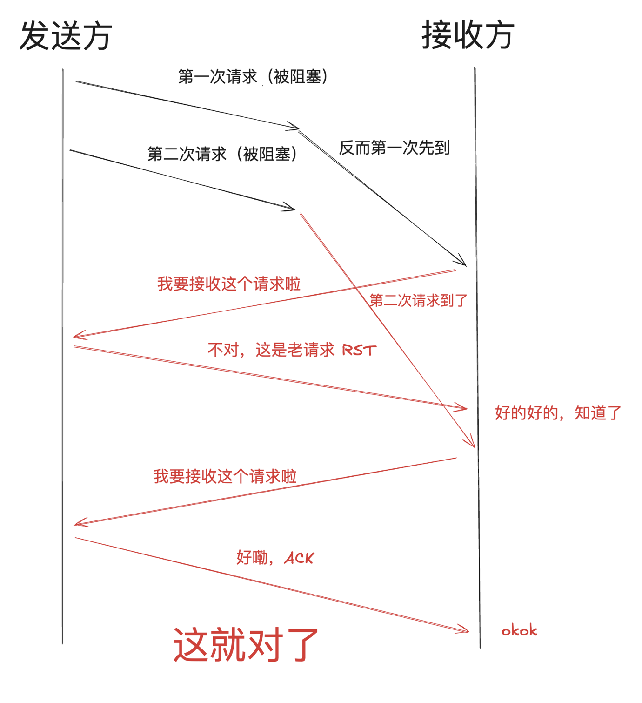
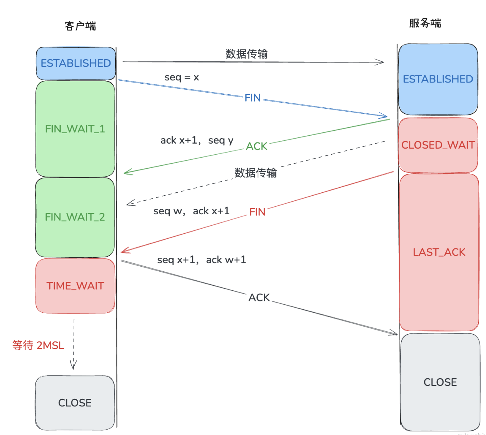

# tcp

## http

**HTTP/1.0**

- 增加了 HEAD、POST 等新方法。
- 增加了响应状态码。
- 引入了头部，即请求头和响应头。
- 在请求中加入了 HTTP 版本号。
- 引入了 Content-Type，使得传输的数据不再限于文本。

**HTTP/1.1**

- 新增了连接管理即 keepalive，允许持久连接。
- 支持 pipeline，无需等待前面的请求响应，即可发送第二次请求。
- 允许响应数据分块（chunked），即响应的时候不标明 Content-Length，客户端就无法断开连接，直到收到服务端的 EOF，利于传输大文件。
- 新增缓存的控制和管理。
- 加入了 Host 头，用在你一台机子部署了多个主机，然后多个域名解析又是同一个 IP，此时加入了 Host 头就可以判断你到底是要访问哪个主机。

**HTTP/2**

- 是二进制协议，不再是纯文本。
- 支持一个 TCP 连接发起多请求，移除了 pipeline。
- 利用 HPACK 压缩头部，减少数据传输量。
- 允许服务端主动推送数据。

**HTTP/3.0**

- 基于UDP，使用QUIC协议（Quick UDP Internet Connections），提供类似TCP的可靠性和多路复用。
- 通过QUIC协议，避免了TCP队头阻塞，即使在网络不稳定的情况下也能提供更好的性能。
- 默认使用QUIC自带的TLS 1.3加密，安全性更高，且加密是强制的。
- QUIC集成了连接建立和加密握手，连接建立速度更快，尤其在初次连接时。

## TCP 解决的问题

1. **可靠性传输：**
   - TCP确保数据包在网络传输过程中不丢失、不重复，并且按顺序到达。通过确认（ACK）、重传机制以及序列号，TCP能够保证数据在不可靠的IP网络上可靠传输。
2. **流量控制：**
   - TCP通过滑动窗口机制调节发送方的数据发送速率，防止接收方因为处理能力有限而被数据流淹没。
3. **拥塞控制：**
   - TCP通过拥塞避免算法（如慢启动、拥塞避免、快速重传和快速恢复）来防止网络过载，确保网络资源的公平使用和稳定性。
4. **连接管理：**
   - TCP是面向连接的协议，采用三次握手（建立连接）和四次挥手（断开连接）机制来管理会话，确保通信的可靠性和状态的同步。

## 内容

1. **数据包重排序与重传机制：**
   - TCP的序列号机制确保数据包按照正确的顺序组装。接收方通过序列号识别数据包的顺序，如果检测到丢失或乱序的包，会请求重传，保证数据完整性。
2. **滑动窗口与流量控制：**
   - 滑动窗口用于动态调整可以发送的数据量。接收方通过发送窗口大小通告，指示发送方可以发送的最大数据量。这种机制不仅避免了接收方的溢出，还提高了数据传输效率。
3. **拥塞控制算法：**
   - TCP的拥塞控制算法是核心的网络稳定性保证。经典算法包括以下几个步骤：
     - 慢启动：逐步增加发送窗口，直到检测到网络的拥塞点。
     - 拥塞避免：当达到网络容量后，逐渐增加窗口以避免拥塞。
     - 快速重传和快速恢复：在检测到包丢失时，立即进行重传并调整发送窗口，快速恢复正常传输状态。
4. **TCP三次握手与四次挥手：**
   - 三次握手：建立连接时，双方通过三次信息交换（SYN, SYN-ACK, ACK）来确保双方都准备好进行数据传输，并协商参数（如初始序列号）。
   - 四次挥手：断开连接时，通过四次消息交换来确保数据传输完成且资源可以安全释放，防止未传输的数据丢失。
5. **TCP的适应性与演变：**
   - 随着互联网的发展，TCP也经历了多次改进，如TCP Reno、TCP NewReno、TCP Vegas等，它们在拥塞控制和流量管理上有不同策略，以适应不同的网络环境。
6. **TCP的局限性：**
   - 虽然TCP解决了可靠传输的问题，但在高延迟、高带宽的网络（如卫星通信、现代数据中心）中可能会受到性能瓶颈，进而催生了如QUIC等新协议的出现。

## TCP 与 UDP 的区别

| 特性              | TCP                                   | UDP                                        |
| ----------------- | ------------------------------------- | ------------------------------------------ |
| 连接方式          | 面向连接                              | 无连接                                     |
| 可靠性            | 提供可靠性，保证数据按顺序到达        | 不可靠，不保证顺序或完整性                 |
| 流量控制/拥塞控制 | 提供流量控制和拥塞控制                | 没有流量控制和拥塞控制                     |
| 顺序保证          | 保证数据顺序                          | 不保证数据顺序                             |
| 头部大小          | 较大（20字节及以上）                  | 较小（8字节）                              |
| 性能              | 较低，延迟大                          | 较高，延迟小                               |
| 数据传输模式      | 字节流传输模式                        | 数据报传输模式                             |
| 适用场景          | 文件传输、Web、邮件等需要可靠性的应用 | 实时通讯、语音、视频、游戏等高性能要求应用 |
| 是否能粘包        | 是                                    | 否                                         |

## 粘包与拆包

1. **粘包与拆包（也称半包）现象：**
   - **粘包：** 在TCP传输中，发送方的多个数据包在接收方被合并成一个包接收，导致多条消息数据粘在一起，接收方无法正确区分这些消息的边界。
   - **拆包：** 发送方的一个数据包在接收方被分成了多个包接收，导致一条完整的消息被拆成多个部分，接收方无法一次性接收到完整的数据。
2. **原因：**
   - **粘包：** 主要由于TCP是面向字节流的协议，它不关心数据边界，数据在发送方可能被一次性发送，接收方在读取时可能会将多个消息拼接在一起。
   - **拆包：** 可能由于网络传输中的MTU（最大传输单元）限制或发送缓冲区大小限制，一个大包被分成了多个小包传输。
3. **解决方法：**
   - **使用定长消息：** 每个消息都有固定的长度，接收方按照固定长度读取数据。
   - **添加消息分隔符：** 在每个消息之间添加特定的分隔符（如换行符），接收方可以通过分隔符来区分消息。
   - **使用消息头：** 在消息的头部添加一个长度字段，指示消息的长度，接收方根据这个长度来读取相应长度的数据。

## 三次握手

1. 客户端发送SYN包请求连接。
2. 服务器收到SYN包后，返回SYN+ACK包，表示同意连接并等待客户端确认。
3. 客户端收到SYN+ACK包后，发送ACK包确认，连接建立。

为了阻止历史的重复连接初始化导致的混乱

### SYN

在TCP（传输控制协议）中，SYN（Synchronize Sequence Numbers，同步序列号）是一个用于建立连接的特殊标志位。它在TCP三次握手过程中起着至关重要的作用，确保了两个通信实体之间能够建立一个可靠的连接

1. **连接建立失败的情况**：
   - 客户端发送SYN包至服务器后宕机。
   - 服务器发送SYN+ACK包，但一直未收到客户端的ACK响应。
   - 服务器会进行阶段性重试。
2. **重试机制**：
   - 重试次数由系统参数`tcp_synack_retries`决定。
   - 在Linux系统中，默认重试次数为5次。
   - 重试是阶梯性的，间隔时间分别为1秒、2秒、4秒、8秒、16秒。
   - 第五次重试后，还需要等待32秒才能知道这次重试的结果。
3. **总等待时间**：
   - 总共需要等待63秒才能断开连接并释放资源。

### SYN Flood 攻击

SYN Flood是一种拒绝服务攻击（DoS），通过发送大量SYN包耗尽服务器资源，使服务器无法响应用户连接请求。

利用TCP三次握手机制，攻击者发送大量SYN包但不完成后续握手步骤（不发送ACK），导致服务器在等待未完成连接状态下耗尽资源。

## 四次挥手

除了四次挥手断开连接，还有 RST（Reset）标志强制断开、超时

为什么要四次挥手

- 主要是为了确保数据完整性。
- TCP是一个全双工协议，双方都要关闭，每一方都向对方发送FIN和回应ACK。
- 客户端发起连接断开，代表客户端没有数据要发送的，但是服务端可能还有数据没有返回给客户端。
- 就像我对你说你数据发完了，然后你回复好的你收到了。然后你对我说你数据发完了，然后我向你回复我收到了。这样才能保证数据不会丢失。
- 所以一个FIN+ACK代表一方结束数据的传输，因此需要两对FIN+ACK，加起来就是四次通信。

如果 Client 发送 FIN 给 server 的时候已经没数据发送给 Client 了，那么 Server 就可以将 ACK 和它的 FIN 一起发给 Client，这样就变成**三次挥手**

1. **第一次挥手（FIN → ACK）**：
   - 客户端主动关闭连接，发送FIN包，进入FIN_WAIT_1状态。
   - 服务器收到FIN后，表示不再接收数据，但仍可能继续发送数据。
2. **第二次挥手（ACK）**：
   - 服务器发送ACK包，确认已收到FIN。
   - 此时服务器进入CLOSE_WAIT状态，客户端进入FIN_WAIT_2状态。
3. **第三次挥手（FIN → ACK）**：
   - 服务器完成所有数据传输后，发送FIN包，进入LAST_ACK状态。
   - 客户端收到FIN后，准备关闭连接。
4. **第四次挥手（ACK）**：
   - 客户端发送最后一个ACK包，进入TIME_WAIT状态，等待可能迟到的FIN包。
   - 服务器收到ACK后，关闭连接，进入CLOSED状态。
   - 客户端在TIME_WAIT计时结束后（2MSL），正式关闭连接。

### TIME_WAIT 作用

1. 确保最后的ACK被成功接收：

- 在TCP四次挥手过程中，主动关闭连接的一方在发送最后一个ACK确认包后进入TIME_WAIT状态。
- 如果这个ACK丢失了，另一方（被动关闭连接的一方）没有收到确认包，会重发FIN报文。主动关闭的一方需要在TIME_WAIT状态下保持一段时间，以便能够重发ACK，确保连接能被正确地关闭。

2. 防止旧的重复分段干扰新连接：

- TCP连接在关闭后，可能会有一些延迟的或者已经失效的报文还在网络中传输。如果立即重新使用相同的IP地址和端口建立新的连接，可能会受到这些旧报文的干扰。
- TIME_WAIT状态可以确保在旧连接的所有报文都超时失效后，才允许新的连接使用相同的IP地址和端口，从而避免数据混乱。

## ISN

在TCP协议中，ISN（Initial Sequence Number，初始序列号）是建立连接时为每个TCP连接分配的一个起始序列号。序列号是TCP协议用于数据传输的重要机制

- ISN是以时间戳为基础生成的，这意味着ISN的生成与系统时间相关，以确保每次生成的ISN都是唯一的。
- 根据RFC 793，ISN的生成与一个假的时钟绑定在一起。这个时钟每四微秒增加1，这为ISN提供了一个递增的基础值。
- 当ISN达到2的32次方（即232）时，它会回绕到0并重新开始计数。这意味着大约每4.5小时（具体时间取决于计数速率），ISN会经历一次回绕。
- 为了提高安全性，实际的ISN实现中会加入一些随机值。这样做是为了防止不法份子通过预测ISN的生成模式来发起攻击，如SYN洪水攻击。
- 通过在ISN生成中加入随机值，可以使得ISN的预测变得更加困难，从而提高了TCP连接的安全性。

## 流量控制

滑动窗口

- TCP滑动窗口机制的主要作用是实现流量控制（Flow Control），即协调发送方和接收方的数据传输速率，确保发送方不会发送超出接收方处理能力的数据量，防止接收端缓冲区溢出。
- 滑动窗口允许发送方在未收到前一个数据包的确认（ACK）前继续发送多个数据包，从而提高网络吞吐量，减少等待时间，实现高效的数据流传输。

## 拥塞控制

慢启动（Slow Start）：

- 发送方在连接建立初期，缓慢地增加数据发送速率。初始的拥塞窗口（cwnd）通常为一个MSS（最大报文段大小），然后在每次收到ACK后成倍增加cwnd，直到达到慢启动阈值（ssthresh）或检测到网络拥塞。

拥塞避免（Congestion Avoidance）：

- 当cwnd达到ssthresh后，TCP进入拥塞避免阶段，拥塞窗口的增长速度从指数变为线性增长，即每个RTT（往返时间）增加一个MSS。这一阶段旨在避免激烈的拥塞反应，保持网络稳定性。

快速重传（Fast Retransmit）：

- 发送方在收到三个重复的ACK后，立即重传被认为丢失的报文段，而无需等待超时。这减少了重传的延迟，迅速应对数据丢失。

快速恢复（Fast Recovery）：

- 在快速重传后，TCP不进入慢启动，而是减小cwnd到当前的一半，并设置ssthresh为当前新的cwnd的值，然后开始线性增加cwnd，以快速恢复到丢包前的传输速率。
