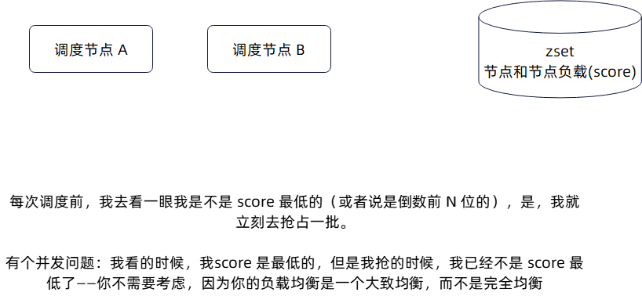
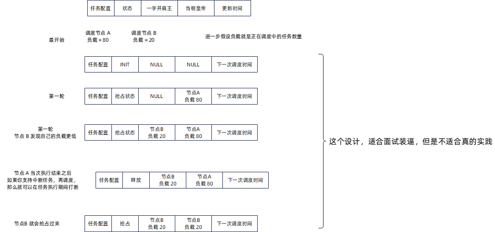

# 分布式任务调度系统

## 分布式锁方案

> 如果抢到了分布式锁，那么就执行任务，否在就不执行

基于 redis 实现的分布式锁

### 缺点

只能控制住同一时刻只有一个 goroutine 在计算热榜，但是控制不住计算一次之后，别的机器就不要去计算热榜了

### 如何解决缺点

当下的分布式锁的意思是，我只在计算的过程中持有这个锁，等计算完毕我就释放锁。

我们可以考虑在启动的时候拿到锁，而后不管计算几次，都不会释放锁

自己拿到了锁，那么就要开启自动续约功能

## 基于 mysql 的分布式任务调度

### 两种形态

- SDK 形态
- 调度中心形态
- 同时支持两种形态

### 负载均衡

#### **调度节点**





#### **执行节点**

- 普通的客户端负载均衡算法都可以用
- 维护一个客户端节点正在执行任务数量 —— 对应于微服务负载均衡中的活跃请求数负载均衡

### **长时间执行任务的进度探查与上报**

- 比如说处理 1000w 条数据
- 执行时间要个几十分钟

#### **关键点**

- 调度中心开始调度，执行节点只会返回一个 Accepted 的响应，意思就是我正在执行。
- 两个选择：
  - 调度中心主动探查
    - 同样用 HTTP 接口或者 RPC 接口来探查
      - 例如 HTTP 接口 POST  POST /a/b/most_fans 方法，就是启动新任务
      - GET /a/b/most_fans 就是拿执行进度
      - GET /a/b/all_tasks 拿到当前节点所有执行中任务
    - 一种优化措施：就是每个执行节点至多有一个 TCP 连接，专门用来传递进度
  - 执行节点主动上报
    - 调度节点暴露 HTTP 接口或者 RPC 接口
      - 执行节点 POST /a/b/task_progress execution_id: 123, progress: 50%
    - **调度节点提供一个 消息队列和对应的 Topic**。
      - 执行节点发送消息 execution_id: 123, progress: 50% 到 Topic 上
      - 调度节点消费消息

### 中断与再均衡

#### **调度节点的再均衡问题**

一般不考虑。

#### **执行节点中断与再均衡问题**

- 要在上报进度的时候，执行节点要上报自己的进度，负载，以及是否重调度，和重调度的参数。举个例子：{progress: 50%, rebalance: true, params: {offset: 10w} }
- 调度节点收集到进度信息，选择其它执行节点，带上 params，要求执行节点继续执行

### 任务编排

- 调度节点上，维持住一个有向图
- 每次收到任务执行完毕的信息，就检查这个有向图，确定下一个任务

### 思路

- 在数据库中创建一张表，里面是等待运行的定时任务
- 所有的实例都试着从这个表里面“抢占”等待运行的任务，抢占到了就执行

> 抢占的时候我崩了怎么办？
>
> 答：引入续约机制
>
> 怎么表达一个抢占动作？
>
> 答：使用乐观锁更新状态，也就是我先找到符合条件的记录，然后我尝试更新状态为调度中，为了防止并发竞争，我用 version来保证在我读取，到我更新的时候，没有人抢占了它

### 表结构设计

```go
type Job struct {
	Id       int64 `gorm:"primary_key,AUTO_INCREMENT"`
	Cfg      string
	Executor string
	Name     string `gorm:"unique"`
	Status   int
	Version  int64
	Cron     string
	NextTime int64 `gorm:"index"`
	UTime    int64
	CTime    int64
}
```

### 优化策略

1. 一次取一批， 一次性取出100个，然后随机从某一条开始抢占
2. 随机偏移量，兜底：第一次没查到，偏移量回归到 0
3. id取余分配， 兜底不加余数条件
4. 乐观锁 CAS操作，compare and swap
5. 用乐观锁 取代 for update（性能差，死锁）

## 基于 k8s 的分布式任务调度

```yaml
apiVersion: batch/v1
kind: CronJob
metadata:
  name: webook
spec:
  jobTemplate:
    spec:
      template:
        spec:
          containers:
            - name: hello-world
              image: flycash/cron_job:v0.0.1
              imagePullPolicy: IfNotPresent
          restartPolicy: OnFailure
  schedule: "*/5 * * * *"
```

## 分布式任务调度平台

1. 加入部门管理和权限控制功能
2. 加入 HTTP 任务和 GRPC 任务支持（也就是调度一个任务，就是调用一个 HTTP 接口，或者调用一个GRPC 接口）
3. 加入任务执行历史的功能（也就是记录任务的每一次执行情况）