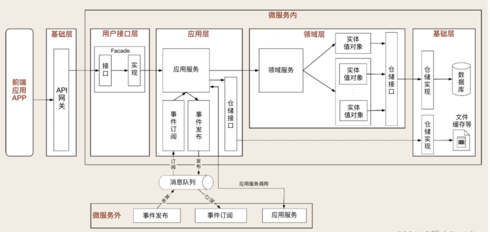
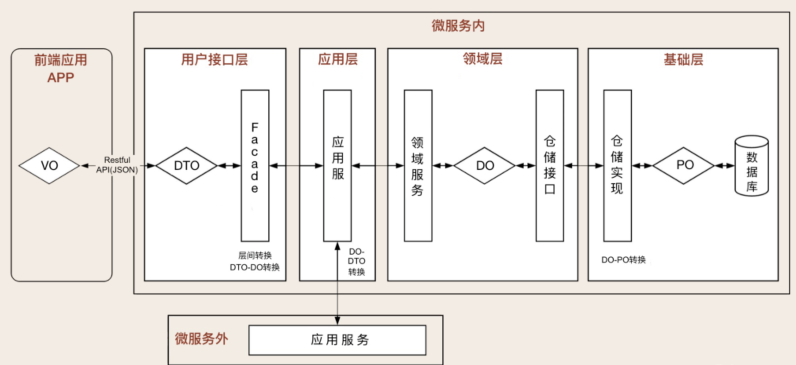

# 微服务

## 演化过程

- 传统分层结构
- SOA 架构
- 微服务架构
- 虚拟化技术

## 微服务拆分

### DDD

- **用户界面层（Presentation Layer）**：负责与用户交互，展示数据并收集用户输入。
- **应用层（Application Layer）**：定义系统的主要用例，协调领域层的操作，管理事务和工作流。
- **领域层（Domain Layer）**：系统的核心，包含领域模型（如实体、值对象、聚合等），负责实现业务逻辑和规则。
- **基础设施层（Infrastructure Layer）**：提供数据存储、消息队列等底层资源的支持，实现与外部系统的集成。





### 依据 DDD 来拆分微服务

一个领域就是一个微服务

### 步骤

1. 单体

   > 完善单元测试
   >
   > 先抽取公共部分，如 utils、helper 等
   >
   > 引入聚合层解除模块间循环依赖
   >
   > 按照业务对象划分模块，分到不同的包里

2. 模块化

   > 创建不同的代码仓库，将公共部分、业务模块逐个挪到别的代码仓库
   >
   > 开始准备微服务环境和微服务框架选型
   >
   > 搭建好 CI 和集成测试环境

3. 模块依赖化

   > 业务模块逐个服务化，解决微服务开发、测试、部署中所遇到的问题
   >
   > 搭建自动部署和回滚平台
   >
   > 调研服务治理和网关
   >
   > 引入消息队列
   >
   > 引入分布式事务解决方案
   >
   > 引入分布式任务调度
   >
   > 搭建可观测性平台logging、tracing、metrics以及对应的告警系统

4. 微服务化

   > 做好测试 测试覆盖率 80% 以上
   >
   > 引入服务治理
   >
   > 引入网关
   >
   > 引入回归测试
   >
   > 按照业务分库

## 服务部署不停机方案

### 回滚方案

引入一个同时使用本地调用和微服务调用的中间状态。如果微服务调用出了问题，我们就把流量立刻切换回去本地调用，否则就加大流量。

### 线上灰度方案

随机数+阈值 或者 业务id的哈希值

```go
// 流量调度
func (i *InteractiveClient) selectClient() intrv1.InteractiveServiceClient {
	// [0, 100) 的随机数
	num := rand.Int31n(100)
	if num < i.threshold.Load() {
		return i.remote
	}
	return i.local
}
```

