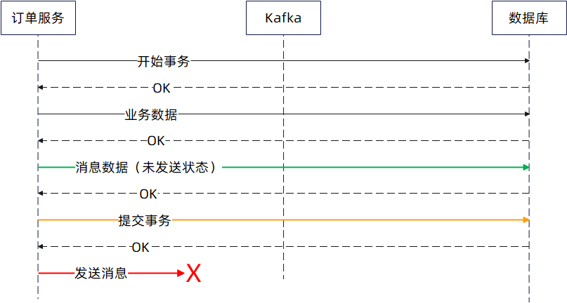
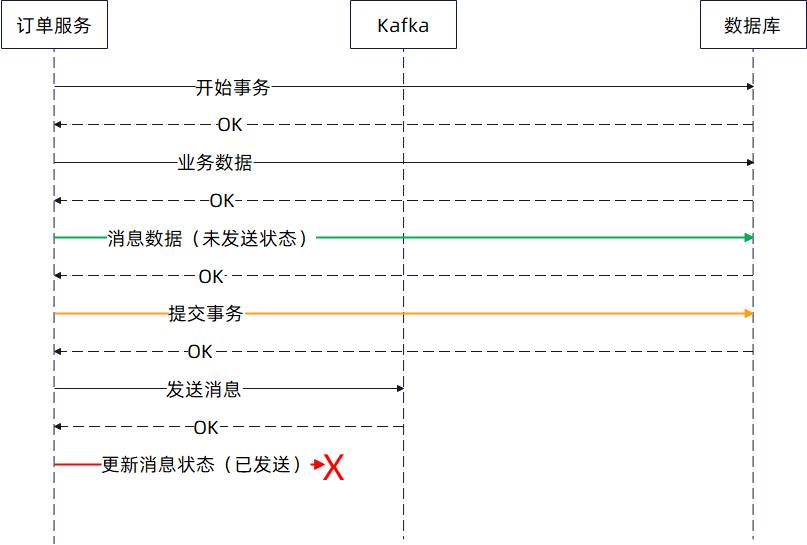

# 本地消息表

本地消息表是实践中一种非常常见的保证业务成功之后，一定要发消息成功的解决方案。而且它还是可靠消息最终一致性和 SAGA 这两种分布事务解决方案中经常使用到的一种技术

## 步骤

本地消息表的核心思想是在数据库中创建一张专门的表来记录需要发送的消息。这张表通常包含消息内容、Topic、重试次数以及状态，如未发送、已发送、已失败。状态字段尤为重要，只有在超过重试次数后，消息状态才会标记为“已失败”。

假设我们需要在订单创建成功后发送一条消息到Kafka。

那么首先，在进行订单创建等业务数据变更的同时，将需要发送的消息记录写入本地消息表。这两步操作在同一个数据库事务中完成，确保业务数据和消息记录要么同时成功，要么同时失败，保持数据的一致性。此时，消息的状态为**未发送**。

接下来，只有在本地事务成功提交后，才进行消息的发送操作。这样可以避免因事务回滚导致消息已发送但业务数据未变更的情况。

而后，在发送成功之后，将数据库中的消息状态更新为**已发送**。

然而，实际操作中可能会遇到两种主要错误：一是提交事务后发送消息失败，二是消息发送成功但更新状态失败

为了应对这些情况，需要引入补偿任务。**补偿任务的逻辑是扫描数据库中处于“未发送”状态且一段时间未更新的消息，然后重新发送**。如果发送成功，则将该消息状态更新为发送成功；如果发送失败并且已经达到了重试次数上限，则更新状态为已失败。

这里的““一段时间”设置很关键，如果希望消息尽快发出，可以设置为 3 秒；如果业务执行时间较长，可以考虑设置为十几秒甚至一分钟。

补偿任务可以不断循环执行，每次处理一批符合条件的消息。如果未找到符合条件的消息，任务可以睡一秒钟，稍作等待。

但是，也可以想到，这里面即便是引入了本地消息表，又引入了补偿任务，但是最终发送消息的时候，还是有可能失败。

比如说如果在重试这段时间内，到消息队列的网络一直不通，那么这个消息还是没有办法发送成功。因此总的来说，这个方案有极大概率保证消息发送成功，但是做不到百分百发送成功。

## 数据库内容

顾名思义，本地消息表就是你需要在数据库中建一张表，这张表包含了以下几个信息：

- 消息内容
- Topic
- 重试次数
- 状态：最基本的几个状态是
  - 未发送
  - 已发送
  - 已失败：只有在超过了重试次数之后，才会标记为这个状态。也就是某次发送失败，但是没有超过重试次数，那么状态还是维持在未发送状态；

也可以根据实际需要额外添加字段

## 补偿任务

有俩种常见的失败的任务

第一个是提交事务之后发送消息失败了，至于失败的原因有很多，可能是订单服务崩溃了，也可能是发送超时了，还有可能就是 Kafka 直接返回失败了



第二个是消息发送成功了，但是更新状态失败了。同样地，失败的原因并不是很重要，比如说可能是订单服务崩溃，也可能是超时，还有可能是数据库崩溃





第二种如果重试成功了，那么代表消费者会收到多条同样的消息，**因此消费者自身需要做到幂等**。

所以这时候就要引入一个补偿任务了。补偿任务的逻辑很简单，**扫描数据中处于未发送状态且一段时间未更新的消息，而后发送出去。**

用 SQL 来表达，就是类似于：

```sql
SELECT * FROM local_msgs WHERE status=未发送 AND update_time < now() - t
```

这里的 t 就是落后的时间长度，这主要是为了避免业务刚插入数据，业务都还没发，定时任务就把消息发出去了。并且也可以在重试的时候，做到每隔时间 t 就重试一次，避免立刻重试。

而任务可以考虑说不断循环，每次找一批符合条件的，挨个发送。如果要是啥都没找到，那么可以自己睡一秒钟，稍微等一下。

### 具体步骤

- 部署了同一个补偿任务的节点抢分布式锁
- 抢到补偿任务的节点开始执行补偿任务，每个任务都是一个无限循环
- 每次循环从数据库中找出一批需要补偿发送的消息
  - 如果当次循环没有找到数据，那么就睡眠一秒
  - 如果当次循环连续发送失败，那么认为补偿任务执行失败，需要退出，释放分布式锁
- 将这些消息发送出去

节点完整的动态调度的流程：

- 节点 A 抢到分布式锁，开始执行补偿任务
- 节点 A 执行补偿任务的时候，发现自己已经不能继续执行补偿任务了
  - 理论上来说，如何发现、达成什么条件才算是不能继续执行补偿任务，是一个很灵活的问题；
  - 默认的实现是连续多次发送补偿消息失败，就算是不能继续执行了
- 节点 A 释放分布式锁，并且陷入睡眠。这个时候 A 会睡很长时间，默认是 1 分钟
- 节点 B 和节点 C 尝试抢占分布式锁，假设说 B 抢占成功，那么 B 会负责执行补偿任务，步骤如上面。节点 C 抢占失败，会睡眠。
- 不管是 C 醒过来，还是 A 醒过来，都可以继续尝试抢占分布式锁
  - 如果 B 还占着，那么他们都会失败
  - 如果 B 也让出了分布式锁，那么他们中会有一个人能成功

所以动态调度就是尝试**抢占-发现不行-让出-睡眠-醒来**继续尝试抢占的机制。通过节点抢占-让出，让补偿任务可以灵活在多个节点中转移，防止节点崩溃导致补偿任务没有执行

## 可观测性

- 特定的业务执行情况，比如说可以用 key 去 trace 平台上搜索
- 补偿任务的运行情况，中间有没有出现失败，失败是因为什么原因失败的
- 本地事务结束之后直接发送成功的比例
- 重试之后都失败了的比例
