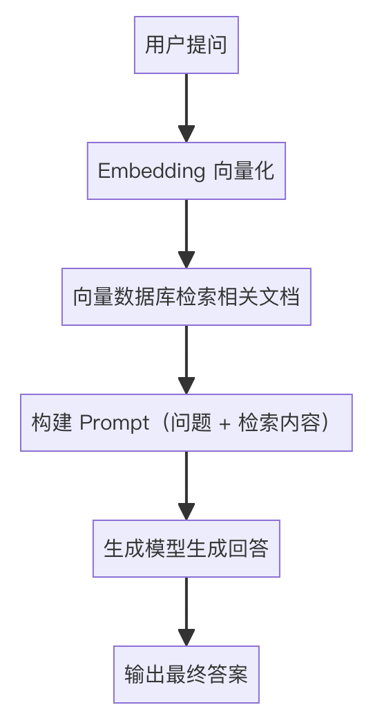
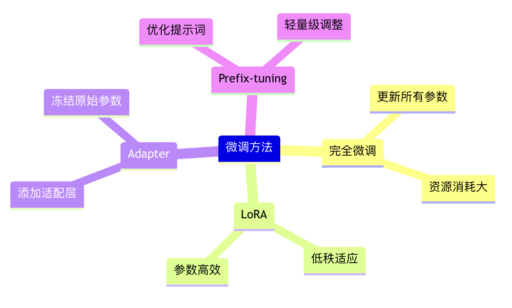

# AI 大模型应用

## RAG

RAG（Retrieval Augmented Generation，检索增强生成）是一种结合信息检索和生成式模型的技术方案。其主要流程包括两个核心环节：

1. **检索（Retrieval）**：基于用户的输入，从外部知识库中检索与查询相关的文本片段，通常使用向量化表示和向量数据库进行语义匹配。

2. **生成（Generation）**：将用户查询与检索到的内容作为上下文输入给生成模型（如 GPT 等），由模型输出最终回答。

即我们在本地检索到相关的内容，把它增强到提示词里，然后再去做结果生成。

简单来说就是利用外部知识动态补充模型生成能力，既能保证回答的准确性，又能在知识库更新时及时反映最新信息（还有一点就是部分业务是内部文档，网上没有，因此可以本地提供知识库来增强 AI 的知识）。

> 为什么会有 RAG？

因为，随着自然语言处理技术的发展，纯生成模型虽然可以生成流畅的文本，但有时知识会滞后或不够精准。

通过引入检索模块，RAG 模型能够从外部知识库中提取实时且丰富的信息，再经过生成模型综合处理，提升回答的准确率和覆盖面，而无需重新训练模型。

### ReRank

在 RAG 中，Rerank 是一个对初步检索返回的候选文档列表进行再次排序的过程。

因为初步检索需要快速地在海量的文档中找出大致相关的文档，其需要考虑效率，所以查找出的文档不会非常准确，这步是粗排。

在已经筛选的相关的文档中再进行精筛，找出匹配度更高的文档让其排在前面，选其中的 Top-K 然后扔给大模型，提高答案的准确性，这就是 Rerank，也是精排。

### Rerank 需要怎么做？

1. **初步检索生成候选文档**：使用速度较快的传统检索方法获得一组候选文档。
2. **根据 Rerank 模型重新排序**：根据 Rerank 模型匹配得分对候选文档进行排序，选出最相关的 Top-K 文档。
3. **交给生成模块**：Top-K 候选文档传递给大模型，帮助生成更精准、更富信息量的回答。

### 文档问答系统

使用 LangChain 构建文档问答系统主要包含两个核心阶段:

1) 文档索引阶段(Indexing)

数据准备过程包含三个主要步骤:

- 文档加载：使用 Document Loader 加载各种格式的文档。
- 文档分块：使用 Text Splitter 将文档切分成合适大小的块。
- 向量化存储：为文本块创建向量嵌入(embeddings)并存储到向量数据库中。

2) 问答检索阶段(Retrieval & Generation)

问答生成过程包含两个主要步骤:

- 相关文档检索：根据用户问题从向量库中检索最相关的文档片段。
- 答案生成：将检索到的文档和用户问题一起传给 LLM 生成最终答案。

## 微调

## 向量数据库

向量数据库是一种专门设计用来存储和管理向量嵌入(vector embeddings)的数据库系统。它可以将非结构化数据(如文本、图片、音频等)转换成高维向量的形式进行存储，并提供高效的相似性搜索功能。

在基于大模型的应用开发中，向量数据库主要解决以下核心问题：

1) 高效的相似性搜索

通过将用户查询转换为向量，可以快速找到语义相似的内容，这对于实现智能问答、推荐系统等功能至关重要。

2) 海量数据处理

能够高效处理大模型生成的海量数据，传统数据库难以处理百万甚至数十亿的数据点，而向量数据库专门针对这种场景进行了优化。

3) 实时交互支持

在需要实时用户交互的应用中(如聊天机器人)，向量数据库可以确保快速检索相关上下文信息，提供实时响应。

## LangChain 中 chain 和 agent

LangChain框架中的Chain和Agent是两个核心组件，它们的主要区别在于执行方式：

1) Chain（链）

Chain是一个预定义的固定操作序列，按照既定的顺序执行任务。类似于一条生产线，每个步骤都是预先设定好的，按部就班地执行。

2) Agent（代理）

Agent则是一个能够动态决策的智能体，它可以根据当前情况自主选择使用什么工具、采取什么行动来完成任务。Agent使用语言模型作为推理引擎，能够实时判断和选择最优的行动序列。

### 多路召回的动态权重分配

在 LangChain.js 中实现多路召回的动态权重分配主要有以下几种方式:

1) 使用 EnsembleRetriever

EnsembleRetriever 是 LangChain 提供的一个组合检索器，可以将多个检索器的结果进行组合。它支持不同的权重分配策略。

2) 自定义权重分配逻辑

可以通过实现自定义的权重分配逻辑，根据查询内容或其他因素动态调整不同检索器的权重。

3) 查询分析路由

通过查询分析来选择最合适的检索器或调整权重分配。

## 大模型涌现能力

大模型的涌现能力（Emergent Abilities）是指在模型规模达到某个临界值后突然出现的、在小规模模型中不存在的能力。这种能力的出现往往是不可预测的，无法通过简单外推小模型的性能来预测。

1) 思维链推理（Chain-of-thought）

这是一种在解决复杂问题时能够像人类一样展示推理过程的能力。当模型规模达到一定程度（约 10^22 FLOPs）后，模型能够生成中间推理步骤，大幅提升在数学应用题等多步骤推理任务上的表现。

2) 指令跟随能力

模型能够准确理解和执行自然语言指令，无需像小模型那样依赖大量示例。这种能力在大规模模型中表现得更为突出，能够理解更复杂的指令并产生符合要求的输出。

3) 多任务理解与迁移

大模型展现出了强大的跨任务泛化能力，能够在没有专门训练的情况下完成新的任务。比如在 MMLU（Massive Multi-task Language Understanding）测试中，大模型可以回答涉及数学、历史、法律等多个领域的问题。

## 突破大模型上下文限制

1) 文本压缩与分段处理

- 文本预处理：使用中间截断法(middle truncation)对过长文本进行压缩。
- 智能分段：将长文本按语义完整性分成多个片段，保持上下文连贯性。
- 动态窗口：根据查询需求动态调整上下文窗口大小，实现查询感知的上下文化处理。

2) 检索增强生成(RAG)

- 向量检索：使用向量数据库存储文档片段，按相关性检索。
- 混合检索：结合关键词和语义检索，提高检索准确性。
- 动态更新：支持知识库的实时更新，确保信息时效性。

3) 模型优化方案

- Ring Attention：通过改进注意力机制提升计算效率。
- 相对位置编码：采用相对位置编码替代绝对位置编码。
- 模型微调：针对长文本场景进行特定任务微调。

## AI 幻觉

### RAG

### 提示工程与边界设置

### 知识图谱增强

### 多模态融合与交叉验证

## RAG 召回结果不满意

当 RAG 系统的召回结果与用户查询意图不匹配时,我们可以从以下三个主要环节进行优化:

1) 预处理阶段优化

- 数据清洗：删除无关文本、特殊字符和噪声数据,纠正拼写和语法错误。
- 元数据增强：为文档添加概念标签、层级信息等元数据,提升检索效率。
- 分块策略：根据具体任务调整chunk大小,确保信息完整性和相关性。

2) 检索阶段优化

- 混合检索：结合关键词检索(BM25)和语义检索(向量检索)的优势。
- 查询重写：使用 LLM 从不同角度重写用户查询,生成多个查询变体。
- 重排序：对检索结果进行二次排序,提升最相关文档的排名。

3) 后处理阶段优化

- 上下文压缩：压缩和过滤不相关的上下文内容。
- RAG Fusion：结合多查询检索和文档重排序,提高检索准确性。