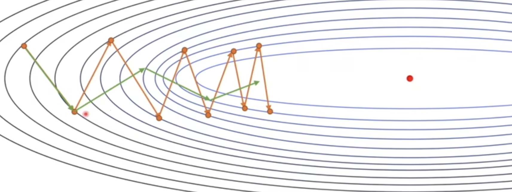

# 神经网络

### 前言

神经网络是模拟人的神经系统，神经系统的基本单元是神经元，神经网络的基本单元是感知机

## 感知机（Perceptron）

**前言**

感知机就是一个线性函数 + 激活函数

马文明斯基在 1969 年就提出了感知机的缺陷，让神经网络停滞了 30 年，让我们看看如今是如何解决的感知机的缺陷

### 感知机

处理分类问题 二分问题

加权和
$$
z = \mathbf{w}^T \mathbf{x} + b
$$
激活函数
$$
a = f(z)
$$
输出值
$$
y = f(\mathbf{w}^T \mathbf{x} + b)
$$

### 缺陷

> 异或问题 线性不可分 能实现与 或 非

### 解决方案

升维（kernel 核方法）

叠加感知机

## 神经网络

全神经网络 前馈神经网络 循环神经网络

全神经网络计算量大，用梯度下降算法 随机梯度下降算法 卷积和池化降维 

只训练一种数据，无法夹逼一条直线，用 sigmoid 激活函数

## 损失函数

比较俩个概率模型的差别
$$
L(\theta) = \frac{1}{N} \sum_{i=1}^{N} L(y^{(i)}, \hat{y}^{(i)})
$$
**最小二乘法** 不适合用梯度下降算法
$$
L(\theta) = \frac{1}{N} \sum_{i=1}^{N} \left( \hat{y}^{(i)} - y^{(i)} \right)^2
$$
**极大似然估计法**
$$
L(\theta) = - \sum_{i=1}^{N} \left[ y^{(i)} \log(\hat{y}^{(i)}) + (1 - y^{(i)}) \log(1 - \hat{y}^{(i)}) \right]
$$
挑出似然值最大的概率模型

**交叉熵法** 信息学上的概念
$$
L(\theta) = - \sum_{i=1}^{N} \left[ y^{(i)} \log(\hat{y}^{(i)}) + (1 - y^{(i)}) \log(1 - \hat{y}^{(i)}) \right]
$$

## 梯度下降法

**前言**

通过**反向传播**调整神经网络参数的策略，通过梯度信息反向传播信息

没有梯度下降法就没有神经网络，训练量极大，梯度下降法对各个参数，根据贡献大小进行分配偏差，贡献大的多调整，贡献小的少调整。分配方法是向量（梯度的方向）的加法

### 什么是梯度

梯度就是函数值增加最快的方向
$$
\nabla f(x_1, x_2, \dots, x_n) = \left( \frac{\partial f}{\partial x_1}, \frac{\partial f}{\partial x_2}, \dots, \frac{\partial f}{\partial x_n} \right)
$$

梯度在神经网络中可以帮助参数确定变化最快的方向

### 正向传播

$$
\mathbf{z}^{(l)} = \mathbf{W}^{(l)} \mathbf{a}^{(l-1)} + \mathbf{b}^{(l)}
$$

$$
\mathbf{a}^{(l)} = \sigma(\mathbf{z}^{(l)})
$$

### 反向传播

- 输出层的梯度

假设输出层的激活值为 a(L)（L是最后一层），损失函数为 L(θ)，输出层的梯度为：
$$
\delta^{(L)} = \frac{\partial L}{\partial a^{(L)}} \cdot f'(z^{(L)})
$$
等号前是 输出层的误差项

点乘前是 损失函数 L 相对与 输出层激活值 a 的梯度

点乘后是 激活函数 f 对 加权和 z 的导数

- 隐藏层的梯度

对于每一层 l，从输出层反向传播误差，更新每一层的梯度
$$
\delta^{(l)} = \left( W^{(l+1)T} \delta^{(l+1)} \right) \cdot f'(z^{(l)})
$$

### 更新参数

计算权重和偏置的梯度

- 权重的梯度

$$
\frac{\partial L}{\partial W^{(l)}} = \delta^{(l)} \cdot (a^{(l-1)})^T
$$

- 偏置的梯度

$$
\frac{\partial L}{\partial b^{(l)}} = \delta^{(l)}
$$

更新参数
$$
W^{(L)} = W^{(L)} - \eta \frac{\partial L}{\partial W^{(L)}}
$$

$$
b^{(L)} = b^{(L)} - \eta \frac{\partial L}{\partial b^{(L)}}
$$

其中 η 是学习率

## 梯度下降法优化

### 随机梯度下降（mini-batch）

随机挑一个批次进行训练

### 牛顿法

通过 **二阶信息**（Hessian 矩阵）来加速梯度下降优化过程

**二阶导数（Hessian）**：描述了函数在某一点的“弯曲”程度。它告诉我们在某个方向上，函数是否上升得更快或下降得更快，也可以反映出函数的曲率

没有学习率
$$
\theta_{n+1} = \theta_n - H^{-1} \nabla L(\theta_n)
$$

$$
H = \begin{bmatrix}
\frac{\partial^2 L}{\partial \theta_1^2} & \frac{\partial^2 L}{\partial \theta_1 \partial \theta_2} & \cdots & \frac{\partial^2 L}{\partial \theta_1 \partial \theta_m} \\
\frac{\partial^2 L}{\partial \theta_2 \partial \theta_1} & \frac{\partial^2 L}{\partial \theta_2^2} & \cdots & \frac{\partial^2 L}{\partial \theta_2 \partial \theta_m} \\
\vdots & \vdots & \ddots & \vdots \\
\frac{\partial^2 L}{\partial \theta_m \partial \theta_1} & \frac{\partial^2 L}{\partial \theta_m \partial \theta_2} & \cdots & \frac{\partial^2 L}{\partial \theta_m^2}
\end{bmatrix}
$$

### 动量法

用历史数据去修正分量减少震动
$$
\Delta W(t)i = \frac{\partial J(W(t-1)i)}{\partial W_i}
$$

$$
\mathbf{V}(t) = \beta \cdot \mathbf{V}(t-1) + (1 - \beta) \cdot \Delta W(t)i
$$

$$
\mathbf{W}(t)i = \mathbf{W}(t-1)i - \eta \cdot \mathbf{V}(t)
$$

beta 很久之前的数据对当前的影响很小

### Nesterov

用预测未来的数据去修正分量
$$
v_{t+1} = \beta v_t + \eta \nabla_\theta L(\theta_t - \beta v_t)
$$

$$
\theta_{t+1} = \theta_t - v_{t+1}
$$

$$
\theta_t 是当前的参数 \\
\mathbf{v}_t 是动量（更新的速度）\\
\beta 是动量系数，控制动量的影响程度（通常 0 \leq \beta < 1）\\
\eta 是学习率 \\
\nabla_\theta L(\theta_t - \beta \mathbf{v}_t) 是对预测位置（即考虑了动量的参数）计算的梯度。
$$

### AdaGrad

基于历史数据学习率自适应，适合稀疏数据，纬度越高一般越稀疏（依赖于纬度而不是纵深）
$$
G_t = G_{t-1} + \nabla_\theta L(\theta_t)^2
$$

$$
\theta_{t+1} = \theta_t - \frac{\eta}{\sqrt{G_t + \epsilon}} \cdot \nabla_\theta L(\theta_t)
$$

ϵ 是一个小常数，用于防止除零错误

### RMSprop

解决了 AdaGrad 中学习率持续衰减的问题，减少了过久历史数据的影响
$$
G_t = \beta G_{t-1} + (1 - \beta) \nabla_\theta L(\theta_t)^2
$$

$$
\theta_{t+1} = \theta_t - \frac{\eta}{\sqrt{G_t + \epsilon}} \cdot \nabla_\theta L(\theta_t)
$$

### Adam

RMSprop 和 动量法的结合

### Nadam

RMSprop 和 Nesterov 法的结合

## Softmax

**前言**

ReLU 防止梯度丢失，放在隐藏层

sigmoid 适用于打标签

softmax 适用于分类