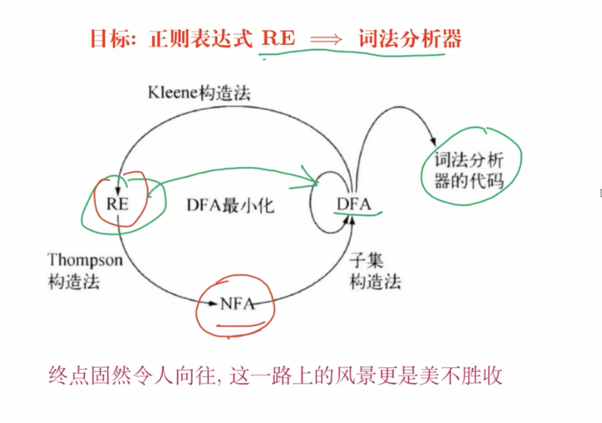

# Automaton

> RE 正则表达式
>
> NFA 非确定性有限自动机 简洁易于理解
>
> DFA 确定性有限自动机 易于判断，适合产生词法分析器

## RE 正则表达式

| 表达式   | 匹配描述                                | 例子      |
| -------- | --------------------------------------- | --------- |
| `c`      | 单个非运算符字符 `c`                    | `a`       |
| `\c`     | 字符 `c` 的字面值                       | `\*`      |
| `"s"`    | 字符串 `s` 的字面值                     | `"**"`    |
| `.`      | 除换行符以外的任何字符                  | `a.*b`    |
| `^`      | 一行的开始                              | `^abc`    |
| `$`      | 行的结尾                                | `abc$`    |
| `[s]`    | 字符串 `s` 中的任意一个字符             | `[abc]`   |
| `[^s]`   | 不在字符串 `s` 中的任意一个字符         | `[^abc]`  |
| `r*`     | 和 `r` 匹配的零个或多个连续接成的串     | `a*`      |
| `r+`     | 和 `r` 匹配的一个或多个连续接成的串     | `a+`      |
| `r?`     | 零个或一个 `r`                          | `a?`      |
| `r{m,n}` | 最少 `m` 个，最多 `n` 个 `r` 的重复出现 | `a{1,5}`  |
| `r1r2`   | `r1` 后加上 `r2`                        | `ab`      |
| `r1|r2`  | `r1` 或 `r2`                            | `a|b`     |
| `(r)`    | 与 `r` 相同                             | `(a|b)`   |
| `r1/r2`  | 后面跟有 `r2` 时的 `r1`                 | `abc/123` |

## Thompson 构造法

### Thompson构造法的基本思想

Thompson构造法通过**构建简单的NFA单元**，然后将这些单元根据正则表达式的操作（如连接、并、闭包）组合成一个完整的NFA。这个NFA能够接受正则表达式所描述的所有字符串。

以下是该构造法的基本单元及其组合方式：

1. 基本单元

   - **空字符串 ε**：用两个状态（起始状态和终止状态）表示，从起始状态到终止状态通过 ε 转移。
   - **单字符 a**：用两个状态表示，从起始状态到终止状态通过字符`a`转移。

2. 组合规则

   - **连接（Concatenation）**：如果要构建 `A·B`，可以将 `A` 的终止状态与 `B` 的起始状态通过 ε 转移相连。

   - **并（Union/Alternation）**：对于 `A | B`，构造一个新的起始状态和终止状态，从新的起始状态通过 ε 转移连接到 `A` 和 `B` 的起始状态，再从 `A` 和 `B` 的终止状态通过 ε 转移连接到新的终止状态。

   - 闭包（Kleene Star）

     ：对 `A*`，创建新的起始和终止状态，并通过 ε 转移连接：

     - 从新的起始状态到`A`的起始状态。
     - 从`A`的终止状态返回到`A`的起始状态（形成循环）。
     - 从新的起始状态直接到新的终止状态（表示空串）。
     - 从`A`的终止状态到新的终止状态。

### 具体步骤

为了更好地理解Thompson构造法的具体操作步骤，假设我们有一个简单的正则表达式 `a(b|c)*`。我们通过以下步骤构造其NFA：

1. **构建基本单元**：
   - 构建字符`a`的NFA单元。
   - 构建字符`b`和字符`c`的NFA单元。
2. **构建并（Union）操作**：
   - 使用并操作构建 `b|c` 的NFA，即创建一个新的起始状态连接到`b`和`c`的起始状态，也创建新的终止状态从`b`和`c`的终止状态出发。
3. **构建闭包（Star）操作**：
   - 使用闭包操作对 `b|c` 进行星闭包构建，即创建新的起始状态和新的终止状态，通过ε转移实现循环结构，确保重复匹配。
4. **构建连接操作**：
   - 将字符`a`的NFA和 `(b|c)*` 的NFA连接在一起，形成 `a(b|c)*` 的完整NFA。

### 构造的特点

- **简单直接**：每种正则操作（连接、并、闭包）都有固定的构造步骤，使得实现自动化构造变得容易。
- **非确定性**：由于Thompson构造法生成的是NFA，因此可以在一个状态下有多个可能的转移，尤其是使用 ε 转移来实现不同单元的组合。

## 子集构造法

## DFA 最小化