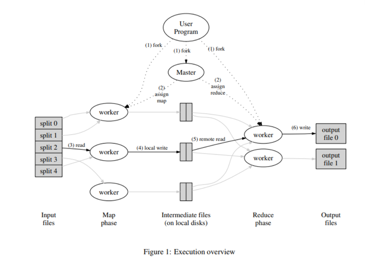

# MapReduce

## 概念

>  MapReduce 本质上是分治，创建一个 master 和若干个 worker，由 master 给 worker 分配多个 Map 任务，每个 worker 通过 RPC 来请求 master，并把运行结果 Key-Value 储存在 本地（实际上GFS），map 任务执行完之后把中间结果交给 reduce 处理，整个系统处于 Reduce 阶段，同理通过 RPC 请求任务，输出最终结果

 





## 思路

Master 应该存在一个状态，用以告诉 Worker 当前系统处于什么阶段，应该执行什么任务

Master 应该存放有任务队列，用以将任务发放

Master 应该告诉 Worker 一些必要信息，比如 中间文件位置

Worker 完成任务后应该通知 Master，否则若超时将视为任务失败，将把超时任务分发给其他 Worker

因为可能在同一时刻，有多个 Worker 同时访问 Master，所以 Master 在某些地方应该上锁

因为在同一个文件系统，所以 Worker 在执行任务时，应当先创建临时文件，再通过`os.Rename()`重命名，以免出现一些错误

每个 Worker 应该有一个 ID，以便避免任务超时重发时出现的相关bug

在本实验中，由于每个文件都不大，所以就不进行文件切分，而是把每个小文件当成一个 map 任务，然后产生`nReduce`数量的 reduce 任务和最终结果

在 Map 阶段所有任务完成之后，再进行 Reduce

Reduce 同理 处理中间文件的时候需要 sort

Map 生产中间文件的时候须进行哈希运算，值在 0-Reduce的数量

master 创建一个 gorontine 来检测超时的任务，以便重新布置任务

## 实现

### worker

```go
func Worker(mapf func(string, string) []KeyValue, reducef func(string, []string) string) {
	// 启动worker
	for {
		// worker从master获取任务
		task := getTask()

		// 拿到task之后，根据task的state，map task交给mapper， reduce task交给reducer
		// 额外加两个state，让 worker 等待 或者 直接退出
		switch task.TaskState {
		case Map:
			mapper(&task, mapf)
		case Reduce:
			reducer(&task, reducef)
		case Wait:
			time.Sleep(5 * time.Second)
		case Exit:
			return
		}
	}
}
```

### master

```go
func MakeCoordinator(files []string, nReduce int) *Master {
	m := Master{
		TaskQueue:     make(chan *Task, max(nReduce, len(files))),
		TaskMeta:      make(map[int]*MasterTask),
		MasterPhase:   Map,
		NReduce:       nReduce,
		InputFiles:    files,
		Intermediates: make([][]string, nReduce),
	}

	// 切成16MB-64MB的文件
	// 创建map任务
	m.createMapTask()

	// 一个程序成为master，其他成为worker
	//这里就是启动master 服务器就行了，
	//拥有master代码的就是master，别的发RPC过来的都是worker
	m.server()
	// 启动一个goroutine 检查超时的任务
	go m.catchTimeOut()
	return &m
}
```

