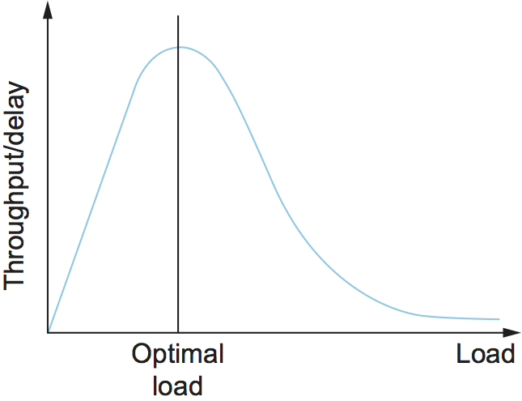

# 设计拥塞控制

## 选择

### 中心化还是分布式

原则上来说，网络资源分配的第一个设计决策就是：采取集中式还是分布式方法？实际上，互联网的规模以及连接到互联网的不同组织的自治性，必然会导致采用分布式方法，原因是

* 互联网的拥塞控制方法是在其数百万个主机和路由器之间分布式实施的，我们可以合理地将它们视为以协作的方式来实现全局最优解。从这个角度看，存在一个共享的目标函数，所有元素都在执行一个分布式算法来优化该目标函数。本书中描述的各种机制只是定义了不同的目标函数，但是一直存在的挑战是，当多种不同的机制部署之后，如何考虑这些目标函数之间的竞争。
* 虽然对于整个互联网来说，采用中心化方法不太可行，但对于一个有限的范围来说，这种方法可能却更加合适。例如，一个逻辑上的中心化控制器可以收集关于网络链路和交换机状态的信息，计算出全局最优的资源分配方案，然后向终端用户建议（甚至限制）每个用户可用的容量。

中心化控制在数据中心内部已经被有效的应用起来。数据中心是拥塞控制问题的一个有趣的环境。首先，它的 RTT 非常低。其次，在许多情况下，可以将数据中心视为一个干净的环境，因为受控所以不用考虑各种现存的拥塞控制算法，从而使得新的拥塞控制算法实施可能性更大。**Fastpass** 就是这样一种集中式方法的良好例证。

### 路由器还是主机为中心

既然资源分配是分布式的，那下一个问题就是：应该在网络内部（路由器或交换机）还是在网络边缘（主机）实现拥塞控制机制。

1. 以路由器为中心。路由器可以允许主机来向自己预留容量，然后确保每个流的数据包基于该容量相应地被传送。例如，他们可以通过实施一个信号协议以及Fair Queue来做到这一点，只在当有足够容量时才接受新的数据流，同时也管理主机，以确保它们的数据流只使用给它们预留的资源。这对应于一个基于预留的方法，其中的网络可以保证 QoS。但我们认为这个内容超出了本书的讨论范围。
2. 是以主机为中心。路由器不提供任何保证，也不提供关于可用容量的明确反馈（当其缓冲区满时会静默丢包），而是由主机负责观察网络状况（例如，他们成功通过网络发送了多少个数据包）并相应地调整其行为。
3. 介于这两个方案中间的位置。路由器可以采取更积极的措施来帮助终端主机完成拥塞控制的任务，但这不是通过预留容量和缓冲区空间来实现。当路由器的缓冲区满时，它会向终端主机发送一个反馈。

一般来说，以主机为中心的拥塞控制算法实现在位于传输层的TCP中，或者一些其他模仿TCP的传输层协议，例如_DCCP(datagram congestion control protocol)_ 或 _QUIC（一种为基于HTTP的应用设计的相对较新的传输协议）_。然而，也可以在应用程序本身中实现拥塞控制。_DASH_（_Dynamic Adaptive Streaming over HTTP_）就是一个例子，尽管它通常被认为是传输层（因为它是基于TCP运行的）和应用层的拥塞控制的组合。通过测量的网络性能，视频流服务器可以向客户端发送不同的视频编码，并因此改变HTTP流的速率。实际上，TCP会尝试找到数据流的稳定带宽，然后应用程序调整其发送速率，以完全利用该稳定带宽，同时不发送超过当前网络条件下可承受的数据量。拥塞控制的主要责任属于TCP，但应用程序旨在保持管道充满，同时也维护良好的用户体验。

### 基于窗口还是基于速率

在确定了以主机为中心的方法后，下一个实现选择是基于_窗口_ 的还是基于_速率 。_TCP 使用基于窗口机制来实现流控制，因此对于 TCP 拥塞控制的设计决策使用相同的方式。

但其实也可以通过计算出网络能承受的速率，然后调整传输速度来实现拥塞控制。真实的传输速率是在某个时间段（如RTT）内传输的字节数。我们在这里同时提出基于速率和窗口的方法，是因为在不同的场景适用不同的方法。例如，基于速率的方法更适合于多媒体应用程序，这类程序以某种平均速率生成数据，并且需要一定量最小的吞吐量才能有效工作。

通过基于资源预留的方法来实现不同QoS等级的系统中（注，即以路由器为中心的极端方法），采用基于速率的拥塞控制方法是合理的选择。但即便在像互联网这样的尽力而为传输模型中，也可以实现一种自适应的基于速率的拥塞控制机制，该机制会通知应用程序何时需要通过例如调整其编解码器，来调整其传输速率。这就是 TCP-friendly rate control （TFRC） 的核心思想，它将TCP 预防拥塞的概念扩展到那些需要以特定速率发送数据包的应用程序中（例如，以特定质量级别的视频编解码产生的比特率）。TFRC通常与RTP一起使用，RTP是为实时应用设计的传输协议。

最后，TCP拥塞控制领域一个最新的进展是BBR（Bottleneck Bandwidth and RTT），它结合了基于窗口的拥塞控制和基于速率的拥塞控制，以限制网络内队列的堆积。

### 基于控制还是基于规避

我们最后关注的实现选择，相对来说有点微妙。这里的挑战在于终端主机，它需要基于反馈和观察来计算当前网络有多少可用容量，并以此调整其发送速率。大体上来说，有两种策略：一种是激进的方法，主机会故意以造成数据包丢失的速率发送数据包，然后真正丢包时作出响应；另一种是保守的方法，主机试图探测路由器队列堆积的开始阶段，并在队列真正溢出到丢包之前放慢速度。我们将第一种机制称为基于控制（control-based），第二种机制称为基于规避（avoidance-based）。

它们的区别经常被忽视，并且“拥塞控制”一词通常被泛泛地用来指代两者，但我们需要知道它们有着重要的区别。不过，必须承认，如果区别不是很关键的时候，我们还是会用“拥塞控制”一词来泛指两种方式。

同时需要注意的是，我们称之为“基于控制”的和“基于避免”的方法，有时也会分别被称为 _基于丢包（loss-based）_和 _基于延时（delay-based）_，这是根据它们使用哪种标准来作为调整拥塞窗口的信号。前者在检测到丢包时调整窗口，而后者在检测到延迟变化时调整窗口。从这个角度看，接下来四个章节介绍的每种算法实际上都是以某种方式改进了这些信号的准确性。

## 评判标准

### 有效性

在评估拥塞控制机制的有效性时，可以从网络的两个主要指标开始，它们是：吞吐量和延迟。显然，我们希望吞吐量尽可能高，延迟尽可能低。不幸的是，这些目标之间可能彼此矛盾。一种增加吞吐量的方法是让尽可能多的数据包进入网络，以此来驱动所有链路的利用率达到100%。我们这样做是为了避免链路空闲，因为空闲的链路会降低吞吐量。但这种策略的问题在于，增加网络中的数据包数量的同时也会增加每个路由器的队列长度。这样的持续队列累积意味着数据包在网络中被延迟了，更坏的情况下数据包会被丢弃。在网络中间丢包不仅会影响延时，还会降低吞吐量，因为数据包未能成功送到目的地会导致上游链路带宽被浪费。

> 我们有时使用goodput，而不是吞吐量（throughput）来强调我们关心的是成功通过网络送到接收端的数据，而不仅仅是发送端发出的数据。

系统吞吐量与延迟的比例是评估拥塞控制机制（即网络资源的分配方案）效果的一个通用指标。这个比例有时被称为系统的_功率（Power）：_

$$
Power = Throughput / Delay
$$
直观地说，这里Power值是你给网络系统施加的负载的函数，而我们的目标就是最大化Power。施加的负载由拥塞控制机制（即网络资源的分配方案）决定。下面展示了一个有代表性的功率曲线，理想情况下，资源分配机制会保持在这个曲线的顶点。在峰值左侧，机制过于保守；也就是说，它没有允许发送足够多的数据包来保持链路繁忙。在峰值右侧，则是允许进入网络的数据包太多，以至于(a)由于队列导致的延迟增加（分母）远大于任何小的吞吐量的增加，或者(b)吞吐量（分子）由于数据包被丢弃而开始下降。

此外，我们还需要关注系统在高负荷运行时的情况——即上图中曲线的右端。理想情况下，我们希望避免系统吞吐量接近零的情况。我们的目标是使机制保持稳定---即使当前负载很高，数据包还是能通过网络传递。如果一种机制不能在高负载下稳定运行，那么网络将会遭受拥塞崩溃。

### 公平性

我们还必须考虑公平性问题。当我们尝试定义何为公平的资源分配时，我们很快就会进入模糊不清的领域。例如，基于预留的资源分配方案提供了一种明确的受控的不公平分配方案。通过这样的方案，我们可以使用通过预留来使视频流在某个链接上获得1 Mbps的速率，而文件传输在同一链接上仅获得10 kbps的速率。

在没有特殊说明时，当多个数据流共享一个特定链路时，我们希望每个数据流都能获得等额的带宽分配。这里的公平性通过分配相同的带宽来体现。但分配相同的带宽不一定等同于公平性。

假设最公平的情况是所有数据流获得相同的带宽，网络研究员Raj Jain提出了一个可以用来量化拥塞控制机制公平性的指标。Jain的公平性指数定义如下。假设一组流量吞吐量$$（x1,x2,...,xn）（x_1, x_2, ..., x_n）$$。它们有相同的单位，例如bps。下面的函数给出了数据流的公平性指标：
$$
f(x_1, x_2, \dots, x_n) = \frac{\left(\sum_{i=1}^n x_i\right)^2}{n \sum_{i=1}^n x_i^2}
$$

## 对比分析

测量任何拥塞控制机制的第一步是单独评估其性能，这包括了：

* 数据流能达到的平均吞吐量（goodput）
* 数据流经历的平均端到端延时（RTT）
* 在一系列操作场景下避免持续队列堆积的机制
* 在一系列操作场景下保持传输稳定的机制
* 数据流可以多公平的获得网络容量的程度（Jain的公平性指数）
